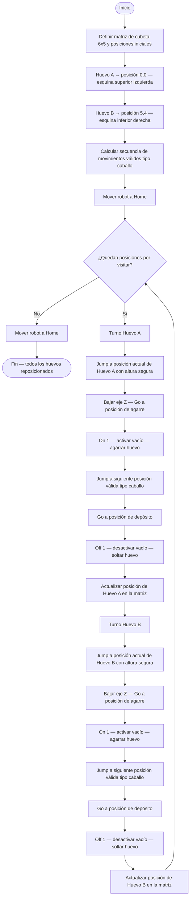

<div align="center">


<a href="https://www.epson.com/en_US/products/robots/"></a>
<a href="https://www.epson.com/en_US/products/robots/scara/t3/s/SPT_T3-401S"></a>
<a href="./LICENSE"></a>

</div>

---

<div align="center">

```
╔══════════════════════════════════════════════════════════════════╗
║  🦾  Análisis y Operación del Manipulador EPSON T3-401S          ║
║  SCARA  ·  Gripper Neumático  ·  Patrón Caballo  ·  EPSON RC+   ║
╚══════════════════════════════════════════════════════════════════╝
```

</div>

> **Resumen del proyecto:** Práctica de laboratorio del curso *Robótica Industrial 2026-I* donde se analiza y opera el manipulador SCARA **EPSON T3-401S**. Se realiza una comparación técnica con el ABB IRB140 y el Motoman MH6, se diseña un gripper neumático por vacío, y se programa una trayectoria con patrón de movimiento de caballo de ajedrez para manipular huevos en una cubeta de 30 posiciones (6×5), usando el software **EPSON RC+ 7.0**.

---

## 📋 Tabla de contenidos

| # | Sección |
|---|---------|
| 1 | [Cuadro comparativo EPSON T3-401S vs MH6 vs IRB140](#-cuadro-comparativo-epson-t3-401s-vs-mh6-vs-irb140) |
| 2 | [Configuración Home del EPSON T3-401S](#-configuración-home-del-epson-t3-401s) |
| 3 | [Movimientos manuales — procedimiento y teclas](#️-movimientos-manuales--procedimiento-y-teclas) |
| 4 | [Niveles de velocidad para movimiento manual](#-niveles-de-velocidad-para-movimiento-manual) |
| 5 | [Software EPSON RC+ 7.0 — aplicaciones y comunicación](#-software-epson-rc-70--aplicaciones-y-comunicación) |
| 6 | [Comparación EPSON RC+ 7.0 vs RoboDK vs RobotStudio](#️-comparación-epson-rc-70-vs-robodk-vs-robotstudio) |
| 7 | [Diseño del gripper neumático por vacío](#-diseño-del-gripper-neumático-por-vacío) |
| 8 | [Diagrama de flujo — patrón de caballo de ajedrez](#-diagrama-de-flujo--patrón-de-caballo-de-ajedrez) |
| 9 | [Plano de planta](#️-plano-de-planta) |
| 10 | [Trayectoria con patrón de caballo — código](#️-trayectoria-con-patrón-de-caballo--código) |
| 11 | [Videos de simulación e implementación](#-videos-de-simulación-e-implementación) |
| 12 | [Autores](#-autores) |

---

## Cuadro comparativo EPSON T3-401S vs MH6 vs IRB140

| Característica | EPSON T3-401S | Motoman MH6 | ABB IRB140 |
|---|---|---|---|
| **Tipo** | SCARA | Articulado (6 ejes) | Articulado (6 ejes) |
| **Fabricante** | Epson | Yaskawa | ABB |
| **Grados de libertad** | 4 | 6 | 6 |
| **Carga máxima** | 3 kg | 6 kg | 6 kg |
| **Alcance máximo** | 400 mm | 1 422 mm | 810 mm |
| **Repetibilidad** | ±0.01 mm | ±0.08 mm | ±0.03 mm |
| **Recorrido eje Z (vertical)** | 150 mm | — | — |
| **Recorrido eje 4 (rotación)** | ±360° | — | — |
| **Velocidad máx. TCP** | 5 000 mm/s | — | 1 000 mm/s |
| **Peso del robot** | 8 kg | 130 kg | 98 kg |
| **Controlador** | RC90 / T series | DX100 / YRC1000 | IRC5 |
| **Lenguaje de programación** | SPEL+ | INFORM III | RAPID |
| **Comunicación con PC** | USB / Ethernet | Ethernet | Ethernet / USB |
| **Montaje** | Mesa | Suelo, techo, pared | Suelo, techo, pared |
| **Aplicaciones típicas** | Ensamble fino, pick & place, electrónica | Manipulación, soldadura, paletizado | Manipulación, soldadura por arco, ensamble |
| **Grado de protección** | IP20 | IP54 | IP54 |
| **Software de simulación** | EPSON RC+ 7.0 | RoboDK, MotoSim | RobotStudio |

---

## Configuración Home del EPSON T3-401S

El manipulador EPSON T3-401S es un robot SCARA de 4 grados de libertad: dos articulaciones rotacionales en el plano horizontal (J1 y J2), un eje vertical lineal (J3) y una rotación de la herramienta (J4).

A diferencia de los robots articulados de 6 ejes, el EPSON T3-401S define su posición de **Home** como el punto de referencia absoluto del sistema de coordenadas del robot, desde el cual todas las trayectorias se referencian.

### Definición de Home en EPSON RC+ 7.0

En el EPSON T3-401S, la posición de Home **no es fija de fábrica** como en el Motoman — se define durante la puesta en marcha mediante el procedimiento de calibración del encoder absoluto. La posición Home típica coloca el robot con:

| Articulación | Descripción | Posición Home típica |
|---|---|---|
| **J1** | Rotación del brazo 1 (hombro) | 0° — brazo alineado con el eje X |
| **J2** | Rotación del brazo 2 (codo) | 0° — brazo 2 extendido en línea con brazo 1 |
| **J3** | Desplazamiento vertical del eje Z | Posición más alta (retracción máxima) |
| **J4** | Rotación de la herramienta | 0° — herramienta sin rotación |


### ¿Cómo se define el Home en EPSON RC+ 7.0?

El Home se establece mediante el comando `Hofs` en SPEL+, que registra los offsets del encoder absoluto en la posición actual del robot como punto de origen. Una vez definido, el robot puede regresar a Home en cualquier momento con la instrucción:

```spel
Home
```

---

## Movimientos manuales — procedimiento y teclas

El EPSON T3-401S se opera manualmente desde el software **EPSON RC+ 7.0** en el PC, usando el panel **Jog & Teach** accesible desde el menú `Robot → Jog & Teach`.

### Cambio entre modos de movimiento

| Modo | Descripción | Cómo activarlo en RC+ 7.0 |
|---|---|---|
| **Joint (Articular)** | Mueve cada articulación J1, J2, J3, J4 de forma independiente | Seleccionar `Joint` en el panel Jog & Teach |
| **World (Cartesiano)** | Mueve el TCP en el sistema de coordenadas global X, Y, Z, U | Seleccionar `World` en el panel Jog & Teach |
| **Tool** | Movimiento relativo al frame de la herramienta activa | Seleccionar `Tool` en el panel Jog & Teach |
| **Local** | Movimiento relativo a un sistema de coordenadas local definido | Seleccionar `Local` en el panel Jog & Teach |

### Traslaciones en X, Y, Z (modo World)

Una vez seleccionado el modo `World` en el panel Jog & Teach:

| Eje | Dirección positiva | Dirección negativa |
|---|---|---|
| **X** | Botón `+X` | Botón `-X` |
| **Y** | Botón `+Y` | Botón `-Y` |
| **Z** | Botón `+Z` (sube) | Botón `-Z` (baja) |

### Rotaciones (modo World)

| Eje | Rotación positiva | Rotación negativa |
|---|---|---|
| **U (rotación herramienta)** | Botón `+U` | Botón `-U` |

> El EPSON T3-401S al ser SCARA solo tiene un grado de libertad rotacional en la herramienta (U/J4). No tiene rotaciones Rx ni Ry independientes como un robot de 6 ejes.

### Movimiento articular (modo Joint)

| Articulación | Dirección positiva | Dirección negativa |
|---|---|---|
| **J1** | Botón `+J1` | Botón `-J1` |
| **J2** | Botón `+J2` | Botón `-J2` |
| **J3** | Botón `+J3` | Botón `-J3` |
| **J4** | Botón `+J4` | Botón `-J4` |

---

## Niveles de velocidad para movimiento manual

### Niveles disponibles en EPSON RC+ 7.0

El panel Jog & Teach de EPSON RC+ 7.0 permite ajustar la velocidad de movimiento manual mediante un control deslizante o selector de porcentaje:

| Nivel | Porcentaje de velocidad | Uso recomendado |
|---|---|---|
| **Low** | 1% – 10% | Aproximaciones finas, enseñanza de puntos cerca de la pieza |
| **Medium** | 11% – 50% | Movimientos de alcance medio con precisión aceptable |
| **High** | 51% – 100% | Desplazamientos rápidos en espacio libre |

### ¿Cómo se cambia el nivel de velocidad?

En el panel **Jog & Teach**:
1. Localizar el control de velocidad (slider o campo numérico etiquetado como `Speed` o `Jog Speed`).
2. Arrastrar el slider o ingresar directamente el porcentaje deseado (1–100%).
3. El cambio es inmediato y se aplica al siguiente movimiento jog.

### ¿Cómo se identifica el nivel en la pantalla?

El porcentaje de velocidad activo se muestra numéricamente en el campo `Speed` del panel Jog & Teach. Adicionalmente, la barra de estado inferior de EPSON RC+ 7.0 puede mostrar el estado de movimiento del robot en tiempo real.

> *Complementar con captura de pantalla del panel Jog & Teach si se tomó durante el laboratorio.*

---

## Software EPSON RC+ 7.0 — aplicaciones y comunicación

### Principales aplicaciones

EPSON RC+ 7.0 es el entorno de desarrollo integrado (IDE) oficial de Epson para la programación, simulación y control de sus manipuladores. Sus principales funcionalidades incluyen:

- **Programación en SPEL+:** lenguaje de alto nivel propio de Epson, orientado a la robótica, con instrucciones de movimiento, control de E/S, manejo de errores y lógica de programa.
- **Simulación 3D integrada:** permite simular trayectorias en un entorno virtual antes de ejecutarlas en el robot físico, verificando alcance y colisiones.
- **Panel Jog & Teach:** interfaz gráfica para mover manualmente el robot y registrar puntos de paso directamente desde el PC.
- **Gestión de puntos y trayectorias:** el software almacena puntos (`Point`) en archivos `.pts` y los referencia desde el programa SPEL+.
- **Monitor de E/S digitales:** permite visualizar y forzar el estado de las entradas y salidas digitales del controlador RC90 en tiempo real.
- **Control de herramienta y frames:** gestión de los parámetros de herramienta (`Tool`) y sistemas de coordenadas locales (`Local`).

### ¿Cómo se comunica EPSON RC+ 7.0 con el manipulador?

La conexión entre el PC y el robot EPSON T3-401S se realiza mediante **cable USB** directamente al controlador RC90. El proceso es:

1. Conectar el cable USB entre el PC y el puerto USB del controlador RC90.
2. En EPSON RC+ 7.0, ir a `Setup → PC to Controller Communications`.
3. Seleccionar el tipo de conexión `USB` y el controlador detectado.
4. Hacer clic en `Connect`. El software establece la comunicación y el indicador de estado cambia a `Connected`.

### ¿Qué hace EPSON RC+ 7.0 para mover el manipulador?

Al ejecutar un programa SPEL+, RC+ 7.0 interpreta las instrucciones de movimiento (`Move`, `Jump`, `Arc`, `Go`), calcula la trayectoria cartesiana o articular correspondiente mediante cinemática inversa, y envía los perfiles de posición y velocidad al controlador RC90 a través del USB. El RC90 se encarga del control de los servomotores de cada articulación en tiempo real.

---

## Comparación EPSON RC+ 7.0 vs RoboDK vs RobotStudio

| Aspecto | EPSON RC+ 7.0 | RoboDK | RobotStudio |
|---|---|---|---|
| **Fabricante** | Epson | RoboDK Inc. | ABB |
| **Robots compatibles** | Solo robots Epson | +500 marcas y modelos | Solo robots ABB |
| **Lenguaje de programación** | SPEL+ | Python (API) + post-procesadores | RAPID |
| **Licenciamiento** | Gratuito — incluido con el robot | De pago con versión de prueba | Gratuito básico; licencias avanzadas de pago |
| **Simulación** | Sí — integrada en el entorno | Sí — multi-robot | Sí — gemelo digital certificado ABB |
| **Conexión al robot** | USB directo al controlador RC90 | Ethernet TCP/IP | Ethernet / OPC-UA |
| **Curva de aprendizaje** | Baja-media — entorno guiado | Media | Media-alta |
| **Tipos de trayectoria** | Move, Jump, Arc, Go, CP | MoveL, MoveJ, MoveC | MoveL, MoveJ, MoveC, MoveAbsJ |
| **Control de E/S** | Sí — monitor integrado | Limitado | Sí — completo para IRC5 |
| **Uso típico** | Programación y operación de robots Epson | Entornos multi-marca, educación | Celdas ABB de alta precisión |

### ¿Qué significa cada herramienta?

**EPSON RC+ 7.0** es el entorno nativo del T3-401S. Su fortaleza está en la **integración total** con el hardware: desde la enseñanza de puntos hasta el control de las salidas digitales que activan el gripper neumático, todo se gestiona desde un único entorno sin capas intermedias. El lenguaje SPEL+ resulta intuitivo para operaciones de pick & place.

**RoboDK**, usado en el Laboratorio 02 con el Motoman MH6, ofrece **flexibilidad multi-fabricante** y la potencia de Python para generar trayectorias complejas algorítmicamente, como la curva de la mariposa.

**RobotStudio**, usado en el Laboratorio 01 con el IRB140, representa la **máxima fidelidad de simulación** para robots ABB, con un gemelo digital que replica con exactitud el comportamiento del controlador IRC5.

### Tipos de trayectoria en EPSON RC+ 7.0

| Instrucción | Tipo de movimiento | Descripción |
|---|---|---|
| `Move` | Punto a punto (PTP) | Movimiento articular directo entre dos puntos — la trayectoria del TCP no es predecible |
| `Jump` | PTP con perfil Z | Sube a una altura segura, se traslada y baja — ideal para pick & place |
| `Arc` / `Arc3` | Arco circular | Trayectoria en arco definida por un punto intermedio y un punto final |
| `Go` | Cartesiano lineal | Movimiento lineal del TCP en el espacio cartesiano |
| `CP` | Continuous Path | Modo de trayectoria continua sin detenerse en puntos intermedios |

---

## Diseño del gripper neumático por vacío

### Descripción general

El gripper diseñado opera por **vacío activo**: una ventosa de goma se posiciona sobre el huevo y una electroválvula conectada a una salida digital del controlador RC90 activa el sistema de vacío para generar la succión. Para soltar el huevo, la electroválvula se desactiva y se rompe el vacío.

### Componentes utilizados

| Componente | Especificación | Función |
|---|---|---|
| **Ventosa** | Silicona Ø 40 mm, perfil esférico | Contacto con la superficie curva del huevo |
| **Generador de vacío (eyector)** | Venturi tipo miniatura | Genera vacío a partir de aire comprimido |
| **Electroválvula 5/2** | 24 VDC, monoestable | Controla el flujo de aire al eyector |
| **Racores y tuberías** | Ø 4 mm | Conexiones neumáticas |
| **Acople al flange** | Impresión 3D / aluminio | Fija la ventosa al eje Z del T3-401S |

### Configuración de E/S digitales

| Señal | Tipo | Pin RC90 | Función |
|---|---|---|---|
| `Out(1)` | Salida digital | DO1 | Activa la electroválvula → genera vacío → agarra el huevo |

**En SPEL+:**
```spel
' Activar vacío (agarrar huevo)
On 1

' Desactivar vacío (soltar huevo)
Off 1
```

### Diagrama esquemático

> *Adjuntar imagen del diagrama neumático y eléctrico del gripper. Incluir: compresor → electroválvula → eyector de vacío → ventosa, con las conexiones eléctricas al RC90.*

---

## Diagrama de flujo — patrón de caballo de ajedrez

El patrón de movimiento del caballo en ajedrez avanza en forma de "L": **2 posiciones en un eje y 1 en el perpendicular** (o viceversa). Sobre la cubeta de 6×5 (6 columnas, 5 filas = 30 posiciones), los dos huevos parten de las esquinas opuestas y se mueven alternadamente cubriendo todas las posiciones.



---

## Plano de planta

> *Adjuntar imagen o archivo con el plano de planta indicando: ubicación del EPSON T3-401S, posición de la cubeta de huevos respecto al robot, posiciones iniciales de los dos huevos (esquinas de la cubeta), y el sistema de coordenadas de referencia.*

---

## Trayectoria con patrón de caballo — código

### Lógica del patrón de caballo sobre la cubeta 6×5

La cubeta tiene **6 columnas (c = 0…5)** y **5 filas (f = 0…4)**. Desde cualquier posición `(c, f)`, los movimientos válidos del caballo son los 8 desplazamientos `(±1, ±2)` y `(±2, ±1)` que caigan dentro de los límites de la cubeta.

### Código desarrollado en EPSON RC+ 7.0 (SPEL+)

> El archivo completo `.prg` se encuentra adjunto en el repositorio. A continuación se muestra la estructura principal:

```spel
' ============================================
' Laboratorio 03 - Patrón Caballo de Ajedrez
' EPSON T3-401S - EPSON RC+ 7.0
' ============================================

' Separación entre posiciones de la cubeta (mm)
' Ajustar según medición real de la cubeta
#define SEP_X  38.0   ' Separación entre columnas
#define SEP_Y  38.0   ' Separación entre filas
#define Z_SAFE -50.0  ' Altura segura de traslado
#define Z_PICK -150.0 ' Altura de agarre del huevo

Function Main
    ' Ir a Home al inicio
    Home
    
    ' Posiciones iniciales de los huevos
    ' Huevo A en esquina (col=0, fila=0)
    ' Huevo B en esquina (col=5, fila=4)
    
    ' Ejecutar secuencia alternada
    Call MoverHuevoA
    Call MoverHuevoB
    ' ... continuar alternando según secuencia calculada
    
    Home
Fend

' ---- Subrutina: calcular posición XY en la cubeta ----
Function PosX(col As Integer) As Real
    PosX = col * SEP_X
Fend

Function PosY(fila As Integer) As Real
    PosY = fila * SEP_Y
Fend

' ---- Subrutina: pick & place de un huevo ----
Function PickAndPlace(x_orig As Real, y_orig As Real, x_dest As Real, y_dest As Real)
    ' Aproximación sobre origen
    Jump XY(x_orig, y_orig, Z_SAFE, 0)
    ' Bajar a posición de agarre
    Go XY(x_orig, y_orig, Z_PICK, 0)
    ' Activar vacío
    On 1
    Wait 0.3
    ' Subir con el huevo
    Go XY(x_orig, y_orig, Z_SAFE, 0)
    ' Trasladar al destino
    Jump XY(x_dest, y_dest, Z_SAFE, 0)
    ' Bajar a posición de depósito
    Go XY(x_dest, y_dest, Z_PICK, 0)
    ' Desactivar vacío
    Off 1
    Wait 0.3
    ' Subir sin el huevo
    Go XY(x_dest, y_dest, Z_SAFE, 0)
Fend
```

> *El código completo con la secuencia de movimientos tipo caballo calculada para los 30 pasos se encuentra en el archivo `horse_pattern.prg` adjunto en el repositorio.*

---

## 🎥 Videos de simulación e implementación

> **Video de simulación en EPSON RC+ 7.0.**

<div align="center">

<a href="#">
  
</a>

</div>

> **Video de implementación física en el EPSON T3-401S.**

<div align="center">

<a href="#">
  
</a>

</div>

> **Video demostrativo del gripper neumático levantando un huevo.**

<div align="center">

<a href="#">
  
</a>

</div>

---

## Autores

<div align="center">

| Integrante | GitHub |
|---|---|
| — | — |
| — | — |

</div>

---

<div align="center">


</div>

