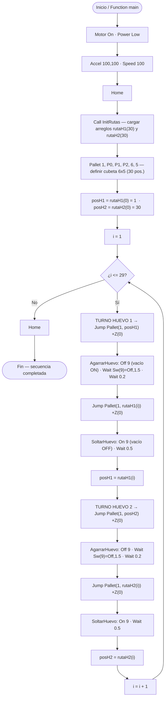

<div align="center">


<a href="https://www.epson.com/en_US/products/robots/"></a>
<a href="https://www.epson.com/en_US/products/robots/scara/t3/s/SPT_T3-401S"></a>
<a href="./LICENSE"></a>

</div>

---

<div align="center">

```
╔══════════════════════════════════════════════════════════════════╗
║      Análisis y Operación del Manipulador EPSON T3-401S          ║
║   SCARA  ·  Gripper Neumático  ·  Patrón Caballo  ·  EPSON RC+   ║
╚══════════════════════════════════════════════════════════════════╝
```

</div>

> **Resumen del proyecto:** Práctica de laboratorio del curso *Robótica Industrial 2026-I* donde se analiza y opera el manipulador SCARA **EPSON T3-401S**. Se realiza una comparación técnica con el ABB IRB140 y el Motoman MH6, se diseña un gripper neumático por vacío, y se programa una trayectoria con patrón de movimiento de caballo de ajedrez para manipular dos huevos en una cubeta de 30 posiciones (6×5), usando el software **EPSON RC+ 7.0** y el lenguaje **SPEL+**.

---

## Tabla de contenidos

| # | Sección |
|---|---------|
| 1 | [Cuadro comparativo EPSON T3-401S vs MH6 vs IRB140](#cuadro-comparativo-epson-t3-401s-vs-mh6-vs-irb140) |
| 2 | [Configuración Home del EPSON T3-401S](#configuración-home-del-epson-t3-401s) |
| 3 | [Movimientos manuales — procedimiento y teclas](#movimientos-manuales--procedimiento-y-teclas) |
| 4 | [Niveles de velocidad para movimiento manual](#niveles-de-velocidad-para-movimiento-manual) |
| 5 | [Software EPSON RC+ 7.0 — aplicaciones y comunicación](#software-epson-rc-70--aplicaciones-y-comunicación) |
| 6 | [Comparación EPSON RC+ 7.0 vs RoboDK vs RobotStudio](#comparación-epson-rc-70-vs-robodk-vs-robotstudio) |
| 7 | [Diseño del gripper neumático por vacío](#diseño-del-gripper-neumático-por-vacío) |
| 8 | [Configuración de E/S digitales (IOLabels)](#configuración-de-es-digitales-iolabels) |
| 9 | [Diagrama de flujo — patrón de caballo de ajedrez](#diagrama-de-flujo--patrón-de-caballo-de-ajedrez) |
| 10 | [Plano de planta](#plano-de-planta) |
| 11 | [Trayectoria con patrón de caballo — código](#trayectoria-con-patrón-de-caballo--código) |
| 12 | [Video de simulación](#video-de-simulación) |
| 13 | [Autores](#autores) |

---

## Cuadro comparativo EPSON T3-401S vs MH6 vs IRB140

| Característica | EPSON T3-401S | Motoman MH6 | ABB IRB140 |
|---|---|---|---|
| **Tipo** | SCARA | Articulado (6 ejes) | Articulado (6 ejes) |
| **Fabricante** | Epson | Yaskawa | ABB |
| **Grados de libertad** | 4 | 6 | 6 |
| **Carga máxima** | 3 kg | 6 kg | 6 kg |
| **Alcance máximo** | 400 mm | 1 422 mm | 810 mm |
| **Repetibilidad** | ±0.02 mm | ±0.08 mm | ±0.03 mm |
| **Recorrido eje Z (vertical)** | 150 mm | — | — |
| **Recorrido eje 4 (rotación)** | ±360° | — | — |
| **Velocidad máx. articular** | 3 700 mm/s (J1/J2)* | — | 1 000 mm/s (TCP) |
| **Peso del robot** | 16 kg (sin cables) | 130 kg | 98 kg |
| **Controlador** | Integrado (all-in-one, T-Series) | DX100 / YRC1000 | IRC5 |
| **Lenguaje de programación** | SPEL+ | INFORM III | RAPID |
| **Comunicación con PC** | USB / Ethernet | Ethernet | Ethernet / USB |
| **Montaje** | Mesa | Suelo, techo, pared | Suelo, techo, pared |
| **Aplicaciones típicas** | Ensamble fino, pick & place, electrónica | Manipulación, soldadura, paletizado | Manipulación, soldadura por arco, ensamble |
| **Grado de protección** | IP20 | IP54 | IP54 |
| **Software de simulación** | EPSON RC+ 7.0 | RoboDK, MotoSim | RobotStudio |

> *Velocidad máxima de las articulaciones 1 y 2 según el manual del fabricante (J3: 1 000 mm/s, J4: 2 600 °/s). Tiempo de ciclo estándar ≈ 0.52–0.54 s.

> **Nota importante:** el EPSON T3-401S es un robot **"all-in-one"**: el controlador está **integrado en la propia base del robot** (no usa un controlador externo RC90 como otros modelos Epson). Por eso la conexión con el PC se hace por USB directamente al robot.

---

## Configuración Home del EPSON T3-401S

El manipulador EPSON T3-401S es un robot SCARA de 4 grados de libertad: dos articulaciones rotacionales en el plano horizontal (J1 y J2), un eje vertical lineal (J3) y una rotación de la herramienta (J4).

A diferencia de los robots articulados de 6 ejes, el EPSON T3-401S define su posición de **Home** como el punto de referencia absoluto del sistema de coordenadas del robot, desde el cual todas las trayectorias se referencian.

### Definición de Home en EPSON RC+ 7.0

En el EPSON T3-401S, la posición de Home **no es fija de fábrica** — se define durante la puesta en marcha mediante el procedimiento de calibración del encoder absoluto. La posición Home típica coloca el robot con:

| Articulación | Descripción | Posición Home típica |
|---|---|---|
| **J1** | Rotación del brazo 1 (hombro) | 0° — brazo alineado con el eje X |
| **J2** | Rotación del brazo 2 (codo) | 0° — brazo 2 extendido en línea con brazo 1 |
| **J3** | Desplazamiento vertical del eje Z | Posición más alta (retracción máxima) |
| **J4** | Rotación de la herramienta | 0° — herramienta sin rotación |

### ¿Cómo se define el Home en EPSON RC+ 7.0?

El Home se establece mediante el comando `Hofs` en SPEL+, que registra los offsets del encoder absoluto en la posición actual del robot como punto de origen. Una vez definido, el robot puede regresar a Home en cualquier momento con la instrucción:

```spel
Home
```

En la rutina del proyecto, `Home` se invoca al inicio (tras `Motor On` y `Power Low`) y al final de la secuencia para dejar el robot en una posición segura.

---

## Movimientos manuales — procedimiento y teclas

El EPSON T3-401S se opera manualmente desde el software **EPSON RC+ 7.0** en el PC, usando el panel **Jog & Teach** accesible desde el menú `Robot → Jog & Teach`.

### Cambio entre modos de movimiento

| Modo | Descripción | Cómo activarlo en RC+ 7.0 |
|---|---|---|
| **Joint (Articular)** | Mueve cada articulación J1, J2, J3, J4 de forma independiente | Seleccionar `Joint` en el panel Jog & Teach |
| **World (Cartesiano)** | Mueve el TCP en el sistema de coordenadas global X, Y, Z, U | Seleccionar `World` en el panel Jog & Teach |
| **Tool** | Movimiento relativo al frame de la herramienta activa | Seleccionar `Tool` en el panel Jog & Teach |
| **Local** | Movimiento relativo a un sistema de coordenadas local definido | Seleccionar `Local` en el panel Jog & Teach |

### Traslaciones en X, Y, Z (modo World)

| Eje | Dirección positiva | Dirección negativa |
|---|---|---|
| **X** | Botón `+X` | Botón `-X` |
| **Y** | Botón `+Y` | Botón `-Y` |
| **Z** | Botón `+Z` (sube) | Botón `-Z` (baja) |

### Rotaciones (modo World)

| Eje | Rotación positiva | Rotación negativa |
|---|---|---|
| **U (rotación herramienta)** | Botón `+U` | Botón `-U` |

> El EPSON T3-401S, al ser SCARA, solo tiene un grado de libertad rotacional en la herramienta (U/J4). No tiene rotaciones Rx ni Ry independientes como un robot de 6 ejes.

### Movimiento articular (modo Joint)

| Articulación | Dirección positiva | Dirección negativa |
|---|---|---|
| **J1** | Botón `+J1` | Botón `-J1` |
| **J2** | Botón `+J2` | Botón `-J2` |
| **J3** | Botón `+J3` | Botón `-J3` |
| **J4** | Botón `+J4` | Botón `-J4` |

---

## Niveles de velocidad para movimiento manual

### Niveles disponibles en EPSON RC+ 7.0

El panel Jog & Teach de EPSON RC+ 7.0 permite ajustar la velocidad de movimiento manual mediante un control deslizante o selector de porcentaje:

| Nivel | Porcentaje de velocidad | Uso recomendado |
|---|---|---|
| **Low** | 1% – 10% | Aproximaciones finas, enseñanza de puntos cerca de la pieza |
| **Medium** | 11% – 50% | Movimientos de alcance medio con precisión aceptable |
| **High** | 51% – 100% | Desplazamientos rápidos en espacio libre |

### ¿Cómo se cambia el nivel de velocidad?

En el panel **Jog & Teach**:
1. Localizar el control de velocidad (slider o campo numérico etiquetado como `Speed` o `Jog Speed`).
2. Arrastrar el slider o ingresar directamente el porcentaje deseado (1–100%).
3. El cambio es inmediato y se aplica al siguiente movimiento jog.

### ¿Cómo se identifica el nivel en la pantalla?

El porcentaje de velocidad activo se muestra numéricamente en el campo `Speed` del panel Jog & Teach. Adicionalmente, la barra de estado inferior de EPSON RC+ 7.0 muestra el estado de movimiento del robot en tiempo real.

---

## Software EPSON RC+ 7.0 — aplicaciones y comunicación

### Principales aplicaciones

EPSON RC+ 7.0 es el entorno de desarrollo integrado (IDE) oficial de Epson para la programación, simulación y control de sus manipuladores. Sus principales funcionalidades incluyen:

- **Programación en SPEL+:** lenguaje de alto nivel propio de Epson, orientado a la robótica, con instrucciones de movimiento, control de E/S, manejo de errores y lógica de programa.
- **Simulación 3D integrada:** permite simular trayectorias en un entorno virtual antes de ejecutarlas en el robot físico, verificando alcance y colisiones.
- **Panel Jog & Teach:** interfaz gráfica para mover manualmente el robot y registrar puntos de paso directamente desde el PC.
- **Gestión de puntos y trayectorias:** el software almacena puntos (`Point`) en archivos `.pts` y los referencia desde el programa SPEL+.
- **Editor de etiquetas de E/S:** permite asignar nombres y descripciones a las entradas/salidas digitales (archivo `IOLabels.dat`), como las señales `DI_09` y `DO_09` usadas para el gripper.
- **Monitor de E/S digitales:** permite visualizar y forzar el estado de las entradas y salidas digitales del controlador integrado en tiempo real.
- **Control de herramienta y frames:** gestión de los parámetros de herramienta (`Tool`) y sistemas de coordenadas locales (`Local`).

### ¿Cómo se comunica EPSON RC+ 7.0 con el manipulador?

La conexión entre el PC y el robot EPSON T3-401S se realiza mediante **cable USB** directamente al controlador integrado del robot (no hay un controlador externo). El proceso es:

1. Conectar el cable USB entre el PC y el puerto USB del robot T3-401S.
2. En EPSON RC+ 7.0, ir a `Setup → PC to Controller Communications`.
3. Seleccionar el tipo de conexión `USB` y el controlador detectado.
4. Hacer clic en `Connect`. El software establece la comunicación y el indicador de estado cambia a `Connected`.

### ¿Qué hace EPSON RC+ 7.0 para mover el manipulador?

Al ejecutar un programa SPEL+, RC+ 7.0 interpreta las instrucciones de movimiento (`Move`, `Jump`, `Arc`, `Go`), calcula la trayectoria cartesiana o articular correspondiente mediante cinemática inversa, y envía los perfiles de posición y velocidad al controlador integrado. Este se encarga del control de los servomotores de cada articulación en tiempo real.

---

## Comparación EPSON RC+ 7.0 vs RoboDK vs RobotStudio

| Aspecto | EPSON RC+ 7.0 | RoboDK | RobotStudio |
|---|---|---|---|
| **Fabricante** | Epson | RoboDK Inc. | ABB |
| **Robots compatibles** | Solo robots Epson | +500 marcas y modelos | Solo robots ABB |
| **Lenguaje de programación** | SPEL+ | Python (API) + post-procesadores | RAPID |
| **Licenciamiento** | Gratuito — incluido con el robot | De pago con versión de prueba | Gratuito básico; licencias avanzadas de pago |
| **Simulación** | Sí — integrada en el entorno | Sí — multi-robot | Sí — gemelo digital certificado ABB |
| **Conexión al robot** | USB directo al controlador integrado | Ethernet TCP/IP | Ethernet / OPC-UA |
| **Curva de aprendizaje** | Baja-media — entorno guiado | Media | Media-alta |
| **Tipos de trayectoria** | Move, Jump, Arc, Go, CP | MoveL, MoveJ, MoveC | MoveL, MoveJ, MoveC, MoveAbsJ |
| **Control de E/S** | Sí — monitor integrado | Limitado | Sí — completo para IRC5 |
| **Uso típico** | Programación y operación de robots Epson | Entornos multi-marca, educación | Celdas ABB de alta precisión |

### ¿Qué significa cada herramienta?

**EPSON RC+ 7.0** es el entorno nativo del T3-401S. Su fortaleza está en la **integración total** con el hardware: desde la enseñanza de puntos hasta el control de las salidas digitales que activan el gripper neumático, todo se gestiona desde un único entorno sin capas intermedias. El lenguaje SPEL+ resulta intuitivo para operaciones de pick & place.

**RoboDK**, usado en el Laboratorio 02 con el Motoman MH6, ofrece **flexibilidad multi-fabricante** y la potencia de Python para generar trayectorias complejas algorítmicamente, como la curva de la mariposa.

**RobotStudio**, usado en el Laboratorio 01 con el IRB140, representa la **máxima fidelidad de simulación** para robots ABB, con un gemelo digital que replica con exactitud el comportamiento del controlador IRC5.

### Tipos de trayectoria en EPSON RC+ 7.0

| Instrucción | Tipo de movimiento | Descripción |
|---|---|---|
| `Move` | Cartesiano lineal | Movimiento lineal del TCP en el espacio cartesiano |
| `Jump` | PTP con perfil Z | Sube a una altura segura, se traslada y baja — ideal para pick & place (usado en este proyecto) |
| `Arc` / `Arc3` | Arco circular | Trayectoria en arco definida por un punto intermedio y un punto final |
| `Go` | Punto a punto (PTP) | Movimiento articular directo entre dos puntos — la trayectoria del TCP no es predecible |
| `CP` | Continuous Path | Modo de trayectoria continua sin detenerse en puntos intermedios |

> En este proyecto el movimiento principal se realiza con `Jump`, que sube el eje Z, se traslada sobre la cubeta y baja sobre la posición destino, evitando golpear los huevos vecinos.

---

## Diseño del gripper neumático por vacío

### Descripción general

El gripper diseñado opera por **vacío activo**: una ventosa de silicona se posiciona sobre el huevo y una electroválvula, gobernada por una salida digital del robot, activa el sistema de vacío para generar la succión. Para soltar el huevo, la electroválvula cambia de estado y se rompe el vacío de forma controlada.

El sistema utiliza además una **entrada digital de realimentación** (sensor de vacío) que permite a la rutina confirmar que la succión se ha establecido antes de mover el huevo, evitando que se caiga durante el traslado.

### Componentes utilizados

| Componente | Especificación | Función |
|---|---|---|
| **Ventosa** | Silicona Ø 40 mm, perfil esférico | Contacto con la superficie curva del huevo |
| **Generador de vacío (eyector)** | Venturi tipo miniatura | Genera vacío a partir de aire comprimido |
| **Electroválvula 5/2** | 24 VDC, monoestable | Controla el flujo de aire al eyector |
| **Sensor de vacío** | Salida digital, realimentación a `DI_09` | Confirma que la succión se estableció |
| **Racores y tuberías** | Ø 4 mm | Conexiones neumáticas |
| **Acople al flange** | Impresión 3D / aluminio | Fija la ventosa al eje Z del T3-401S |

### Principio de funcionamiento (lógica negada)

El control de la ventosa emplea **lógica negada** sobre la salida digital del puerto 9:

- **Agarrar:** `Off 9` → la electroválvula activa el eyector → se genera vacío → el huevo queda sujeto.
- **Soltar:** `On 9` → se corta el vacío → el huevo se libera suavemente.

Antes de mover el huevo, la rutina espera la confirmación del sensor con `Wait Sw(9) = Off, 1.5` (espera hasta 1.5 s a que la entrada digital confirme la succión).

---

## Configuración de E/S digitales (IOLabels)

Las señales digitales del gripper están etiquetadas en el archivo **`IOLabels.dat`** del proyecto (editable desde EPSON RC+ 7.0). Se definen una entrada y una salida, ambas en el bit 9:

| Señal | Tipo | Bit | Etiqueta | Función |
|---|---|---|---|---|
| `DO_09` | Salida digital | 9 | `DO_09` | Controla la electroválvula del vacío. **Lógica negada:** `Off 9` agarra, `On 9` suelta |
| `DI_09` | Entrada digital | 9 | `DI_09` | Realimentación del sensor de vacío. `AgarrarHuevo` espera `Sw(9) = Off` como confirmación de succión |

**En SPEL+ (extraído de `main.prg`):**
```spel
' ---- Agarrar huevo (lógica negada) ----
Off 9                  ' activa el vacío -> sujeta el huevo
Wait Sw(9) = Off, 1.5  ' espera confirmación de succión (máx 1.5 s)
Wait 0.2               ' estabilización mecánica de la cáscara

' ---- Soltar huevo ----
On 9                   ' rompe el vacío -> libera el huevo
Wait 0.5               ' asegura que el huevo bajó suavemente
```

> El archivo `IOLabels.dat` se incluye como **anexo** del repositorio para documentar la configuración de E/S del robot.

---

## Diagrama de flujo — patrón de caballo de ajedrez

La rutina define la cubeta como un **Pallet de 6×5 (30 posiciones)**, carga dos recorridos precalculados de caballo (`rutaH1` y `rutaH2`), y mueve **alternadamente** ambos huevos un paso cada uno por iteración. El segundo recorrido es la simetría central del primero (`rutaH2 = 31 − rutaH1`), de modo que los huevos parten de esquinas opuestas (posición 1 y posición 30) y nunca coinciden en la misma celda.



---

## Plano de planta

> Ubicación del EPSON T3-401S, posición de la cubeta de huevos respecto al robot, posiciones iniciales de los dos huevos (esquinas 1 y 30 de la cubeta) y el sistema de coordenadas de referencia.


<!-- Reemplazar la ruta ./docs/plano_de_planta.png por la del archivo real del plano dentro del repositorio -->

---

## Trayectoria con patrón de caballo — código

### Lógica del patrón de caballo sobre la cubeta 6×5

La cubeta se modela con la instrucción **`Pallet`** de SPEL+: `Pallet 1, P0, P1, P2, 6, 5` genera una cuadrícula de **6 columnas × 5 filas (30 posiciones)** a partir de tres puntos enseñados (origen `P0`, extremo en X `P1` y extremo en Y `P2`), con centros separados aprox. **45 mm**. Cada posición se referencia con `Pallet(1, n)`, con `n` de 1 a 30.

Desde cualquier casilla, los movimientos válidos del caballo son los 8 desplazamientos `(±1, ±2)` y `(±2, ±1)` que caigan dentro de la cubeta. El recorrido completo (un **open knight's tour** validado sobre la malla 6×5) está precalculado y almacenado en `InitRutas`:

- **`rutaH1`** → recorrido del Huevo 1, que parte de la posición **1**.
- **`rutaH2`** → recorrido del Huevo 2, simétrico central del anterior (`rutaH2(i) = 31 − rutaH1(i)`), que parte de la posición **30**.

Los movimientos se ejecutan con `Jump`, que sube el eje Z, traslada y baja sobre la posición destino (a ~60 mm sobre la mesa según los puntos enseñados), evitando golpear huevos vecinos.

### Código desarrollado en EPSON RC+ 7.0 (SPEL+)

> El archivo completo se encuentra en el repositorio como **`main.prg`**. A continuación se muestra la estructura principal:

```spel
' Declaración de arreglos globales para las rutas (índices 0..30)
Global Integer rutaH1(30)
Global Integer rutaH2(30)

Function main
    Motor On
    Power Low

    ' Velocidad y aceleración conservadoras para manipular huevos
    Accel 100, 100
    Speed 100

    Home

    ' 1. Cargar las rutas de caballo precalculadas en los arreglos
    Call InitRutas

    ' 2. Definir el Pallet (6 columnas x 5 filas = 30 posiciones)
    '    P0 = origen, P1 = extremo X, P2 = extremo Y (centros ~45 mm)
    Pallet 1, P0, P1, P2, 6, 5

    ' Posición física actual de cada huevo
    Integer posH1, posH2
    posH1 = rutaH1(0)   ' Huevo 1 inicia en la posición 1
    posH2 = rutaH2(0)   ' Huevo 2 inicia en la posición 30

    Integer i
    ' 3. Ciclo principal: 29 saltos de caballo alternados
    For i = 1 To 29
        ' --- TURNO HUEVO 1 ---
        Jump Pallet(1, posH1) +Z(0)
        Call AgarrarHuevo
        Jump Pallet(1, rutaH1(i)) +Z(0)
        Call SoltarHuevo
        posH1 = rutaH1(i)

        ' --- TURNO HUEVO 2 ---
        Jump Pallet(1, posH2) +Z(0)
        Call AgarrarHuevo
        Jump Pallet(1, rutaH2(i)) +Z(0)
        Call SoltarHuevo
        posH2 = rutaH2(i)
    Next

    ' 4. Volver a posición segura
    Home
Fend

' ---- Control de la ventosa (lógica negada, puerto 9) ----
Function AgarrarHuevo
    Off 9                  ' activa el vacío
    Wait Sw(9) = Off, 1.5  ' espera confirmación de succión (máx 1.5 s)
    Wait 0.2
Fend

Function SoltarHuevo
    On 9                   ' rompe el vacío
    Wait 0.5
Fend

' ---- Rutas de caballo precalculadas (extracto) ----
Function InitRutas
    ' RUTA HUEVO 1 (open knight's tour 6x5 validado)
    rutaH1(0) = 1 : rutaH1(1) = 9 : rutaH1(2) = 5 : rutaH1(3) = 18
    ' ... (30 posiciones, ver main.prg)

    ' RUTA HUEVO 2 (simetría central: 31 - posición de H1)
    rutaH2(0) = 30 : rutaH2(1) = 22 : rutaH2(2) = 26 : rutaH2(3) = 13
    ' ... (30 posiciones, ver main.prg)
Fend
```

> La secuencia completa de las 30 posiciones de cada ruta está en el archivo `main.prg` adjunto en el repositorio.

---

## Video de simulación

> **Video de simulación en EPSON RC+ 7.0** mostrando la trayectoria completa de los dos huevos con el patrón de caballo. *(El video comienza con la introducción oficial del laboratorio — Intro LabSIR.)*

<div align="center">

<a href="#">
  
</a>

</div>

<!-- Reemplazar el href="#" por el enlace real del video de simulación -->

---

## Autores

<div align="center">

| Integrante | GitHub |
|---|---|
| Juan Andrés Mora Henao | — |
| Andrés Gustavo Pinilla Martínez | — |
| Duvan Felipe Pacheco | — |

</div>

---

<div align="center">


</div>
