<div align="center">


<a href="https://docs.ros.org/en/jazzy/"></a>
<a href="https://www.python.org/"></a>
<a href="./LICENSE"></a>

</div>

---

<div align="center">

```
╔══════════════════════════════════════════════════════════════════╗
║     Control de Turtlesim con ROS 2 Jazzy Jalisco                ║
║  Teclado  ·  Figuras  ·  Letras Hershey  ·  Líder-Seguidor       ║
╚══════════════════════════════════════════════════════════════════╝
```

</div>

> **Resumen del laboratorio:** Práctica de laboratorio del curso *Robótica 2026-I* donde se implementa un nodo en Python para ROS 2 Jazzy Jalisco que controla el simulador *turtlesim* mediante teclado, integrando control manual, trayectorias automáticas (cuadrado, triángulo, exploración), dibujo de letras personalizadas con fuentes vectoriales Hershey y un sistema líder-seguidor con dos tortugas. Todo el control se realiza sin utilizar el nodo predefinido `turtle_teleop_key`, empleando lectura de teclado no bloqueante con las bibliotecas estándar de Python.

---

## Tabla de contenidos

| # | Sección |
|---|---------|
| 1 | [Descripción general](#descripción-general) |
| 2 | [Diagrama de flujo](#diagrama-de-flujo) |
| 3 | [Control manual de la tortuga](#control-manual-de-la-tortuga) |
| 4 | [Funciones automáticas](#funciones-automáticas) |
| 5 | [Dibujo de letras personalizadas](#dibujo-de-letras-personalizadas) |
| 6 | [Sistema líder-seguidor](#sistema-líder-seguidor) |
| 7 | [Descripción de nodos, tópicos y servicios](#descripción-de-nodos-tópicos-y-servicios) |
| 8 | [Evidencias de ejecución](#evidencias-de-ejecución) |
| 9 | [Referencias](#referencias) |

---

## Descripción general

El presente laboratorio tiene como objetivo implementar un nodo en Python para ROS 2 Jazzy Jalisco que controle el simulador *turtlesim* mediante teclado, integrando control manual, trayectorias automáticas, dibujo de letras personalizadas con fuentes vectoriales Hershey y un sistema líder-seguidor con dos tortugas.

El nodo `TurtleKeyboardController`, implementado en `move_turtle.py`, se comunica exclusivamente a través de los mecanismos de ROS 2: publica mensajes `Twist` en los tópicos `/turtle1/cmd_vel` y `/turtle2/cmd_vel`, se suscribe a `/turtle1/pose` y `/turtle2/pose`, e invoca servicios como `/spawn`, `/reset` y `/turtle1/set_pen`. Todo el control se realiza sin utilizar el nodo predefinido `turtle_teleop_key`, empleando en su lugar lectura de teclado no bloqueante mediante las bibliotecas estándar de Python (`termios`, `tty`, `select`).

El código está organizado en métodos modulares, documentado con docstrings en español y manejado con `rclpy.spin_once` en lugar de `time.sleep()` para evitar el bloqueo permanente del nodo. Se incluye además la verificación de la arquitectura ROS 2 mediante comandos de inspección de nodos, tópicos y servicios.

---

## Diagrama de flujo

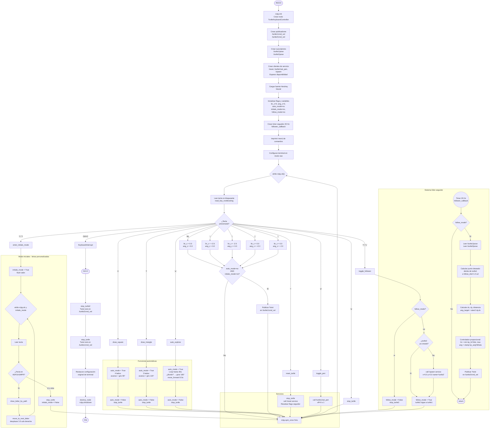

---

## Control manual de la tortuga

### Funcionamiento

El control manual de la tortuga se implementa en el nodo `TurtleKeyboardController`, que lee la entrada del teclado de forma no bloqueante y publica mensajes `geometry_msgs/msg/Twist` en el tópico `/turtle1/cmd_vel`. Cada flecha direccional tiene una acción específica: la flecha hacia arriba para avanzar, la flecha hacia abajo para retroceder, la flecha hacia la izquierda para girar a la izquierda y la flecha hacia la derecha para girar a la derecha.

### Metodología

#### 1. Creación del espacio de trabajo

Siguiendo la estructura estándar definida en la [Guía 03 - Intro Turtlesim](https://github.com/labsir-un/03_Rob_2026_I_ROS2_Jazzy_Turtlesim.git), se creó el espacio de trabajo `my_turtle_controller` con la siguiente jerarquía de directorios:

```
my_turtle_controller/
├── src/
│   └── my_turtle_controller/
│       ├── package.xml
│       ├── setup.py
│       ├── setup.cfg
│       ├── resource/
│       │   └── my_turtle_controller
│       └── my_turtle_controller/
│           ├── __init__.py
│           └── move_turtle.py
```

El paquete `my_turtle_controller` se configuró con el tipo de compilación `ament_python`, propio de los paquetes Python en ROS 2. El archivo `package.xml` declara las dependencias ejecutables necesarias: `rclpy` (biblioteca cliente de ROS 2 para Python), `geometry_msgs` (que contiene el tipo de mensaje `Twist`) y `turtlesim`. El archivo `setup.py` define el punto de entrada (*entry point*) `move_turtle`, que vincula el ejecutable `ros2 run` con la función `main` del módulo `move_turtle.py`.

#### 2. Implementación del nodo `TurtleKeyboardController`

El nodo se implementó en el archivo `move_turtle.py` siguiendo el patrón canónico de nodos ROS 2 en Python establecido en las guías de referencia. La clase `TurtleKeyboardController` hereda de `rclpy.node.Node` y contiene los siguientes elementos:

**Constructor (`__init__`):** Se inicializa el nodo con el nombre `turtle_keyboard_controller`. Se crea un publicador asociado al tópico `/turtle1/cmd_vel` con una cola de calidad de servicio (QoS) de profundidad 10. Se almacena la configuración actual del terminal mediante `termios.tcgetattr` para poder restaurarla al finalizar la ejecución. Se definen las velocidades lineal (`linear_speed = 2.0`) y angular (`angular_speed = 1.5`) que se aplicarán al presionar las teclas de dirección. Finalmente, se inicializan los atributos `lin_x` y `ang_z` en cero, de modo que la tortuga permanezca detenida hasta que se presione una tecla.

**Método `get_key`:** Implementa la lectura de teclado de forma no bloqueante utilizando las bibliotecas estándar `sys`, `select`, `termios` y `tty`. El método coloca el terminal en modo raw (`tty.setraw`) para capturar las secuencias de escape correspondientes a las flechas del teclado. Mediante `select.select` se verifica si hay datos disponibles en la entrada estándar con un tiempo de espera de 10 milisegundos. Si se detecta una tecla, se evalúa el primer carácter: si es `\x1b` (escape), se leen los dos caracteres siguientes para distinguir entre las flechas arriba (`[A`), abajo (`[B`), derecha (`[C`) e izquierda (`[D`). Al finalizar, se restaura la configuración original del terminal.

**Método `run`:** Constituye el bucle principal del nodo. Mientras `rclpy.ok()` sea verdadero, el método lee una tecla mediante `get_key` y, según el valor retornado, actualiza los atributos `lin_x` y `ang_z` conforme a la siguiente correspondencia:

| Tecla | Velocidad lineal (`lin_x`) | Velocidad angular (`ang_z`) | Acción |
|-------|---------------------------|----------------------------|--------|
| ↑ | +2.0 | 0.0 | Avanzar hacia adelante |
| ↓ | -2.0 | 0.0 | Retroceder |
| ← | 0.0 | +1.5 | Girar a la izquierda |
| → | 0.0 | -1.5 | Girar a la derecha |
| Ninguna | 0.0 | 0.0 | Detenerse |

A continuación, se construye un mensaje `Twist` con los valores actualizados y se publica en el tópico `/turtle1/cmd_vel`. Se invoca `rclpy.spin_once` para permitir que ROS 2 procese eventos pendientes sin bloquear el bucle. El método incluye manejo de la excepción `KeyboardInterrupt` para una finalización ordenada y, en el bloque `finally`, restaura la configuración del terminal y publica un mensaje de velocidad cero para asegurar que la tortuga se detenga.

#### 3. Compilación y ejecución

El espacio de trabajo se compiló utilizando la herramienta `colcon` con la bandera `--symlink-install`, que establece enlaces simbólicos hacia los archivos fuente y facilita el desarrollo iterativo:

```bash
cd ~/my_turtle_controller
colcon build --symlink-install
```

Una vez compilado, se inicializó el entorno de ROS 2 y se ejecutó el nodo `turtlesim_node` en una terminal:

```bash
ros2 run turtlesim turtlesim_node
```

En una segunda terminal, se cargaron los entornos de ROS 2 y del workspace, y se lanzó el nodo de control:

```bash
source /opt/ros/jazzy/setup.bash
source ~/my_turtle_controller/install/setup.bash
ros2 run my_turtle_controller move_turtle
```

### Resultados

Al ejecutar el nodo `move_turtle`, la terminal de control muestra un mensaje informativo con las instrucciones de uso. La tortuga responde a las teclas direccionales de la siguiente manera:

- Al presionar la flecha hacia arriba, la tortuga se desplaza hacia adelante siguiendo una trayectoria lineal en la dirección de su orientación actual.
- Al presionar la flecha hacia abajo, la tortuga retrocede en línea recta.
- Al presionar la flecha hacia la izquierda, la tortuga rota sobre su propio eje en sentido antihorario.
- Al presionar la flecha hacia la derecha, la tortuga rota en sentido horario.
- Cuando ninguna tecla se encuentra presionada, la tortuga se detiene por completo, publicándose un mensaje con velocidad lineal y angular igual a cero.

<div align="center">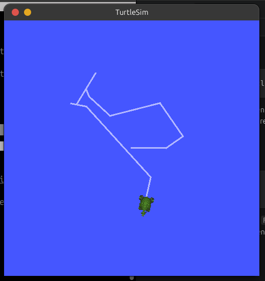</div>

<div align="center">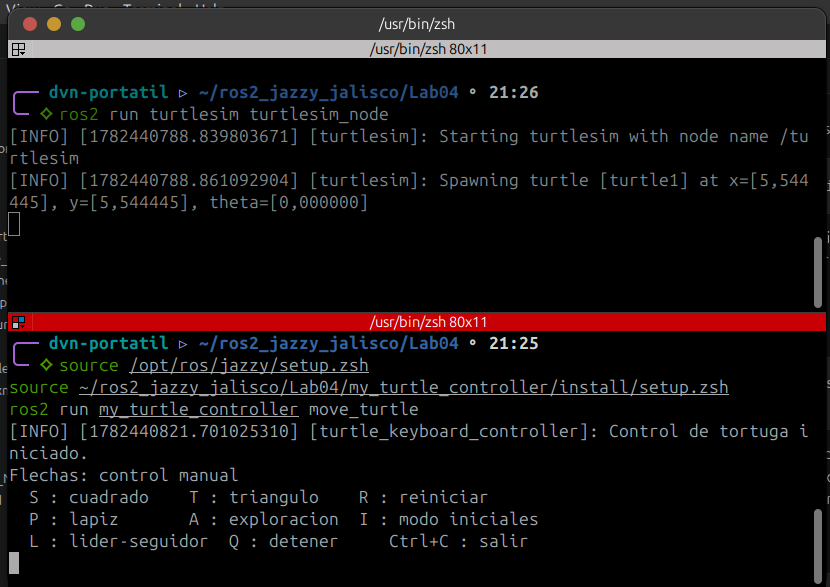</div>

### Arquitectura ROS 2 involucrada

**Nodos:** Se emplean dos nodos: `turtlesim` (el simulador, que actúa como suscriptor) y `turtle_keyboard_controller` (el nodo implementado, que actúa como publicador). Cada nodo constituye una unidad de ejecución independiente dentro del grafo computacional de ROS 2.

**Tópicos:** La comunicación entre ambos nodos se realiza a través del tópico `/turtle1/cmd_vel`. Este tópico transporta mensajes de tipo `geometry_msgs/msg/Twist`, cuya estructura contiene dos campos vectoriales: `linear` (con componentes `x`, `y`, `z`) y `angular` (con componentes `x`, `y`, `z`). Para el control de la tortuga en el plano bidimensional de turtlesim, únicamente se utilizan las componentes `linear.x` (velocidad lineal hacia adelante o atrás) y `angular.z` (velocidad de rotación alrededor del eje vertical).

**Mensajes:** El tipo de mensaje `Twist` es parte del paquete estándar `geometry_msgs` y constituye la interfaz de datos compartida entre el publicador y el suscriptor. La definición completa del mensaje puede inspeccionarse mediante el comando `ros2 interface show geometry_msgs/msg/Twist`.

**Paradigma publicador-suscriptor:** La comunicación sigue el patrón publish/subscribe, donde el nodo `turtle_keyboard_controller` publica mensajes sin conocimiento del suscriptor, y el nodo `turtlesim` los recibe de forma asíncrona. Este desacoplamiento es una característica fundamental de la arquitectura de ROS 2.

### Comandos de verificación

Para inspeccionar la arquitectura generada, pueden emplearse los siguientes comandos de ROS 2 mientras el sistema se encuentra en ejecución:

```bash
ros2 node list
ros2 topic list
ros2 topic info /turtle1/cmd_vel
ros2 topic echo /turtle1/cmd_vel
```

<div align="center">
  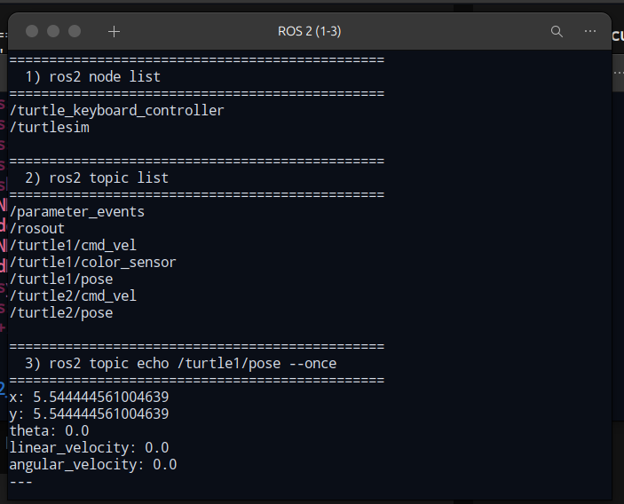
  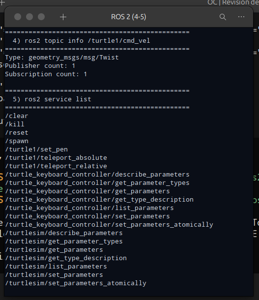
</div>

### Conclusiones

La implementación del control manual de la tortuga mediante un nodo propio en Python permitió comprender y aplicar los conceptos fundamentales de ROS 2: creación de nodos, publicación de mensajes en tópicos y el patrón de comunicación publicador-suscriptor. Se verificó que es posible sustituir el nodo `turtle_teleop_key` por una implementación propia que cumple con la misma funcionalidad, utilizando exclusivamente las bibliotecas estándar de Python (`termios`, `tty`, `select`) para la captura de teclado y la API de `rclpy` para la interacción con ROS 2.

La estructura modular del código, con métodos independientes para la inicialización, la lectura de teclado y el bucle de control, sienta las bases para la incorporación de las funcionalidades adicionales que se desarrollarán en las siguientes actividades del laboratorio, tales como las trayectorias automáticas, el dibujo de letras personalizadas y el sistema líder-seguidor con dos tortugas.

---

## Funciones automáticas

### Funcionamiento

Una vez implementado el control manual, el script `move_turtle.py` se extiende con funciones modulares que permiten ejecutar acciones especiales y trayectorias automáticas desde el teclado. Cada acción se implementa como un método independiente dentro de la clase `TurtleKeyboardController`, garantizando la separación de responsabilidades y la legibilidad del código. Las acciones incluyen el dibujo de figuras geométricas (cuadrado y triángulo equilátero), el reinicio de la posición de la tortuga, la activación y desactivación del lápiz de dibujo, una trayectoria automática con evasión de bordes y la detención completa del movimiento.

### Teclas de función

| Tecla | Acción |
|-------|--------|
| S | Dibujar cuadrado |
| T | Dibujar triángulo equilátero |
| R | Reiniciar posición |
| P | Activar/desactivar lápiz |
| A | Exploración automática (30s) |
| Q | Detener movimiento |

### Métodos implementados

**Método `stop_turtle`:** Publica un mensaje `Twist` con velocidad cero en ambos ejes, reinicia los atributos `lin_x` y `ang_z`, y desactiva el modo automático. Es invocado al presionar la tecla Q.

**Método `reset_turtle`:** Detiene la tortuga mediante `stop_turtle` y envía una solicitud vacía al servicio `/reset`. Al completarse, el simulador restablece la tortuga a su posición inicial (x = 5.54, y = 5.54, theta = 0.0) y limpia el rastro de dibujo. La llamada al servicio se realiza de forma asíncrona mediante `call_async`, y el método espera la respuesta con `rclpy.spin_until_future_complete`.

**Método `toggle_pen`:** Construye una solicitud al servicio `/turtle1/set_pen` con el campo `off` igual a 1 si el lápiz está activo (para desactivarlo) o 0 si está inactivo (para activarlo). Los campos de color (`r`, `g`, `b`) se mantienen en 255 (blanco) y el ancho en 3. Al completarse la llamada, se invierte el estado del atributo `pen_down` y se registra el cambio.

**Método `move_forward(speed, duration)`:** Método auxiliar que publica una velocidad lineal constante durante un tiempo determinado. Utiliza `self.get_clock().now()` para medir el tiempo transcurrido y `rclpy.spin_once` en cada iteración para permitir que ROS 2 procese eventos. Retorna `True` si el movimiento se completó o `False` si fue interrumpido (por `rclpy.ok()` falso o porque `auto_mode` se desactivó).

**Método `turn(angular_speed, duration)`:** Análogo a `move_forward`, pero publica una velocidad angular constante durante un tiempo determinado. Se utiliza para los giros en las esquinas de las figuras geométricas.

**Método `draw_square`:** Implementa el dibujo de un cuadrado. Define una longitud de lado de 2.0 unidades y calcula la duración del avance como `lado / velocidad_lineal` y la duración del giro de 90 grados como `(π/2) / velocidad_angular`. Ejecuta un ciclo de cuatro iteraciones, cada una compuesta por un avance y un giro a la izquierda. Entre cada lado se publica un mensaje informativo. La velocidad lineal se fijó en 2.0 unidades/s y la angular en 1.5 rad/s, lo que resulta en lados de 1.0 segundo y giros de aproximadamente 1.05 segundos. El cuadrado resultante tiene aproximadamente 2 unidades de lado.

**Método `draw_triangle`:** Implementa el dibujo de un triángulo equilátero. Calcula el ángulo de giro en cada vértice como `2π/3` radianes (120 grados). Ejecuta un ciclo de tres iteraciones, cada una con un avance y un giro a la izquierda, excepto la última iteración que solo avanza. La longitud de lado es de 2.0 unidades. El giro de 120 grados tiene una duración de aproximadamente 1.4 segundos a la velocidad angular configurada.

**Método `auto_explore`:** Implementa una trayectoria automática con evasión de bordes. La tortuga avanza hacia adelante en intervalos de 0.5 segundos. Después de cada avance, consulta el atributo `current_pose` (actualizado por el suscriptor a `/turtle1/pose`) y verifica si la posición se encuentra cerca de algún borde de la ventana de turtlesim (x < 1.0, x > 10.0, y < 1.0 o y > 10.0). Si se detecta la proximidad a un borde, la tortuga rota 180 grados (π radianes) y continúa avanzando en la dirección opuesta. La exploración tiene una duración máxima de 30 segundos para evitar que se ejecute indefinidamente.

#### Integración con el bucle principal

El método `run` se expandió para reconocer las nuevas teclas y redirigir la ejecución a los métodos correspondientes:

| Tecla | Método invocado | Acción |
|-------|-----------------|--------|
| S | `draw_square()` | Dibujar cuadrado |
| T | `draw_triangle()` | Dibujar triángulo equilátero |
| R | `reset_turtle()` | Reiniciar posición |
| P | `toggle_pen()` | Activar/desactivar lápiz |
| A | `auto_explore()` | Trayectoria automática |
| Q | `stop_turtle()` | Detener movimiento |

Cada método de trayectoria establece `self.auto_mode = True` al iniciar y lo restablece a `False` al finalizar. Los bucles internos de `move_forward` y `turn` verifican esta bandera en cada iteración, lo que permite que el nodo responda adecuadamente si se solicita una interrupción.

#### Aspectos de diseño para evitar el bloqueo permanente

Para cumplir con la restricción de que las funciones automáticas no bloqueen permanentemente la ejecución del nodo, se adoptaron las siguientes decisiones de diseño:

- Los bucles de movimiento utilizan `rclpy.spin_once(self, timeout_sec=0.01)` en lugar de `time.sleep()`. Esto permite que ROS 2 procese eventos (como llamadas a servicios o actualizaciones de tópicos) durante la ejecución de las trayectorias.
- Cada iteración del bucle verifica `rclpy.ok()` para detectar señales de terminación del sistema.
- El atributo `auto_mode` actúa como mecanismo de interrupción: si se desactiva externamente, los bucles internos detectan el cambio y finalizan anticipadamente.
- La trayectoria automática (`auto_explore`) incorpora un límite de tiempo máximo de 30 segundos para evitar que se ejecute indefinidamente.

### Resultados

Al ejecutar el nodo `move_turtle` y presionar las teclas de función, se observan los siguientes comportamientos:

- Al presionar la tecla S, la tortuga dibuja un cuadrado de aproximadamente 2 unidades de lado. La figura se completa en aproximadamente 8 segundos. El cuadrado se forma mediante cuatro segmentos rectos conectados por giros de 90 grados a la izquierda.

- Al presionar la tecla T, la tortuga dibuja un triángulo equilátero de aproximadamente 2 unidades de lado. La figura se completa en aproximadamente 7 segundos. El triángulo se forma mediante tres segmentos rectos conectados por giros de 120 grados a la izquierda.

- Al presionar la tecla R, la tortuga regresa instantáneamente a la posición inicial (x = 5.54, y = 5.54) y se elimina cualquier trazo previo en el simulador.

- Al presionar la tecla P por primera vez, el lápiz se desactiva y la tortuga se desplaza sin dejar trazo. Al presionarla nuevamente, el lápiz se reactiva y la tortuga vuelve a dibujar.

- Al presionar la tecla A, la tortuga comienza a explorar el entorno de forma autónoma. Cuando se aproxima a un borde de la ventana, rota 180 grados y continúa en la dirección opuesta. La exploración se detiene automáticamente después de 30 segundos.

- Al presionar la tecla Q, la tortuga se detiene de inmediato, independientemente de si se encuentra en modo manual o automático.

<div align="center">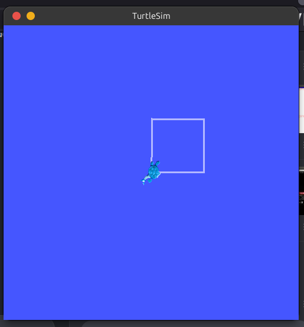</div>

<div align="center">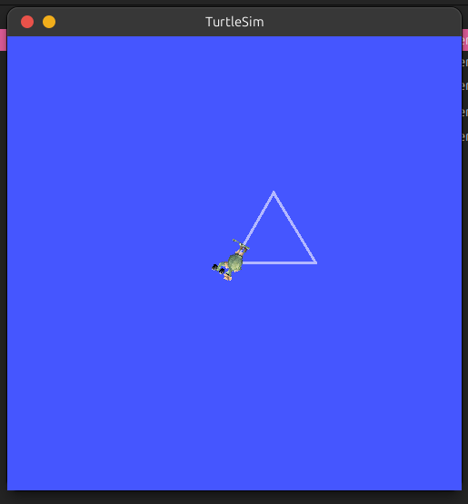</div>

<div align="center">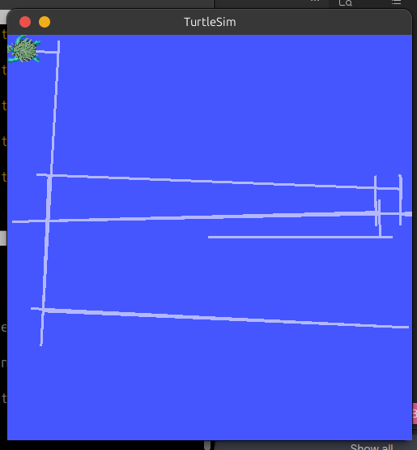</div>

### Análisis de la arquitectura ROS 2 involucrada

La extensión del nodo incorpora los siguientes elementos adicionales de la arquitectura de ROS 2:

**Suscripción a tópicos:** El nodo ahora no solo publica en `/turtle1/cmd_vel`, sino que también se suscribe a `/turtle1/pose`. Esta suscripción permite al nodo recibir información periódica sobre la posición y orientación de la tortuga, lo cual es esencial para la trayectoria automática con evasión de bordes. El tópico `/turtle1/pose` transporta mensajes de tipo `turtlesim/msg/Pose`, que contiene los campos `x`, `y`, `theta`, `linear_velocity` y `angular_velocity`.

**Servicios:** Se emplean dos servicios de ROS 2:

- `/reset` (tipo `std_srvs/srv/Empty`): Es invocado con una solicitud vacía para restablecer el simulador a su estado inicial. Sigue el modelo de comunicación request-response, típico de los servicios en ROS 2.

- `/turtle1/set_pen` (tipo `turtlesim/srv/SetPen`): Es invocado con una solicitud que especifica los componentes de color RGB, el ancho del trazo y el estado de activación (`off`). Permite controlar si la tortuga deja o no un rastro visual al desplazarse.

Ambos servicios se invocan de forma asíncrona mediante `call_async`, y el nodo espera la respuesta utilizando `rclpy.spin_until_future_complete`, que procesa eventos mientras aguarda la conclusión de la llamada.

**Modelo de ejecución no bloqueante:** A diferencia de un enfoque ingenuo que utilizaría `time.sleep()` para temporizar los movimientos, los métodos de trayectoria emplean `rclpy.spin_once` en sus bucles internos. Esto garantiza que el nodo continúe procesando eventos de ROS 2 (como llamadas a servicios, publicaciones y suscripciones) durante la ejecución de las trayectorias automáticas, evitando el bloqueo permanente de la ejecución.

### Comandos de verificación

Para verificar el funcionamiento de los servicios y tópicos involucrados, pueden emplearse los siguientes comandos mientras el sistema se encuentra en ejecución:

```bash
ros2 service list
ros2 service type /reset
ros2 service type /turtle1/set_pen
ros2 topic echo /turtle1/pose
ros2 topic info /turtle1/cmd_vel
ros2 topic info /turtle1/pose
```

### Conclusiones

La implementación de las acciones complementarias y trayectorias automáticas demostró la versatilidad del modelo de comunicación de ROS 2, combinando publicación, suscripción y servicios en un mismo nodo. El diseño modular, con métodos independientes para cada acción, facilita el mantenimiento y la extensión del código. Las decisiones de diseño orientadas a evitar el bloqueo permanente —uso de `rclpy.spin_once`, verificación de `rclpy.ok()` y banderas de interrupción— garantizan que el nodo se mantenga responsivo durante la ejecución de las trayectorias automáticas. La incorporación del servicio de reinicio y del control del lápiz ilustra el uso práctico del paradigma request-response en ROS 2, mientras que la suscripción al tópico de posición permite cerrar el lazo de control para la evasión de bordes.

---

## Dibujo de letras personalizadas

### Funcionamiento

El dibujo de letras personalizadas permite representar las iniciales de los integrantes del equipo mediante un motor de dibujo basado en fuentes vectoriales Hershey. Dado que algunas iniciales coinciden con las teclas asignadas a comandos existentes (R para reiniciar, P para lápiz, A para exploración automática), se implementó el *Modo Iniciales*, activado mediante la tecla I, que aísla las teclas de dibujo de letras del resto de comandos del sistema.

### Integrantes del equipo e iniciales

| Integrante | Iniciales |
|------------|-----------|
| Duvan Felipe Pacheco Rodriguez | D, F, P, R |
| Juan Andres Mora Henao | J, A, M, H |
| Andres Gustavo Pinilla Martinez | A, G, P, M |

Letras implementadas (conjunto único): **D, F, P, R, J, A, M, H, G**.

### Estrategia de resolución de conflictos: Modo Iniciales

Para evitar la colisión entre las teclas de iniciales y los comandos existentes (por ejemplo, R versus `reset_turtle`, P versus `toggle_pen`, A versus `auto_explore`), se implementó un modo de operación exclusivo. Al presionar la tecla I (mayúscula o minúscula), el nodo ingresa al *Modo Iniciales*, que se caracteriza por los siguientes aspectos:

- Se muestra un mensaje informativo en la terminal con la lista de teclas habilitadas y su correspondiente letra.
- El bucle principal deja de procesar los comandos regulares y se enfoca exclusivamente en la lectura de teclas de iniciales.
- Cada tecla presionada que corresponde a una inicial ejecuta el método `draw_letter_by_path`, que utiliza la fuente Hershey para trazar la letra, y al finalizar desplaza automáticamente la tortuga hacia la derecha mediante `move_to_next_letter`.
- Cualquier tecla que no corresponda a una inicial (incluyendo Escape y flechas) desactiva el modo y retorna el control al bucle principal. Al salir, se reimprime el menú principal para orientación del usuario.
- La tecla Q dentro del modo detiene la tortuga y desactiva el modo.

#### 1. Motor de dibujo basado en fuentes Hershey

A diferencia del enfoque tradicional de codificar manualmente cada letra como secuencias de trazos (lo que requeriría decenas de métodos independientes y sería propenso a errores de escalado y posicionamiento), se optó por utilizar las **fuentes vectoriales Hershey**, específicamente la variante `futural` (Futura Light). Las fuentes Hershey fueron diseñadas en la década de 1960 para plotters de pluma y representan cada carácter como un conjunto de **trazos únicos** (single-stroke), sin contornos interiores ni exteriores.

##### 1.1. Instalación de la biblioteca `hershey-fonts`

La biblioteca `hershey-fonts` (Hershey-Fonts 2.1.0) se instaló mediante `pip3`:

```bash
pip3 install --break-system-packages hershey-fonts
```

La biblioteca proporciona acceso a más de 30 fuentes vectoriales, incluyendo `futural` (Futura Light), `rowmans` (Roman Sans), `scriptc` (Script Cursive) y `cursive`. Para este laboratorio se seleccionó `futural` por su simplicidad: cada letra se compone del mínimo número de trazos necesario (por ejemplo, la letra A requiere solo 3 trazos: pata izquierda, pata derecha y barra transversal).

##### 1.2. Extracción de trayectorias: `get_letter_movements`

El método `get_letter_movements(char, height)` es el núcleo del motor de dibujo. Su funcionamiento es el siguiente:

1. **Obtención de trazos:** Llama a `self.hershey.strokes_for_text(char)` para obtener la lista de trazos (stroke) que componen la letra. Cada trazo es una secuencia de puntos (x, y) en coordenadas de la fuente.

2. **Cálculo de la caja delimitadora:** Recolecta todos los puntos de todos los trazos y calcula los valores mínimo y máximo de x e y. La altura de la fuente en coordenadas Hershey es `max_y - min_y`, que para la fuente `futural` es siempre 21 unidades.

3. **Escalado:** Calcula un factor de escala `scale = height / font_height`. Con `height = 3.0` unidades de turtlesim, el factor de escala es aproximadamente `3.0 / 21 = 0.143`.

4. **Centrado:** Calcula el centro geométrico de la letra: `cx = (min_x + max_x) / 2`, `cy = (min_y + max_y) / 2`. Todos los puntos se expresan como desplazamientos relativos a este centro.

5. **Inversión del eje Y (corrección crítica):** La fuente Hershey utiliza la convención de coordenadas de pantalla, donde **Y positivo apunta hacia abajo** (la parte superior de la letra tiene el valor de Y más negativo, `y = -12`; la parte inferior tiene el valor más positivo, `y = +9`). Turtlesim, por el contrario, utiliza la convención cartesiana estándar donde **Y positivo apunta hacia arriba**. Para corregir esta discrepancia, se niega el desplazamiento vertical:

   ```python
   rx = (fx - cx) * scale        # desplazamiento horizontal
   ry = -(fy - cy) * scale       # desplazamiento vertical invertido
   ```

   Sin esta negación, todas las letras se dibujarían reflejadas verticalmente (invertidas).

6. **Asignación del estado del lápiz:** El primer punto de cada trazo se marca con `pen_on = False` (desplazamiento con lápiz arriba hacia el inicio del trazo). Los puntos siguientes se marcan con `pen_on = True` (dibujo con lápiz abajo).

El método retorna una lista de tuplas `(rx, ry, pen_on)` donde `rx` y `ry` son desplazamientos relativos al centro de la letra, ya escalados y centrados, listos para ser ejecutados por `move_to`.

##### 1.3. Ejemplo de datos de la fuente: Letra A en `futural`

```
Stroke 0: (9, -12) → (1, 9)       [Pata izquierda: de arriba a abajo-izquierda]
Stroke 1: (9, -12) → (17, 9)      [Pata derecha: de arriba a abajo-derecha]
Stroke 2: (4, 2) → (14, 2)        [Barra transversal: de izquierda a derecha]
```

La coordenada `y = -12` corresponde a la parte superior de la letra (tope), mientras que `y = +9` corresponde a la parte inferior (fondo). Después del centrado, escalado e inversión del eje Y, la letra A se traduce a los siguientes movimientos en turtlesim (con centro en `start_pose`):

```
UP  : (start.x + 0.00, start.y + 1.50)   [Tope central]
DOWN: (start.x - 1.14, start.y - 1.50)   [Fondo izquierdo]
UP  : (start.x + 0.00, start.y + 1.50)   [Tope central]
DOWN: (start.x + 1.14, start.y - 1.50)   [Fondo derecho]
UP  : (start.x - 0.71, start.y + 0.50)   [Barra, extremo izquierdo]
DOWN: (start.x + 0.71, start.y + 0.50)   [Barra, extremo derecho]
```

#### 2. Controlador de lazo cerrado: `move_to`

El método `move_to(x, y, pen_on)` es el encargado de desplazar la tortuga desde su posición actual hasta las coordenadas absolutas `(x, y)`, con control preciso del lápiz. Su implementación sigue una arquitectura de dos fases:

##### 2.1. Fase de orientación

1. Se calcula la distancia al objetivo: `dist = sqrt((x-pose.x)² + (y-pose.y)²)`.
2. Si `dist < 0.002` unidades, se considera que la tortuga ya está en el destino y se retorna inmediatamente.
3. Se calcula el ángulo hacia el objetivo: `target_theta = atan2(dy, dx)`.
4. Se levanta el lápiz (`set_pen_state(False)`) para evitar marcas durante la rotación.
5. Se invoca `turn_to(target_theta)` que gira la tortuga con tolerancia de **0.005 radianes** (~0.29 grados).

##### 2.2. Fase de avance con corrección angular continua

Una vez orientada, se inicia un bucle de hasta 500 iteraciones (~5 segundos) que combina:

- **Velocidad lineal proporcional:** `lin_speed = min(1.0 × rdist, 2.5)`. Sin velocidad mínima artificial, lo que permite que la tortuga se aproxime suavemente hasta distancias de 0.002 unidades sin sobrepasar el objetivo.

- **Corrección angular continua:** En cada iteración, se recalcula la dirección hacia el destino desde la posición actual: `cur_target_theta = atan2(dy, dx)`. Esto es fundamental porque la dirección hacia el objetivo cambia a medida que la tortuga avanza. El error angular se calcula como `dtheta = cur_target_theta - pose.theta` y se corrige con ganancia `kp_ang = 2.0`.

- **Tolerancia de convergencia:** El bucle termina cuando `rdist < 0.002` unidades, garantizando que dos trazos que deben encontrarse en el mismo punto queden con un error menor a 2 milésimas de unidad (~0.2 píxeles en turtlesim).

- **Interrupción segura:** Cada iteración verifica la tecla Q (detener) y Ctrl+C (salir), además de la bandera `auto_mode`.

#### 3. Dibujo de letras: `draw_letter_by_path`

El método `draw_letter_by_path(char, height=3.0)` coordina el proceso completo de dibujo:

1. Activa `auto_mode`.
2. Obtiene los movimientos mediante `get_letter_movements(char, height)`.
3. Captura la posición actual como `start_pose`.
4. Itera sobre cada movimiento `(rx, ry, pen_on)`:
   - Calcula la posición absoluta: `target = (start_pose.x + rx, start_pose.y + ry)`.
   - Ejecuta `move_to(target, pen_on)`.
5. Al finalizar, detiene la tortuga y desactiva `auto_mode`.

#### 4. Espaciado entre letras

El método `move_to_next_letter` desplaza la tortuga 3.5 unidades hacia la derecha con el lápiz desactivado, dejando espacio suficiente entre letras consecutivas.

#### 5. Integración en el bucle principal

En el método `run`, se agregó la detección de la tecla I. Al presionarla, se invoca `enter_initials_mode()`, que ejecuta su propio bucle interno de lectura de teclas. Mientras este modo está activo, el bucle principal no procesa comandos (gracias a la bandera `initials_mode`). Al salir del modo, se reimprime el menú principal y el control retorna al bucle principal.

| Tecla | Método invocado | Acción |
|-------|-----------------|--------|
| I | `enter_initials_mode()` | Activar modo iniciales |
| A, D, F, G, H, J, M, P, R | `draw_letter_by_path(key)` | Dibujar letra mediante fuente Hershey |
| Q | `stop_turtle()` + salir | Detener y salir del modo |

### Resultados

Al presionar la tecla I, la terminal muestra el mensaje de activación del Modo Iniciales. A continuación, al presionar cada tecla de inicial, la tortuga dibuja la letra correspondiente en el simulador y se desplaza automáticamente hacia la derecha para preparar el espacio para la siguiente letra.

Cada letra se dibuja en aproximadamente 1 a 3 segundos. Las letras que requieren múltiples trazos (como D con 14 puntos de curva, o M con 4 trazos) se dibujan correctamente gracias al control del lápiz mediante el servicio `/turtle1/set_pen`, que permite interrumpir y reanudar el trazo sin dejar marcas indeseadas entre segmentos.

La corrección angular continua en `move_to` asegura que los trazos curvos (como el cuerpo de la letra D o G) se tracen suavemente, sin desviaciones laterales acumulativas. La tolerancia de 0.002 unidades garantiza que los puntos de unión entre trazos independientes (por ejemplo, las dos diagonales de la M en el vértice inferior, o el cierre de la D entre la curva y la línea vertical) converjan visualmente sin huecos perceptibles.

<div align="center">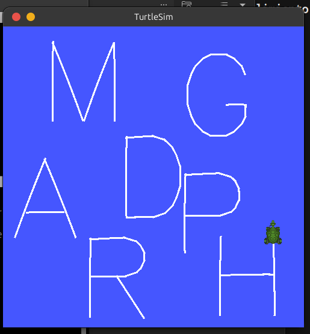</div>

<div align="center">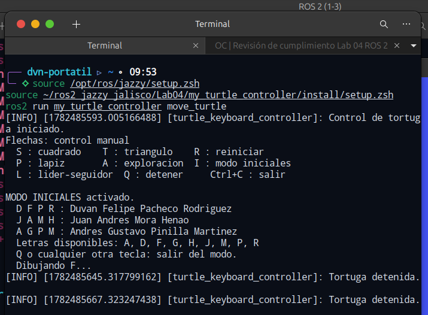</div>

### Análisis de la arquitectura ROS 2 involucrada

El dibujo de letras personalizadas introduce los siguientes aspectos relevantes de la arquitectura de ROS 2:

**Uso intensivo del servicio `/turtle1/set_pen`:** Cada cambio de estado del lápiz (entre trazos de una misma letra) requiere una llamada al servicio. Las llamadas se realizan de forma asíncrona mediante `call_async` y se espera su finalización con `spin_until_future_complete`, lo que permite que el nodo continúe procesando eventos mientras aguarda la respuesta del servicio.

**Publicación de velocidad con control en lazo cerrado:** A diferencia del control manual (lazo abierto), el método `move_to` utiliza realimentación de posición a través del tópico `/turtle1/pose` para cerrar el lazo de control. Cada iteración del bucle de avance lee la pose actual y ajusta las velocidades lineal y angular de forma proporcional al error restante.

**Suscripción a `/turtle1/pose`:** El atributo `current_pose` se actualiza continuamente mediante el suscriptor a `/turtle1/pose`, proporcionando la información necesaria para el control de lazo cerrado.

**Separación de modos de operación:** La bandera `initials_mode` y el bucle interno de `enter_initials_mode` ejemplifican cómo un nodo de ROS 2 puede alternar entre diferentes modos de operación sin perder la capacidad de procesar eventos, gracias al uso de `rclpy.spin_once` dentro del bucle del modo.

### Conclusiones

La implementación del dibujo de letras personalizadas mediante fuentes Hershey constituye un enfoque novedoso y eficiente que resuelve varios problemas inherentes al método tradicional de codificación manual de trazos:

1. **Abstracción:** Un único método (`draw_letter_by_path`) es capaz de dibujar cualquier carácter de la fuente, eliminando la necesidad de codificar individualmente cada letra.

2. **Precisión:** Las fuentes Hershey proporcionan coordenadas precisas para cada trazo, garantizando que la proporción y forma de las letras sean tipográficamente correctas.

3. **Mantenibilidad:** Agregar una nueva letra solo requiere que esté disponible en la fuente; no es necesario escribir código adicional.

4. **Extensibilidad:** El mismo motor puede utilizarse para dibujar palabras completas, números o símbolos con mínimas modificaciones.

El controlador de lazo cerrado con corrección angular continua y tolerancia de 0.002 unidades demostró ser fundamental para la calidad del dibujo, permitiendo que trazos independientes que deben converger en un mismo punto lo hagan sin huecos perceptibles. La corrección del eje Y (inversión vertical) fue un hallazgo crítico durante el desarrollo, resultante de la discrepancia entre la convención de coordenadas de las fuentes Hershey (Y positivo hacia abajo) y el sistema cartesiano de turtlesim (Y positivo hacia arriba).

---

## Sistema líder-seguidor con dos tortugas

### Funcionamiento

El sistema líder-seguidor permite que una segunda tortuga (`turtle2`) siga automáticamente la posición de la tortuga principal (`turtle1`), manteniendo una distancia de seguridad y aproximándose progresivamente. `turtle1` se controla mediante el teclado y ejecuta todas las funciones manuales y automáticas descritas anteriormente.

### Arquitectura del sistema

El sistema líder-seguidor se implementó dentro del mismo nodo `TurtleKeyboardController`, aprovechando los mecanismos de ROS 2 para la comunicación con múltiples tópicos y servicios. La arquitectura consta de los siguientes elementos:

**Servicio `/spawn`:** Se agregó un cliente de servicio (`self.cli_spawn`) de tipo `turtlesim/srv/Spawn` para crear la segunda tortuga. El servicio recibe las coordenadas `(x, y)`, la orientación inicial `theta` y el nombre de la nueva tortuga. Para este laboratorio, `turtle2` se crea en la posición `(5.5, 2.0, 0.0)`.

**Suscripción a `/turtle2/pose`:** Se creó un suscriptor al tópico `/turtle2/pose` que actualiza el atributo `self.turtle2_pose` con la posición de la tortuga seguidora.

**Publicador en `/turtle2/cmd_vel`:** Se creó un publicador de mensajes `Twist` en el tópico `/turtle2/cmd_vel` para enviar comandos de velocidad a `turtle2`.

**Temporizador de seguimiento:** Se creó un timer de ROS 2 con período de 0.05 segundos (20 Hz) que ejecuta el método `follower_callback`. Este temporizador funciona de forma independiente al bucle principal, permitiendo que el seguimiento ocurra en paralelo con el control manual de `turtle1`.

#### Controlador de seguimiento

El método `follower_callback` implementa un controlador proporcional (P) que calcula las velocidades lineal y angular de `turtle2` en cada iteración:

1. **Cálculo del vector relativo:**
   ```python
   dx = turtle1.x - turtle2.x
   dy = turtle1.y - turtle2.y
   dist = sqrt(dx² + dy²)
   ```

2. **Distancia de seguimiento:** Se define una distancia mínima de `follow_dist = 1.0` unidad. Si `dist < follow_dist`, `turtle2` se detiene para evitar superponerse a `turtle1`.

3. **Orientación deseada:** La dirección hacia `turtle1` se calcula como `target_theta = atan2(dy, dx)`. El error angular se normaliza al rango `[-π, π]`.

4. **Velocidad lineal:** Proporcional a la distancia restante más allá de `follow_dist`:
   ```python
   lin_speed = min(kp_lin × (dist - follow_dist), max_lin_speed)
   ```
   con `kp_lin = 1.0` y `max_lin_speed = 2.0`.

5. **Velocidad angular:** Proporcional al error angular:
   ```python
   ang_speed = clamp(kp_ang × dtheta, -max_ang, +max_ang)
   ```
   con `kp_ang = 2.0` y `max_ang = 3.0`.

#### Modo de operación

Para no interferir con las operaciones existentes, el sistema líder-seguidor se activa y desactiva mediante la tecla **L** (toggle). Al presionar L por primera vez:

1. Se invoca el servicio `/spawn` para crear `turtle2` en `(5.5, 2.0, 0.0)`.
2. El flag `follow_mode` se establece en `True`.
3. El temporizador `follower_callback` comienza a publicar comandos de velocidad para `turtle2`.
4. Se muestra un mensaje informativo en la terminal.

Al presionar L nuevamente:

1. Se publica un mensaje `Twist` con velocidad cero en `/turtle2/cmd_vel` para detener `turtle2`.
2. El flag `follow_mode` se establece en `False`.
3. El temporizador deja de publicar comandos.

El temporizador está siempre activo (fue creado en `__init__`), pero el método `follower_callback` retorna inmediatamente si `follow_mode` es `False`, sin publicar ningún comando. Esto evita la sobrecarga de destruir y recrear el temporizador.

#### Integración en el bucle principal

La tecla L se agregó al bucle principal del método `run`:

| Tecla | Método invocado | Acción |
|-------|-----------------|--------|
| L | `toggle_follower()` | Activar/desactivar modo líder-seguidor |

Al presionar L, se invoca `toggle_follower()`, que gestiona la creación de `turtle2`, la activación del modo y la publicación de mensajes de control. El temporizador `follower_callback` ejecuta el controlador de seguimiento en paralelo con el bucle principal, sin bloquearlo.

#### Manejo de finalización

En el bloque `finally` del método `run`, se publica un mensaje de velocidad cero para `turtle2` mediante `stop_turtle2()`, asegurando que la tortuga seguidora se detenga al finalizar el programa.

### Resultados

Al presionar la tecla L, se crea `turtle2` en la parte inferior de la ventana de turtlesim. La tortuga seguidora comienza a desplazarse hacia `turtle1`, orientándose hacia ella y reduciendo la distancia hasta alcanzar aproximadamente 1 unidad de separación.

Cuando `turtle1` se desplaza mediante las flechas del teclado o mediante las trayectorias automáticas (S, T, A), `turtle2` la sigue manteniendo la distancia de seguridad. El seguimiento es fluido gracias a la frecuencia de 20 Hz del temporizador y a la naturaleza proporcional del controlador.

Si `turtle1` se detiene, `turtle2` también se detiene al alcanzar la distancia de 1 unidad. Si `turtle1` se aleja, `turtle2` acelera proporcionalmente hasta un máximo de 2.0 unidades/s.

<div align="center">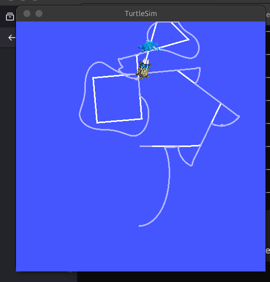</div>

<div align="center">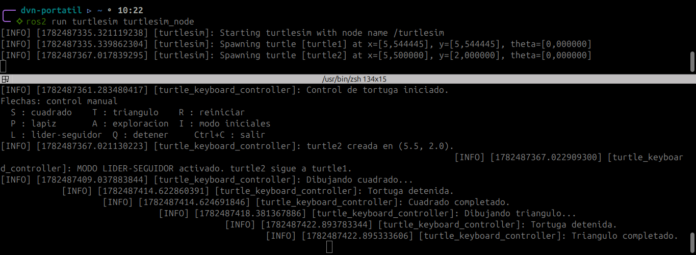</div>

### Análisis de la arquitectura ROS 2 involucrada

El sistema líder-seguidor introduce los siguientes elementos de la arquitectura de ROS 2:

**Múltiples publicadores en un mismo nodo:** El nodo `TurtleKeyboardController` ahora publica en dos tópicos diferentes: `/turtle1/cmd_vel` (control manual) y `/turtle2/cmd_vel` (control del seguidor). Ambos publicadores conviven en el mismo nodo, demostrando que un nodo de ROS 2 puede interactuar con múltiples entidades del grafo computacional.

**Múltiples suscripciones:** El nodo se suscribe a los tópicos de posición de ambas tortugas (`/turtle1/pose` y `/turtle2/pose`), manteniendo actualizados los atributos `current_pose` y `turtle2_pose` para su uso en los controladores.

**Servicio `/spawn`:** La creación de `turtle2` se realiza mediante el servicio `/spawn` de turtlesim, que sigue el paradigma request-response. La solicitud incluye la posición inicial, la orientación y el nombre de la nueva tortuga; la respuesta confirma el nombre asignado.

**Temporizadores como mecanismo de control periódico:** El timer de ROS 2 permite ejecutar el controlador de seguimiento a una frecuencia fija (20 Hz) sin bloquear el bucle principal. Este es un patrón de diseño fundamental en ROS 2 para tareas de control que deben ejecutarse periódicamente y en paralelo con otras operaciones.

**Paralelismo dentro de un nodo:** El temporizador y el bucle principal comparten el mismo hilo de ejecución de ROS 2, pero `rclpy.spin_once` en el bucle principal y el temporizador cooperan mediante el modelo de concurrencia cooperativa de `rclpy`. Ambos se ejecutan sin bloquearse mutuamente, gracias a que `rclpy.spin_once` procesa eventos pendientes (incluyendo callbacks de temporizadores) y retorna el control al bucle principal.

### Conclusiones

La implementación del sistema líder-seguidor demostró la capacidad de ROS 2 para manejar múltiples entidades robóticas desde un solo nodo, combinando publicación, suscripción, servicios y temporizadores en una arquitectura cohesiva.

El uso de un temporizador para el control de seguimiento resultó ser una solución elegante y no intrusiva que permite que el seguidor opere en paralelo con el control manual de la tortuga líder, sin necesidad de hilos adicionales ni mecanismos complejos de sincronización.

El controlador proporcional, a pesar de su simplicidad, demostró ser suficiente para un seguimiento suave y estable en el entorno simulado de turtlesim. La distancia de seguridad de 1 unidad evita colisiones entre las tortugas, mientras que la ganancia proporcional asegura una respuesta rápida sin oscilaciones apreciables.

---

## Descripción de nodos, tópicos y servicios utilizados

A continuación se describen los nodos, tópicos y servicios que conforman la arquitectura de comunicación del laboratorio. Cada sección incluye el comando de inspección de ROS 2 utilizado para verificarlo, su salida y una explicación de la información que permite observar.

### `ros2 node list`

```
/turtlesim
/turtle_keyboard_controller
```

Este comando lista todos los nodos ROS 2 actualmente activos en el grafo de comunicación. En la salida se observan dos nodos:
- `/turtlesim`: El nodo del simulador proporcionado por el paquete `turtlesim`, que ejecuta la ventana gráfica y la simulación física de las tortugas. Publica la pose de cada tortuga y recibe comandos de velocidad.
- `/turtle_keyboard_controller`: El nodo propio implementado en `move_turtle.py`. Este nodo es responsable de leer el teclado, interpretar las teclas presionadas y generar los comandos de velocidad correspondientes.

La coexistencia de ambos nodos en el grafo confirma que la comunicación ocurre de forma desacoplada: cada nodo cumple una función específica y se comunican exclusivamente a través de tópicos y servicios.

### `ros2 topic list`

```
/parameter_events
/rosout
/turtle1/cmd_vel
/turtle1/color_sensor
/turtle1/pose
/turtle2/cmd_vel
/turtle2/pose
```

Este comando enumera todos los tópicos disponibles en el sistema. Los tópicos de interés para el laboratorio son:
- `/turtle1/cmd_vel`: Tópico de tipo `geometry_msgs/msg/Twist` sobre el cual el nodo `turtle_keyboard_controller` publica comandos de velocidad lineal y angular para turtle1.
- `/turtle1/pose`: Tópico de tipo `turtlesim/msg/Pose` sobre el cual el nodo `/turtlesim` publica la pose (x, y, theta) de turtle1. Nuestro nodo se suscribe a este tópico para conocer la posición actual.
- `/turtle2/cmd_vel`: Tópico de tipo `Twist` para comandar la velocidad de turtle2. Es publicado por el seguidor desde el mismo nodo `turtle_keyboard_controller`.
- `/turtle2/pose`: Tópico de tipo `Pose` que publica la pose de turtle2. Nuestro nodo se suscribe para realimentar el controlador del seguidor.

Los tópicos `/parameter_events` y `/rosout` son tópicos internos de ROS 2 utilizados para la gestión de parámetros y el sistema de logging, respectivamente.

### `ros2 topic echo /turtle1/pose`

```
x: 5.544444561004639
y: 5.544444561004639
theta: 0.0
linear_velocity: 0.0
angular_velocity: 0.0
---
```

Este comando se suscribe al tópico `/turtle1/pose` y muestra en tiempo real los mensajes `Pose` que publica el nodo `/turtlesim`. Cada mensaje contiene la posición (x, y), orientación (theta) y las velocidades lineal y angular instantáneas de turtle1. Esta información es fundamental para el control en lazo cerrado: las funciones `move_to`, `turn_to` y `move_relative` utilizan estos datos para calcular el error de posición y orientación, y así generar comandos de velocidad proporcionales que corrigen la trayectoria de la tortuga.

### `ros2 topic info /turtle1/cmd_vel`

```
Type: geometry_msgs/msg/Twist
Publisher count: 1
Subscription count: 1
```

Este comando muestra información detallada del tópico `/turtle1/cmd_vel`: su tipo de mensaje (`geometry_msgs/msg/Twist`), la cantidad de publicadores (1: nuestro nodo `turtle_keyboard_controller`) y la cantidad de suscriptores (1: el nodo `/turtlesim`). La relación 1:1 entre publicador y suscriptor confirma la arquitectura punto a punto esperada: un nodo genera comandos de velocidad y el otro los consume para mover la tortuga.

### `ros2 service list`

```
/clear
/kill
/reset
/spawn
/turtle1/set_pen
/turtle1/teleport_absolute
/turtle1/teleport_relative
/turtlesim/describe_parameters
/turtlesim/get_parameter_types
/turtlesim/get_parameters
/turtlesim/get_type_description
/turtlesim/list_parameters
/turtlesim/set_parameters
/turtlesim/set_parameters_atomically
```

Este comando lista todos los servicios ROS 2 disponibles en el sistema. Los servicios utilizados por nuestro nodo `turtle_keyboard_controller` son:
- `/reset` (tipo `std_srvs/srv/Empty`): Se invoca desde `reset_turtle()` para reiniciar la simulación, limpiando el rastro de dibujo y reposicionando turtle1 en el centro.
- `/spawn` (tipo `turtlesim/srv/Spawn`): Se invoca desde `spawn_turtle2()` para crear una nueva tortuga (turtle2) en una posición específica.
- `/turtle1/set_pen` (tipo `turtlesim/srv/SetPen`): Se invoca desde `set_pen_state()` para activar o desactivar el lápiz de turtle1, controlando si dibuja o no durante el movimiento.

### `rqt_graph`

<div align="center">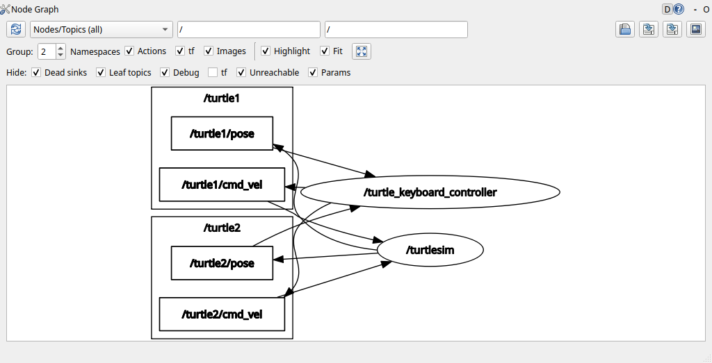</div>

El comando `rqt_graph` genera un grafo visual de la arquitectura ROS 2, mostrando los nodos como óvalos y los tópicos como rectángulos, con flechas que indican la dirección del flujo de datos (publicador → tópico → suscriptor). Este grafo permite verificar visualmente que:

- El nodo `/turtle_keyboard_controller` publica en los tópicos `/turtle1/cmd_vel` y `/turtle2/cmd_vel`.
- El nodo `/turtlesim` publica en los tópicos `/turtle1/pose` y `/turtle2/pose`.
- El nodo `/turtle_keyboard_controller` está suscrito a los tópicos `/turtle1/pose` y `/turtle2/pose`.

Esta topología refleja el patrón publicador-suscriptor de ROS 2, donde los nodos se comunican de forma anónima y desacoplada a través de tópicos con nombres bien definidos.

---

## Evidencias de ejecución

A continuación se presentan las evidencias que verifican la correcta ejecución del programa en ROS 2 Jazzy Jalisco.

### Movimiento manual de la tortuga

<div align="center"></div>

*La tortuga se desplaza por la ventana de turtlesim utilizando las flechas direccionales del teclado (↑ avanza, ↓ retrocede, ← gira a la izquierda, → gira a la derecha). La imagen muestra la trayectoria dibujada por la tortuga como resultado del movimiento manual, evidenciando que el lápiz está activo y que los comandos `Twist` se publican correctamente en el tópico `/turtle1/cmd_vel`.*

### Dibujo de figuras geométricas

<div align="center"></div>

*Al presionar la tecla `S`, la tortuga ejecuta la función `draw_square()` que dibuja un cuadrado de lado 2.0 unidades. La imagen muestra el cuadrado completo con sus cuatro lados visibles y ángulos rectos bien definidos.*

<div align="center"></div>

*Al presionar la tecla `T`, la tortuga ejecuta la función `draw_triangle()` que dibuja un triángulo equilátero de lado 2.0 unidades. La imagen muestra el triángulo con sus tres lados visibles y ángulos de 60° bien definidos.*

<div align="center"></div>

*Al presionar la tecla `A`, la tortuga ejecuta la función `auto_explore()` que realiza un desplazamiento aleatorio con detección de bordes durante un máximo de 30 segundos. La imagen muestra una trayectoria irregular con cambios de dirección al aproximarse a los bordes de la ventana (x < 1.0, x > 10.0, y < 1.0, y > 10.0).*

### Dibujo de letras personalizadas

<div align="center"></div>

*Al presionar la tecla `I` se activa el modo iniciales. Luego, al presionar cualquiera de las teclas `A`, `D`, `F`, `G`, `H`, `J`, `M`, `P` o `R`, la tortuga dibuja la letra correspondiente utilizando la fuente vectorial Hershey (futural) de un solo trazo. La imagen muestra una o más letras dibujadas con trazos continuos y bien formados, con una separación de 3.5 unidades entre letras.*

### Funcionamiento del sistema líder-seguidor

<div align="center"></div>

*Al presionar la tecla `L` se activa el modo líder-seguidor. Se crea turtle2 en la posición (5.5, 2.0) mediante el servicio `/spawn`. La imagen muestra ambas tortugas en la ventana, con turtle2 manteniendo una distancia de aproximadamente 1.0 unidad detrás de turtle1 mientras esta se desplaza. La trayectoria de turtle2 evidencia el seguimiento continuo, incluso durante la ejecución de funciones automáticas (cuadrado, triángulo, exploración).*

### Salida de comandos de inspección de nodos, tópicos y servicios

<div align="center">
  
  
</div>

*La captura muestra la ejecución de los comandos de inspección de ROS 2 en una terminal, evidenciando `ros2 node list`, `ros2 topic list`, `ros2 topic echo /turtle1/pose`, `ros2 topic info /turtle1/cmd_vel` y `ros2 service list`.*

### Visualización de la arquitectura mediante `rqt_graph`

<div align="center"></div>

*La imagen muestra el grafo generado por `rqt_graph` con los nodos `/turtlesim` y `/turtle_keyboard_controller` como óvalos, y los tópicos `/turtle1/cmd_vel`, `/turtle1/pose`, `/turtle2/cmd_vel` y `/turtle2/pose` como rectángulos.*

---

## Referencias

[1] LabSIR UN. *Intro Turtlesim con ROS 2 Jazzy Jalisco* [Repositorio en GitHub]. Disponible en: https://github.com/labsir-un/03_Rob_2026_I_ROS2_Jazzy_Turtlesim.git

[2] LabSIR UN. *Arquitectura de funcionamiento de ROS 2 Jazzy Jalisco* [Repositorio en GitHub]. Disponible en: https://github.com/labsir-un/04_Rob_2026_I_ROS2_Jazzy_Architecture.git

[3] Open Robotics. *Using turtlesim, ros2, and rqt - ROS 2 Jazzy Jalisco Tutorial*. Disponible en: https://docs.ros.org/en/jazzy/Tutorials/Beginner-CLI-Tools/Introducing-Turtlesim/Introducing-Turtlesim.html

[4] Open Robotics. *ROS 2 Jazzy Jalisco Installation Guide*. Disponible en: https://docs.ros.org/en/jazzy/Installation.html

[5] Kolinger, A. *HersheyFonts - Vector font package* [Repositorio en GitHub]. Disponible en: https://github.com/apshu/HersheyFonts

## Autores

<div align="center">

| Integrante | GitHub |
|---|---|
| **Duvan Felipe Pacheco Rodriguez** | <a href="https://github.com/dupachecor"></a> |
| **Juan Andres Mora Henao** | <a href="https://github.com/JuanMora345"></a> |
| **Andres Gustavo Pinilla Martinez** | <a href="https://github.com/AndresPinilla20"></a> |

</div>

---

<div align="center">


</div>
