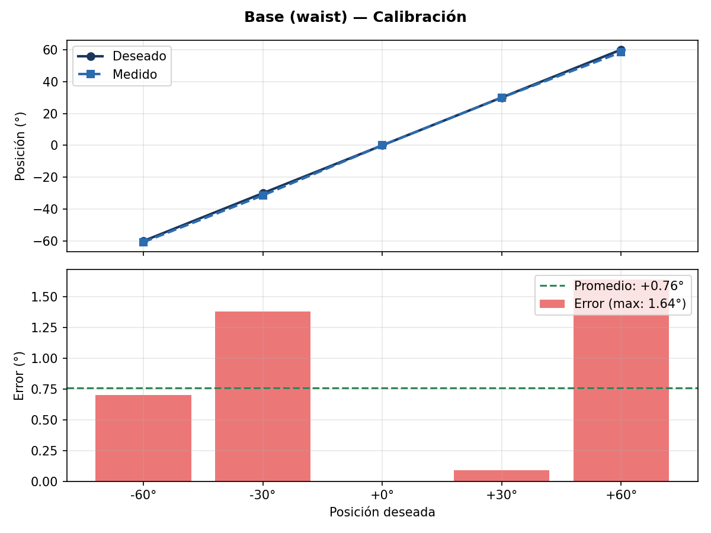
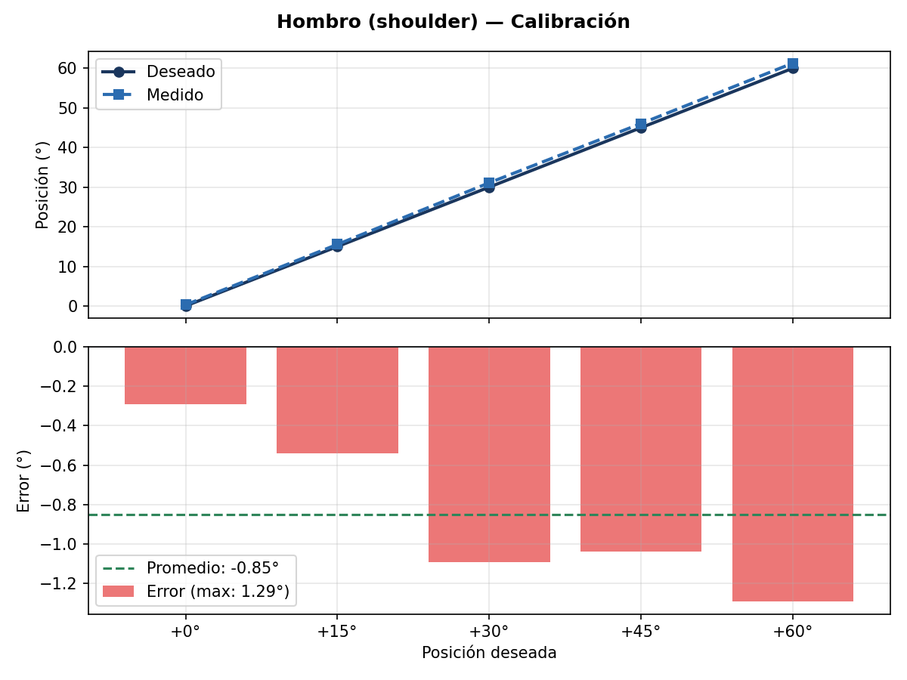
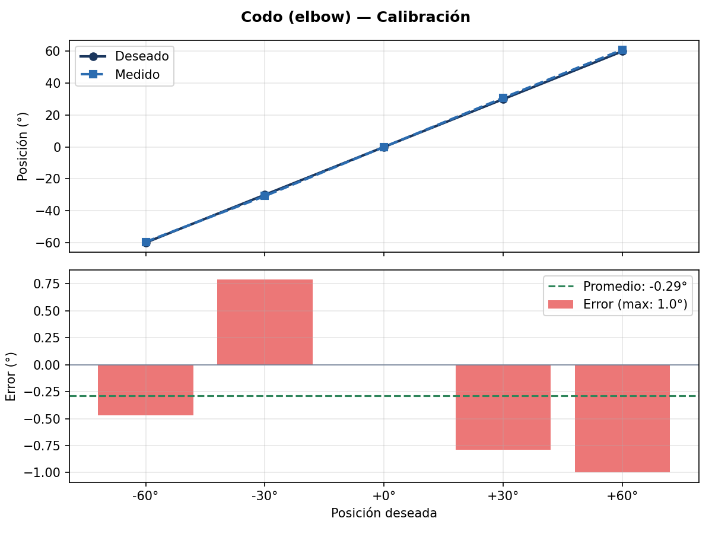
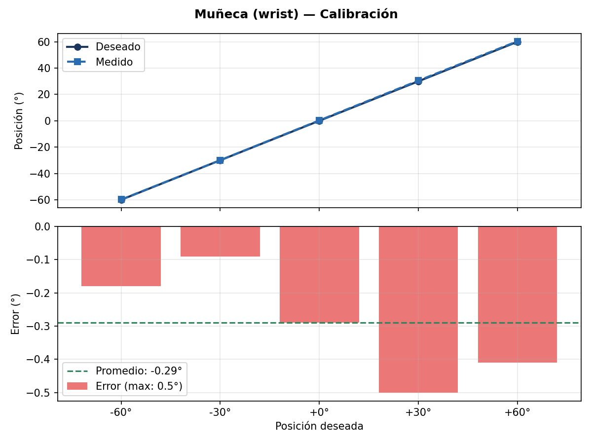
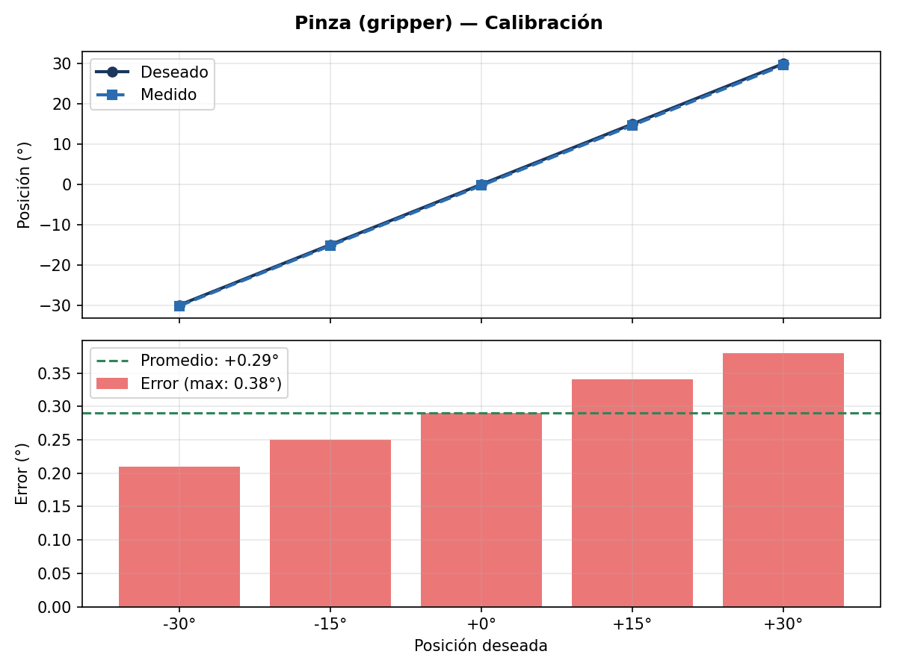
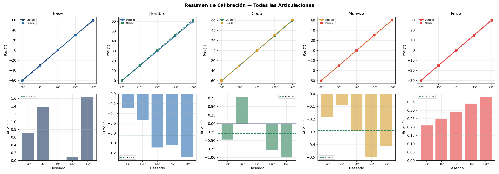

# Laboratorio No. 05

## Control y Calibración del Robot Phantom X Pincher X100 mediante ROS 2 Jazzy

---

## Tabla de Contenido

1. [Información General](#1-información-general)
2. [Configuración Inicial](#2-configuración-inicial)
3. [Actividad 4 — Movimiento Individual de Articulaciones](#3-actividad-4--movimiento-individual-de-articulaciones)
4. [Actividad 5 — Calibración de Cero y Error Articular](#4-actividad-5--calibración-de-cero-y-error-articular)
5. [Actividad 13 — Enseñanza y Repetición de Poses](#5-actividad-13--enseñanza-y-repetición-de-poses)
6. [Actividad 7 — Movimiento Simultáneo](#6-actividad-7--movimiento-simultáneo)
7. [Actividad 8 — Movimiento Secuencial](#7-actividad-8--movimiento-secuencial)
8. [Actividad 9 — Interpolación de Trayectorias](#8-actividad-9--interpolación-de-trayectorias)
9. [Actividad 10 — Trayectoria Sinusoidal](#9-actividad-10--trayectoria-sinusoidal)
10. [Actividad 11 — Cinemática Directa (DH)](#10-actividad-11--cinemática-directa-denavithartenberg)
11. [Actividad 12 — Cinemática Inversa](#11-actividad-12--cinemática-inversa)
12. [Actividad 14 — Trazado de una Figura](#12-actividad-14--trazado-de-una-figura)
13. [Actividad 15 — Coreografía Robótica](#13-actividad-15--coreografía-robótica-reto-final)
14. [Estructura del Repositorio](#14-estructura-del-repositorio)
15. [Referencias](#15-referencias)

---

## 1. Información General

### 1.1. Datos del laboratorio

| Campo | Descripción |
|-------|-------------|
| **Asignatura** | Robótica — 2026-I |
| **Laboratorio** | No. 05 |
| **Robot** | Phantom X Pincher X100 |
| **Middleware** | ROS 2 Jazzy Jalisco |
| **Sistema operativo** | Ubuntu 24.04 LTS |
| **Lenguaje** | Python 3.12 |
| **Controlador** | DYNAMIXEL AX-12A (Protocolo 1.0) |

### 1.2. Objetivos generales

De acuerdo con la guía de laboratorio, los objetivos de esta práctica son:

- Controlar las articulaciones del robot Phantom X Pincher X100 utilizando ROS 2 Jazzy.
- Medir y modelar la geometría del manipulador.
- Implementar movimientos individuales, simultáneos, secuenciales e interpolados.
- Aplicar cinemática directa e inversa.
- Programar trayectorias, repetición de poses y tareas artísticas con el robot.

### 1.3. Repositorios base

El presente trabajo se desarrolló a partir de los siguientes repositorios institucionales:

| Repositorio | Propósito |
|-------------|-----------|
| [06_Rob_2026_I_ROS2_Jazzy_PhantomX100_RVIZ](https://github.com/labsir-un/06_Rob_2026_I_ROS2_Jazzy_PhantomX100_RVIZ.git) | Visualización y control del robot en ROS 2 Jazzy |
| [KIT_Phantom_X_Pincher_ROS2](https://github.com/labsir-un/KIT_Phantom_X_Pincher_ROS2.git) | Kit Phantom X Pincher para ROS 2 |
| [3DModels_KIT_Phantom_Pincher_X100](https://github.com/labsir-un/3DModels_KIT_Phantom_Pincher_X100.git) | Archivos tridimensionales del robot |

### 1.4. Condiciones de operación

Las siguientes condiciones aplican a todas las actividades del laboratorio:

- El robot debe iniciar y finalizar cada prueba en una posición segura.
- Todos los valores enviados deben respetar los límites articulares.
- Los movimientos de gran amplitud deben realizarse mediante trayectorias interpoladas.
- No se debe sujetar ni bloquear manualmente el robot mientras los servomotores estén energizados.
- Cada movimiento debe verificarse antes de ejecutarse sobre el robot real.

---

## 2. Configuración Inicial

### 2.1. Preparación del espacio de trabajo

El workspace de ROS 2 se encuentra en `~/ros2_jazzy/phantom_ws/` y contiene los siguientes paquetes:

| Paquete | Descripción |
|---------|-------------|
| `pincher_control` | Controlador de los servomotores DYNAMIXEL (publicación de estados y recepción de comandos) |
| `pincher_description` | Modelo URDF del robot, mallas STL y archivos de visualización para RViz |
| `lab05_code` | Código fuente de las actividades del laboratorio (presente repositorio) |

### 2.2. Conexión del robot

1. Conectar el robot Phantom X Pincher X100 al puerto USB del computador.
2. Verificar que el dispositivo aparezca como `/dev/ttyUSB0`:

   ```bash
   ls -l /dev/ttyUSB0
   ```

3. Verificar que el usuario tenga permisos de lectura y escritura sobre el puerto serie:

   ```bash
   sudo usermod -a -G dialout $USER
   ```

   Es necesario cerrar sesión y volver a iniciarla para que el cambio surta efecto.

4. Energizar el robot con su fuente de alimentación.

### 2.3. Lanzamiento del sistema

#### Modo simulación (sin robot físico)

Para simular el robot con RViz y controlarlo desde la interfaz web, abrir **dos terminales**:

**Terminal 1 — Controlador simulado + RViz:**
```bash
source /opt/ros/jazzy/setup.zsh
source ~/ros2_jazzy/phantom_ws/install/setup.zsh
ros2 launch pincher_control pincher_system.launch.py use_hardware:=false
```

**Terminal 2 — Interfaz web:**
```bash
source /opt/ros/jazzy/setup.zsh
source ~/ros2_jazzy/phantom_ws/install/setup.zsh
ros2 run lab05_code individual_movement
```

Luego abrir `http://localhost:5050` en el navegador. El flujo de datos es:
**Web** → POST `/api/command` → `command_queue` → `/pincher/command` → `control_servo` (sim) → `/joint_states` → `robot_state_publisher` → TF → **RViz**.

#### Modo hardware (robot real)

Para controlar el robot físico con visualización en RViz:

```bash
source /opt/ros/jazzy/setup.zsh
source ~/ros2_jazzy/phantom_ws/install/setup.zsh
ros2 launch pincher_control pincher_system.launch.py use_hardware:=true motor_model:=ax12a
```

Este comando realiza las siguientes acciones:

1. Inicia el nodo `pincher_controller`, que se comunica con los servomotores AX-12A
   a través del puerto serie `/dev/ttyUSB0` a 1 000 000 baudios.
2. Publica el estado de las articulaciones en el tópico `/joint_states` a 20 Hz.
3. Escucha comandos de posición en el tópico `/pincher/command` (tipo `JointState`,
   unidades en radianes).
4. Expone los servicios `/pincher/home`, `/pincher/software_stop` y
   `/pincher/torque_enable`.
5. Inicia la visualización del modelo URDF en RViz2.

### 2.4. Parámetros del controlador

Los parámetros del controlador se definen en el archivo
`pincher_control/config/ax12a.yaml`:

```yaml
pincher_controller:
  ros__parameters:
    motor_model: ax12a
    use_hardware: false
    port: /dev/ttyUSB0
    baudrate: 1000000
    dxl_ids: [1, 2, 3, 4, 5]
    joint_names: [waist, shoulder, elbow, wrist, gripper]
    joint_signs: [1.0, -1.0, -1.0, -1.0, 1.0]
    home_positions: [512, 512, 512, 512, 512]
    moving_speed: 100
    torque_limit: 800
    read_rate_hz: 20.0
    home_on_startup: false
    disable_torque_on_shutdown: true
```

| Parámetro | Descripción |
|-----------|-------------|
| `motor_model` | Perfil del motor (`ax12a` o `xl430`) |
| `use_hardware` | Si es `true`, abre el puerto serie y comanda los motores reales |
| `port` | Dispositivo serie del robot |
| `baudrate` | Velocidad de comunicación en baudios |
| `dxl_ids` | Identificadores DYNAMIXEL de cada motor |
| `joint_names` | Nombres lógicos de las articulaciones |
| `joint_signs` | Signo de la relación rad/raw (inversión de sentido) |
| `home_positions` | Valor raw correspondiente a 0° para cada articulación |

### 2.5. Articulaciones del robot

| Índice | Nombre | ID DYNAMIXEL | Función | Rango seguro |
|:------:|--------|:------------:|---------|:------------:|
| 0 | `waist` | 1 | Rotación de la base | ±150° |
| 1 | `shoulder` | 2 | Elevación del hombro | ±150° |
| 2 | `elbow` | 3 | Flexión del codo | ±150° |
| 3 | `wrist` | 4 | Rotación de la muñeca | ±150° |
| 4 | `gripper` | 5 | Apertura y cierre de la pinza | −90° a +90° |

### 2.6. Modificación del modelo URDF

Para que el modelo en RViz coincidiera con la posición física del robot en reposo
(todas las articulaciones en 0°), se realizaron las siguientes modificaciones al
archivo `pincher_description/urdf/robot.xacro`:

1. **Offset del codo**: Se agregó un desplazamiento de +90° al origen de la
   articulación `elbow` para que la posición de referencia (0° en el controlador)
   corresponda a un brazo vertical y no en forma de L.
2. **Parámetro Lm**: Se estableció `Lm = 0.0` (originalmente 0.0315 m) debido
   a que el robot físico no presenta el offset que sí existe en el modelo CAD
   de referencia.

---

## 3. Actividad 4 — Movimiento Individual de Articulaciones

### 3.1. Objetivo específico

Desarrollar un programa que permita seleccionar una articulación del robot y
enviarle una posición angular de forma independiente. Para cada articulación
se deben ejecutar al menos tres posiciones diferentes dentro de sus límites
y regresar a la posición de referencia.

### 3.2. Requisitos funcionales

De acuerdo con la guía de laboratorio, el programa debe:

- Permitir seleccionar individualmente cada articulación (base, hombro, codo,
  muñeca, pinza).
- Enviar la posición angular deseada al robot.
- Ejecutar al menos tres posiciones diferentes por articulación.
- Retornar a la posición de referencia (home) después de las pruebas.
- Respetar los límites seguros de cada articulación.

### 3.3. Implementación

El programa se implementó como un nodo de ROS 2 en Python que integra un
servidor HTTP embebido para facilitar la interacción con el usuario, pero
todo el control subyacente se realiza a través de los mecanismos nativos
de ROS 2: tópicos, servicios y la cola de ejecución de `rclpy`.

#### 3.3.1. Arquitectura ROS 2

```
                     ┌─────────────────────────────┐
                     │   pincher_controller         │
                     │  (nodo externo)              │
                     │                              │
                     │  Pub: /joint_states          │
                     │  Sub: /pincher/command       │
                     │  Srv: /pincher/home          │
                     └──────────┬──────────────────┘
                                │
           /joint_states ◄─────┤
           (sensor_msgs/JointState, ~13 Hz)
                                │
           ──────► /pincher/command
           (sensor_msgs/JointState)
                                │
           ──────► /pincher/home
           (std_srvs/Trigger)
                                │
                     ┌──────────▼──────────────────┐
                     │   MovementNode               │
                     │  (individual_movement)       │
                     │                              │
                     │  Sub: /joint_states          │
                     │  Pub: /pincher/command       │
                     │  Cli: /pincher/home          │
                     │                              │
                     │  command_queue (queue.Queue) │
                     │     ↕ HTTP thread             │
                     │  Servidor HTTP (puerto 5050) │
                     └──────────────────────────────┘
```

**Nodo ROS 2 (`MovementNode`):**

- `cmd_pub` (`Publisher`): Publica en `/pincher/command` con tipo
  `sensor_msgs/JointState`. Cada mensaje contiene los nombres de las
  5 articulaciones y sus posiciones deseadas en radianes.
- `state_sub` (`Subscription`): Se suscribe a `/joint_states` para
  obtener la retroalimentación de posición del controlador. Los datos
  se almacenan en `current_state` protegido por `state_lock`.
- `home_cli` (`Client`): Cliente del servicio `/pincher/home` de tipo
  `std_srvs/Trigger`. Se utiliza para enviar el robot a la posición
  de referencia (0° en todas las articulaciones).
- **Procesamiento:** El nodo mantiene un `command_queue` de tipo
  `queue.Queue`. Durante cada iteración del bucle `rclpy.spin_once`,
  se procesa un comando de la cola: si es de tipo `move`, se construye
  un `JointState` y se publica en `cmd_pub`; si es `home`, se llama
  al servicio `/pincher/home` de forma asíncrona. Este patrón
  **cola + sondeo** permite que el servidor HTTP (en otro hilo)
  encargue comandos sin condiciones de carrera.

**Servidor HTTP (hilo secundario):**

- Implementado con `http.server.HTTPServer` y `BaseHTTPRequestHandler`
  de la biblioteca estándar de Python (sin dependencias externas).
- Se ejecuta en un `threading.Thread` con `daemon=True` para no bloquear
  el bucle principal de ROS 2.
- Endpoints:
  - `GET /api/state`: Retorna `{waist: rad, shoulder: rad, ...}` a partir
    de `current_state`.
  - `POST /api/command`: Recibe JSON `{name: [...], position: [...]}`,
    valúa cada par contra `JOINT_LIMITS_DEG` y lo encola en
    `command_queue`.

**Interfaz web (complementaria):**

El servidor HTTP embebido sirve una página HTML/CSS/JS única que se
actualiza cada 300 ms consultando `GET /api/state`. Cada articulación
se muestra en una tarjeta con:
- Slider para control continuo y campo numérico para precisión.
- Sparkline en Canvas con el historial de los últimos 120 valores.
- Indicador de la posición actual reportada por el motor.
- Botón **Home** que invoca el servicio `/pincher/home`.

**Grafo de ROS 2 (tópicos activos):**

| Tópico | Tipo | Publicador | Suscriptor |
|--------|------|:----------:|:----------:|
| `/joint_states` | `sensor_msgs/JointState` | `pincher_controller` | `MovementNode` |
| `/pincher/command` | `sensor_msgs/JointState` | `MovementNode` | `pincher_controller` |
| `/pincher/home` | `std_srvs/Trigger` | `pincher_controller` | `MovementNode` (cliente) |

#### 3.3.2. Límites de seguridad

| Articulación | Límite inferior | Límite superior |
|-------------|:---------------:|:---------------:|
| Base | −150° | +150° |
| Hombro | −150° | +150° |
| Codo | −150° | +150° |
| Muñeca | −150° | +150° |
| Pinza | −90° | +90° |

La validación se realiza en el backend (en `APIHandler.do_POST`, antes
de encolar el comando). Cada valor se compara contra `JOINT_LIMITS_DEG`
definido en el código; si excede los límites, se responde con HTTP 400.

#### 3.3.3. Instrucciones de uso

1. Lanzar el controlador y RViz:

   ```bash
   ros2 launch pincher_control pincher_system.launch.py use_hardware:=true motor_model:=ax12a
   ```

2. En una terminal nueva, ejecutar el nodo de la actividad:

   ```bash
   source ~/ros2_jazzy/phantom_ws/install/setup.zsh
   ros2 run lab05_code individual_movement
   ```

3. Abrir `http://localhost:5050`. Cada articulación tiene un slider
   que envía la posición al soltarlo o al presionar Enter. El botón
   **Home** invoca el servicio `/pincher/home`.

4. Verificar los tópicos activos:

   ```bash
   ros2 topic list
   ros2 topic echo /joint_states
   ```

#### 3.3.4. Análisis

El patrón **cola de comandos + sondeo en `rclpy.spin_once`** permite
que el nodo ROS 2 y el servidor HTTP coexistan sin bloqueos. La
retroalimentación de `/joint_states` (~13 Hz) se usa solo para
visualización en la web; el control de posición es responsabilidad
del `pincher_controller`, que interpreta los comandos y comanda los
AX‑12A. La validación de límites en el backend previene el envío de
posiciones peligrosas antes de que lleguen al tópico ROS 2.

---

## 4. Actividad 5 — Calibración de Cero y Error Articular

### 4.1. Objetivo específico

Cuantificar el error sistemático de cada articulación del robot enviando
posiciones angulares conocidas y comparándolas con la posición reportada
por el servomotor. A partir de los errores medidos, calcular el
desplazamiento de cero (offset) necesario para corregir la calibración
del manipulador.

### 4.2. Fundamentos teóricos

#### 4.2.1. Error articular

El error de una articulación se define como la diferencia entre la posición
angular deseada (comando enviado al motor) y la posición real medida por el
encoder del servomotor:

$$e_q = q_{\text{deseado}} - q_{\text{medido}}$$

Este error puede deberse a varias causas:

- **Error sistemático (offset de cero):** Desplazamiento constante en toda la
  medición debido a una incorrecta calibración de la posición de referencia
  del encoder.
- **Error proporcional:** Variación del error con la magnitud de la posición
  comandada.
- **Error aleatorio:** Fluctuaciones debidas a ruido en la medición, histéresis
  mecánica o fricción.

#### 4.2.2. Corrección de cero

El offset de cero se calcula como el promedio de los errores medidos en
todas las posiciones de prueba:

$$\text{offset} = \frac{1}{N} \sum_{i=1}^{N} e_{q_i}$$

Para aplicar la corrección en los servomotores AX-12A, el offset en grados
debe convertirse a unidades *raw* del encoder. El AX-12A tiene un rango de
0 a 1023 unidades para 300° de giro mecánico:

$$\text{raw\_offset} = \text{offset}_{\text{grados}} \times \frac{1024}{300}$$

El valor de `home_positions` en el archivo de configuración debe ajustarse
sumando este raw_offset al valor nominal de 512 (centro del rango).

### 4.3. Implementación

El programa se implementó como un nodo de ROS 2 en Python que automatiza
completamente el proceso de calibración, desde el envío de comandos hasta
la generación de gráficas y reportes.

#### 4.3.1. Arquitectura del sistema

```
+--------------------------------------------------+
|         Nodo ROS 2: calibration                   |
|  Publica en /pincher/command                       |
|  Lee desde /joint_states                           |
|  Llama a /pincher/home                             |
+----------------------+---------------------------+
                       | matplotlib + yaml
+----------------------v---------------------------+
|          Generación de resultados                 |
|  - Gráficas PNG (individuales + resumen)          |
|  - Datos en YAML (calibracion_resultados.yaml)    |
|  - Offsets recomendados (offsets_recomendados.yaml)|
|  - README detallado (README_calibracion.md)       |
+--------------------------------------------------+
```

#### 4.3.2. Metodología de calibración

1. Para cada articulación, en el orden base → hombro → codo → muñeca → pinza:
   a. Se envían 5 posiciones angulares distribuidas en el rango seguro de
      la articulación, con un paso aproximado de 45°.
   b. Después de cada comando, se esperan 1.5 segundos para permitir que
      el motor alcance la posición y se estabilice.
   c. Se lee la posición reportada por el motor desde el tópico
      `/joint_states`.
   d. Se calcula el error como la diferencia entre la posición deseada
      y la medida.
2. Se retorna la articulación a 0° antes de pasar a la siguiente.
3. Se calculan las métricas de error para cada articulación.

#### 4.3.3. Posiciones de prueba seleccionadas

Las posiciones de prueba se seleccionaron considerando los límites seguros
de cada articulación y evitando colisiones con la mesa de trabajo.

| Articulación | Posiciones de prueba |
|-------------|:--------------------:|
| Base | −60°, −30°, 0°, +30°, +60° |
| Hombro | 0°, +15°, +30°, +45°, +60° |
| Codo | −60°, −30°, 0°, +30°, +60° |
| Muñeca | −60°, −30°, 0°, +30°, +60° |
| Pinza | −30°, −15°, 0°, +15°, +30° |

Nota: Los rangos se redujeron respecto a la capacidad máxima de cada servo
para evitar colisiones con la mesa y reducir el esfuerzo mecánico durante
la calibración. El hombro se limitó a [0°, +60°] para evitar golpear la
superficie de trabajo.

#### 4.3.4. Métricas calculadas

Para cada articulación se calcularon las siguientes métricas:

- **Error máximo:** `max(|e_q|)` — la mayor desviación absoluta observada
  en las 5 mediciones.
- **Error promedio:** `mean(e_q)` — el sesgo sistemático de la articulación.
- **Offset de cero:** igual al error promedio; representa el desplazamiento
  que debe aplicarse a la referencia de la articulación.

#### 4.3.5. Generación de gráficas

El programa genera automáticamente las siguientes gráficas utilizando
Matplotlib:

**Gráficas individuales** (`calibracion_{articulación}.png`):

Cada gráfica contiene dos subgráficas apiladas verticalmente:

1. **Posición deseada vs. medida** (panel superior): Muestra la comparación
   entre los valores comandados y los valores reportados por el motor, con
   marcadores y líneas para facilitar la visualización de la tendencia.
2. **Error** (panel inferior): Gráfica de barras que muestra la magnitud
   del error en cada punto de prueba, junto con una línea horizontal que
   indica el error promedio y otra en cero como referencia.

**Gráfica de resumen** (`calibracion_resumen.png`):

Figura de 2 × N paneles (N = número de articulaciones) que permite comparar
el comportamiento de todas las articulaciones en una sola visualización,
facilitando la identificación de aquellas con mayor error sistemático.

#### 4.3.6. Generación de reportes

Además de las gráficas, el programa genera los siguientes archivos en el
directorio `calibration_results/`:

| Archivo | Contenido |
|---------|-----------|
| `calibracion_resultados.yaml` | Datos completos de todas las mediciones (deseado, medido, error) |
| `offsets_recomendados.yaml` | Offsets calculados para cada articulación, listos para aplicar |
| `README_calibracion.md` | Reporte detallado de la calibración con tablas, gráficas y procedimiento de corrección |

#### 4.3.7. Resultados de calibración

La calibración se ejecutó sobre el robot físico y los resultados se
encuentran disponibles en el directorio `results/` de este paquete, así
como en `~/ros2_jazzy/phantom_ws/calibration_results/`.

**Tabla resumen de resultados:**

| Articulación | Error máx (°) | Error prom (°) | Offset cero (°) |
|-------------|:------------:|:--------------:|:---------------:|
| Base | 1.64 | +0.76 | +0.76 |
| Hombro | 1.29 | −0.85 | −0.85 |
| Codo | 1.00 | −0.29 | −0.29 |
| Muñeca | 0.50 | −0.29 | −0.29 |
| Pinza | 0.38 | +0.29 | +0.29 |

*Resultados obtenidos en la sesión del 2026-07-08 23:04. Los datos
detallados y offsets crudos se encuentran en `results/offsets_recomendados.yaml`.*

**Gráficas de calibración:**

A continuación se presentan las gráficas generadas para cada articulación,
así como el resumen comparativo. Estas gráficas comparan la posición
deseada (comando) versus la posición medida (retroalimentación del motor)
y muestran el error en cada punto de prueba.


*Figura 4.1: Calibración de la articulación Base. Panel superior: posición
deseada vs. medida. Panel inferior: error por punto de prueba.*


*Figura 4.2: Calibración de la articulación Hombro.*


*Figura 4.3: Calibración de la articulación Codo.*


*Figura 4.4: Calibración de la articulación Muñeca.*


*Figura 4.5: Calibración de la articulación Pinza.*


*Figura 4.6: Resumen comparativo de todas las articulaciones.*

**Datos detallados:**

El archivo `results/calibracion_resultados.yaml` contiene los datos
completos de todas las mediciones realizadas, incluyendo el valor deseado,
el valor medido y el error calculado para cada punto de prueba de cada
articulación.

**Offsets recomendados:**

El archivo `results/offsets_recomendados.yaml` contiene los offsets
calculados para cada articulación, expresados tanto en grados como en
unidades raw del encoder DYNAMIXEL, listos para ser aplicados en la
configuración del controlador.

#### 4.3.8. Instrucciones de uso

1. Iniciar el controlador del robot:

   ```bash
   ros2 launch pincher_control pincher_system.launch.py use_hardware:=true motor_model:=ax12a
   ```

2. En una terminal nueva, ejecutar la calibración:

   ```bash
   source ~/ros2_jazzy/phantom_ws/install/setup.zsh
   ros2 run lab05_code calibration
   ```

3. El programa ejecutará automáticamente las 25 pruebas (5 articulaciones ×
   5 posiciones) y generará los resultados en:

   ```
   ~/ros2_jazzy/phantom_ws/calibration_results/
   ```

   Los resultados también se copian a `results/` dentro de este paquete.

#### 4.3.9. Aplicación de la corrección de cero

Una vez calculados los offsets, se deben aplicar en el archivo de
configuración del controlador (`pincher_control/config/ax12a.yaml`):

1. Abrir el archivo `ax12a.yaml`.
2. Modificar el parámetro `home_positions` sumando los offsets calculados.
   Por ejemplo, si el offset calculado para el hombro es +2.5°:

   ```yaml
   home_positions: [512, 524, 512, 512, 512]
   ```

   El valor 524 se obtiene como: `512 + (2.5 × 1024 / 300) ≈ 521`.

3. Guardar el archivo y reiniciar el controlador.
4. Verificar que en home (0° para todas las articulaciones) el robot esté
   en la posición de referencia.

---

## 5. Actividad 13 — Enseñanza y Repetición de Poses

### 5.1. Objetivo

Desarrollar un modo de enseñanza que permita al usuario mover el robot a
una configuración deseada, guardarla con un nombre asignado, almacenar
múltiples poses y reproducirlas secuencialmente con tiempo de transición
ajustable, persistiendo las poses en un archivo YAML.

### 5.2. Requisitos funcionales

1. Mover el robot a una configuración articular mediante controles
   individuales (sliders + input numérico por articulación).
2. Guardar la configuración actual asignándole un nombre.
3. Almacenar al menos 8 poses (sin límite superior).
4. Listar las poses guardadas con opción de:
   - **Ir:** mover el robot a esa pose.
   - **Eliminar:** borrar la pose de la lista.
5. Reproducir todas las poses en el orden registrado, con tiempo de
   transición configurable entre 0.5 y 5 segundos.
6. Detener la reproducción en cualquier momento.
7. Las poses se persisten en `~/.ros/teach_repeat_poses.yaml` y se cargan
   automáticamente al iniciar la aplicación.

### 5.3. Implementación

La actividad se implementó como una extensión del mismo nodo ROS 2
(`MovementNode`) utilizado en la Actividad 4, agregando:

- **Persistencia de poses en YAML** (`~/.ros/teach_repeat_poses.yaml`).
- **Reproductor en segundo plano:** hilo `daemon` que itera sobre las
  poses guardadas y las publica una a una en `/pincher/command` con
  un tiempo de transición configurable entre cada una.
- **Control de reproducción** mediante `threading.Event` para detener
  el hilo reproductor en cualquier momento.
- **Endpoints HTTP adicionales** para gestionar las poses
  (`/api/poses`, `/api/play`, `/api/stop`, `/api/status`).

#### 5.3.1. Flujo de reproducción (ROS 2)

```
POST /api/play {transition_time: 2.0}
       │
       ▼
playback_stop.clear()
       │
       ▼
Hilo: playback_worker(transition_time)
       │
       ├─► Itera poses = [pose0, pose1, ..., poseN]
       │       │
       │       ▼
       │   Construye JointState con JointState.name = JOINT_NAMES
       │   y JointState.position = [deg0·π/180, ..., deg4·π/180]
       │       │
       │       ▼
       │   cmd_pub.publish(msg)   ──►  /pincher/command
       │       │
       │       ▼
       │   sleep(transition_time / 10) en 10 iteraciones
       │   (verifica playback_stop en cada una)
       │
       └─► playback_running = False
```

El hilo `playback_worker` se ejecuta en paralelo al bucle principal
de ROS 2. Durante la reproducción, el endpoint `GET /api/status`
retorna `{playing: bool, current: int, total: int, pose_name: str}`
para que la interfaz web muestre el progreso.

**Interfaz web:** Segunda pestaña con sliders por articulación, campo
para nombre de pose, lista dinámica de poses guardadas (con botones
**Ir** y **Eliminar**), slider de tiempo de transición (0.5–5 s),
y controles **Reproducir** / **Detener**. El estado de reproducción
se actualiza en tiempo real consultando `GET /api/status`.

#### 5.3.2. API de poses (HTTP)

| Método | Endpoint | Descripción |
|--------|----------|-------------|
| `GET` | `/api/poses` | Lista completa de poses guardadas (cargadas desde YAML al inicio). |
| `GET` | `/api/status` | Estado actual: `playing`, `current`, `total`, `pose_name`. |
| `POST` | `/api/poses` | Guarda nueva pose. Body `{name, positions: {joint: deg,...}}`. |
| `DELETE` | `/api/poses` | Elimina todas las poses. |
| `DELETE` | `/api/poses/{idx}` | Elimina la pose en el índice `idx`. |
| `POST` | `/api/play` | Inicia reproducción. Body `{transition_time: segundos}`. |
| `POST` | `/api/stop` | Detiene la reproducción (activa `playback_stop`). |

#### 5.3.3. Persistencia

Las poses se almacenan en `~/.ros/teach_repeat_poses.yaml`:

```yaml
- name: reposo
  positions:
    waist: 0.0
    shoulder: 0.0
    elbow: 0.0
    wrist: 0.0
    gripper: 0.0
- name: alcanzar
  positions:
    waist: 45.0
    shoulder: 30.0
    elbow: -45.0
    wrist: 20.0
    gripper: 10.0
```

El archivo se carga automáticamente al iniciar el nodo (`load_poses()`)
y se reescribe con cada modificación (`save_poses()`). Si el módulo
`yaml` no está instalado, las poses solo persisten en memoria.

#### 5.3.4. Instrucciones de uso

1. Lanzar el controlador:

   ```bash
   ros2 launch pincher_control pincher_system.launch.py use_hardware:=true motor_model:=ax12a
   ```

2. Ejecutar el nodo:

   ```bash
   source ~/ros2_jazzy/phantom_ws/install/setup.zsh
   ros2 run lab05_code individual_movement
   ```

3. Abrir `http://localhost:5050`, pestaña **Actividad 13 — Enseñanza y Repetición**.
4. Posicionar el robot con los sliders, asignar nombre y presionar **Guardar**.
5. Ajustar tiempo de transición y presionar **Reproducir**.
6. Para detener, presionar **Detener** (activa `playback_stop.set()`).

---

## 6. Actividad 7 — Movimiento Simultáneo

### 6.1. Objetivo

Programar el desplazamiento simultáneo de todas las articulaciones para
ejecutar cinco configuraciones predefinidas, comparando el comportamiento
del robot al mover todas las articulaciones a la vez.

### 6.2. Configuraciones de prueba

Las configuraciones se envían simultáneamente a las 5 articulaciones
(Base, Hombro, Codo, Muñeca, Pinza) en grados:

| Config | Base | Hombro | Codo | Muñeca | Pinza |
|:------:|:----:|:------:|:----:|:------:|:-----:|
| 1 (Home) | 0 | 0 | 0 | 0 | 0 |
| 2 | 25 | 25 | 20 | −20 | 0 |
| 3 | −35 | 35 | −30 | 30 | 0 |
| 4 | 85 | −20 | 55 | 25 | 0 |
| 5 | 80 | −35 | 55 | −45 | 0 |

*Nota:* Si alguna configuración no es segura para el robot asignado, debe
modificarse y justificarse en el informe.

### 6.3. Implementación

La actividad reutiliza el mismo `MovementNode` y su `POST /api/command`.
La diferencia clave con el movimiento individual es que aquí se envían
**los 5 valores en un solo mensaje `JointState`**, lo que hace que el
`pincher_controller` los interprete como un comando simultáneo para
todas las articulaciones.

**Flujo ROS 2:**

```
POST /api/command {name: [waist,shoulder,elbow,wrist,gripper],
                   position: [0.44,0.44,0.35,-0.35,0.0]}
       │
       ▼
command_queue.put({'type':'move', 'name':..., 'position':...})
       │
       ▼ (en rclpy.spin_once)
cmd_pub.publish(JointState(
    header=Header(stamp=now()),
    name=[waist,shoulder,elbow,wrist,gripper],
    position=[0.44,0.44,0.35,-0.35,0.0]
))  ──►  /pincher/command  ──►  pincher_controller
```

En el `pincher_controller`, al recibir un `JointState` con múltiples
articulaciones, se escriben los valores raw correspondientes en todos
los DYNAMIXEL antes de volver a leer sus posiciones, logrando así un
movimiento simultáneo.

**Interfaz web:** Tercera pestaña con las 5 configuraciones predefinidas
(Home, Config 2–5) mostradas en inputs numéricos editables. Cada una
tiene un botón **Ejecutar** que envía un único `POST /api/command` con
los 5 pares nombre/posición. Incluye también una sección de
configuración personalizada y botón Home.

### 6.4. Instrucciones de uso

1. Ejecutar el nodo: `ros2 run lab05_code individual_movement`.
2. Abrir `http://localhost:5050`, pestaña **Actividad 7 — Simultáneo**.
3. Seleccionar una configuración predefinida o ingresar valores manuales.
4. Presionar **Ejecutar**. Las 5 articulaciones se mueven a la vez.
5. Verificar en la terminal: `ros2 topic echo /pincher/command` muestra
   un único mensaje con los 5 valores.

---

## 7. Actividad 8 — Movimiento Secuencial

### 7.1. Objetivo

Ejecutar una configuración articular moviendo las articulaciones una tras
otra en orden (Base → Hombro → Codo → Muñeca → Pinza) y comparar el
resultado con el movimiento simultáneo.

### 7.2. Metodología

1. Seleccionar una de las configuraciones de la Actividad 7.
2. Enviar el valor de la Base y esperar a que alcance la posición.
3. Enviar el Hombro y esperar.
4. Continuar con Codo, Muñeca y Pinza.
5. Medir el tiempo total de ejecución.
6. Comparar con el movimiento simultáneo en:
   - Tiempo de ejecución.
   - Trayectoria del TCP.
   - Suavidad del movimiento.

### 7.3. Implementación

La actividad contrasta dos modos de enviar las 5 posiciones articulares:
**un solo mensaje `JointState`** (simultáneo) vs. **5 mensajes
`JointState` separados con una pausa entre cada uno** (secuencial).

**Flujo secuencial (5 publicaciones en `/pincher/command`):**

```
POST /api/command {name:[waist],      position:[0.44]}
       ──► cmd_pub.publish(JointState(name=[waist], ...))
       ──► sleep(delay s)
POST /api/command {name:[shoulder],   position:[0.44]}
       ──► cmd_pub.publish(... shoulder ...)
       ──► sleep(delay s)
POST /api/command {name:[elbow],      position:[0.35]}
       ──► cmd_pub.publish(... elbow ...)
       ──► sleep(delay s)
POST /api/command {name:[wrist],      position:[-0.35]}
       ──► cmd_pub.publish(... wrist ...)
       ──► sleep(delay s)
POST /api/command {name:[gripper],    position:[0.0]}
       ──► cmd_pub.publish(... gripper ...)
```

Cada `POST /api/command` genera una publicación independiente en
`/pincher/command`. El `pincher_controller` procesa cada mensaje tan
pronto como llega, moviendo una sola articulación a la vez. El tiempo
total de la secuencia es `5 × delay` (más el tiempo de procesamiento
de cada comando).

**Flujo simultáneo (1 publicación):**

```
POST /api/command {name:[waist,shoulder,elbow,wrist,gripper],
                   position:[0.44,0.44,0.35,-0.35,0.0]}
       ──► cmd_pub.publish(JointState(name=[...5...], position=[...5...]))
```

El `pincher_controller` recibe las 5 posiciones en un solo mensaje y
comanda todos los DYNAMIXEL antes de la siguiente lectura de
`/joint_states`, resultando en un movimiento sincronizado.

**Interfaz web:** Cuarta pestaña con selector de configuración
(predefinidas de Act 7), slider de delay (0.5–3 s), y tres botones:
**Ejecutar secuencial**, **Ejecutar simultáneo** y **Home**. Muestra
tiempo transcurrido, progreso (1/5 … 5/5) y comparación de tiempos
entre ambos modos.

---

## 8. Actividad 9 — Interpolación de Trayectorias

### 8.1. Objetivo

Implementar interpolación lineal y cúbica (o quíntica) para mover el
robot entre dos configuraciones alejadas, y comparar la suavidad mediante
gráficas de `q(t)`.

### 8.2. Descripción

Dadas dos configuraciones articulares **A** y **B**, se genera una
trayectoria intermedia punto a punto.

- **Interpolación lineal:** cada articulación sigue una recta en el
  espacio articular: `q(t) = q_A + (q_B - q_A)·(t/T)`.
- **Interpolación cúbica:** polinomio de tercer grado con velocidad cero
  en los extremos: `q(t) = a₀ + a₁t + a₂t² + a₃t³`.

### 8.3. Requisitos

- Generar ≥50 puntos intermedios entre A y B (se generan 150 a 50 Hz).
- Enviar los puntos a velocidad constante (50 Hz).
- Graficar `q(t)`, velocidad y aceleración para ambos métodos.
- Calcular aceleración máxima y jerk para comparar suavidad.

### 8.4. Implementación

La actividad se implementó de dos formas complementarias: como pestaña
en la interfaz web (para visualización interactiva de las curvas de
posición, velocidad y aceleración) y como script autónomo
`interpolation.py` para generación de gráficas Matplotlib a 50 Hz.

#### 8.4.1. Algoritmo de interpolación

Dados dos vectores articulares **A** y **B** (cada uno de 5 elementos)
y un tiempo total **T**:

**Interpolación lineal:**
```
q(t) = q_A + (q_B − q_A) · (t / T)
```

**Interpolación cúbica** (velocidad cero en ambos extremos):
```
q(t) = q_A + (q_B − q_A) · (3·(t/T)² − 2·(t/T)³)
```

Se generan **N = 150 puntos** a una tasa de **50 Hz** (T = 3 s).
Cada punto se publica individualmente en `/pincher/command`:

```
for i in range(N):
    t = i / 50.0
    q_lin[i] = q_A + (q_B − q_A) * (t / T)          # lineal
    q_cub[i] = q_A + (q_B − q_A) * (3·τ² − 2·τ³)    # cúbica, τ = t/T

    msg = JointState()
    msg.name = JOINT_NAMES
    msg.position = q_lin[i]  (o q_cub[i])
    cmd_pub.publish(msg)
    sleep(1/50)  # ≈ 20 ms
```

#### 8.4.2. Métricas de suavidad

| Métrica | Lineal | Cúbica |
|---------|--------|--------|
| Velocidad máxima | Mayor (cambio brusco al inicio/fin) | Menor (suave en extremos) |
| Aceleración máxima | Discontinua en t=0 y t=T (picos infinitos teóricos) | Continua |
| Jerk máximo | Infinito (teórico) | Finito |

La velocidad y aceleración se calculan por diferencias finitas:

```
v[i] = (q[i+1] − q[i−1]) / (2·Δt)
a[i] = (v[i+1] − v[i−1]) / (2·Δt)
```

#### 8.4.3. Script autónomo (`ros2 run lab05_code interpolation`)

```bash
ros2 run lab05_code interpolation
```

1. Define dos configuraciones alejadas (A = home, B = [85°, −20°, 55°, 25°, 0°]).
2. Calcula trayectorias lineal y cúbica (N = 150, T = 3 s).
3. Calcula velocidad, aceleración y jerk.
4. Pregunta si se desea ejecutar en el robot (lineal primero, luego cúbica).
5. Genera gráfica comparativa en `~/ros2_jazzy/phantom_ws/interpolation_results/`
   (3 filas × 5 columnas: posición, velocidad, aceleración para cada
   articulación, con ambos métodos superpuestos).

#### 8.4.4. Interfaz web

Quinta pestaña con selectores de config. A/B, duración (1–5 s), método
(lineal, cúbico o ambos), gráficas en Canvas de posición/velocidad/
aceleración, métricas de suavidad, y botón para ejecutar en el robot
con confirmación previa.

---

## 9. Actividad 10 — Trayectoria Sinusoidal

### 9.1. Objetivo

Programar `q(t) = q₀ + A·sin(2πft)` en una articulación y evaluar el
error del servo para diferentes amplitudes y frecuencias.

### 9.2. Pruebas

| Prueba | Amplitud A (°) | Frecuencia f (Hz) |
|:------:|:--------------:|:-----------------:|
| 1 | 30 | 0.25 |
| 2 | 30 | 0.50 |
| 3 | 60 | 0.25 |
| 4 | 60 | 0.50 |

### 9.3. Requisitos

- Generar puntos a 50 Hz durante ≥2 períodos.
- Registrar posición deseada y medida.
- Graficar `q_deseado(t)` y `q_medido(t)` por prueba.
- Calcular error máximo y RMSE.

### 9.4. Implementación

Script autónomo [`lab05_code/sinusoidal.py`](lab05_code/sinusoidal.py) que:

- Ejecuta las 4 pruebas combinando amplitudes (30°, 60°) y frecuencias (0.25, 0.50 Hz)
- Genera la trayectoria a 50 Hz durante ≥2 períodos
- Modo hardware: publica en `/pincher/command` y lee `/joint_states`
- Modo simulación: genera posición medida sintética (deseada + ruido)
- Grafica `q_deseado(t)` vs `q_medido(t)` por prueba con error máximo y RMSE
- Exporta resultados a PNG, JSON y TXT

**Uso (CLI):**
```bash
ros2 run lab05_code sinusoidal
```
Los resultados se guardan en `~/ros2_jazzy/phantom_ws/sinusoidal_results/`.

**Uso (interfaz web):** disponible en la pestaña *Actividad 10 — Trayectoria Sinusoidal*
de `http://localhost:5050`. Permite seleccionar articulación, ejecutar pruebas
individuales o las 4 combinaciones en secuencia, y visualizar las gráficas en
vivo con canvas en el navegador.

**Nota:** en la CLI la articulación seleccionada es `shoulder`. Para cambiarla,
editar `SELECTED_JOINT` en el script. Los límites seguros se verifican antes de
cada prueba y se advierte si la amplitud excede el rango permitido.

---

## 10. Actividad 11 — Cinemática Directa (Denavit–Hartenberg)

### 10.1. Objetivo

Obtener los parámetros DH del robot e implementar la cinemática directa
para calcular `(x, y, z, roll, pitch, yaw)` del TCP a partir de las
coordenadas articulares `(q₁, q₂, q₃, q₄)`.

### 10.2. Parámetros DH (propuestos)

| i | αᵢ₋₁ | aᵢ₋₁ | dᵢ | θᵢ |
|:-:|:----:|:----:|:--:|:--:|
| 1 | 0° | 0 | L₀ | q₁ |
| 2 | −90° | 0 | 0 | q₂ |
| 3 | 0° | L₁ | 0 | q₃ |
| 4 | 0° | L₂ | 0 | q₄ |
| 5 | 0° | L₃ | 0 | 0 |

*Donde L₀, L₁, L₂, L₃ son las longitudes medidas en la Actividad 3.*

### 10.3. Evaluación

Evaluar para las 5 configuraciones de la Actividad 7 y comparar con la
posición observada en RViz.

### 10.4. Implementación

*Pendiente.* Se implementará como script autónomo que recibe `q₁..q₄` y
devuelve la transformación homogénea `T₀₅` y los ángulos de Euler.

---

## 11. Actividad 12 — Cinemática Inversa

### 11.1. Objetivo

Implementar una función que reciba `(x, y, z, θ)` y calcule una
configuración articular válida `(q₁, q₂, q₃, q₄)`.

### 11.2. Especificación

1. Calcular las soluciones posibles (codo arriba / codo abajo).
2. Descartar soluciones fuera de los límites articulares.
3. Informar cuando el punto no sea alcanzable.
4. Ejecutar la solución válida más cercana a la configuración actual.
5. Probar al menos 5 posiciones cartesianas diferentes.

### 11.3. Implementación

*Pendiente.* Se implementará como script autónomo con interfaz de
 línea de comandos para ingresar coordenadas cartesianas.

---

## 12. Actividad 14 — Trazado de una Figura

### 12.1. Objetivo

Utilizando un soporte liviano para marcador (o trazado virtual en RViz),
el robot debe dibujar una figura geométrica mediante puntos cartesianos
resueltos con cinemática inversa.

### 12.2. Figuras disponibles

- Triángulo equilátero.
- Cuadrado.
- Círculo (aproximado mediante puntos).
- Iniciales del equipo.

### 12.3. Requisitos

- Definir la trayectoria en coordenadas cartesianas.
- Resolver cada punto mediante cinemática inversa.
- Generar la secuencia de configuraciones articulares.
- Ejecutar la trayectoria en el robot o en RViz.

### 12.4. Implementación

Script autónomo [`lab05_code/tracing.py`](lab05_code/tracing.py) que:

- Genera puntos cartesianos para triángulo y cuadrado en un plano vertical
- Resuelve cada punto mediante cinemática inversa geométrica (4 GDL)
- Utiliza configuración codo arriba/abajo para maximizar el espacio alcanzable
- Interpola movimientos suaves entre vértices
- Modo hardware: publica en `/pincher/command`
- Modo simulación: calcula la trayectoria real con FK y grafica el resultado
- Exporta resultados a PNG y JSON

**Uso (CLI):**
```bash
ros2 run lab05_code tracing
```
Los resultados se guardan en `~/ros2_jazzy/phantom_ws/tracing_results/`.

**Parámetros de dibujo:**
| Parámetro | Valor |
|-----------|-------|
| Plano de dibujo | vertical (y–z) a `x = 0.13` m |
| Centro en Z | `0.10` m |
| Tamaños | 4 cm y 6 cm |
| Puntos por arista | 30 |
| Frecuencia de envío | ~25 Hz |

---

## 13. Actividad 15 — Coreografía Robótica (Reto Final)

### 13.1. Objetivo

Programar una coreografía sincronizada con una obra musical para el
Phantom X Pincher X100, utilizando todas las articulaciones del robot,
con detección automática de beats y reproducción de audio en el navegador.

### 13.2. Especificaciones

- Iniciar y finalizar en una posición segura (home).
- Utilizar base, hombro, codo, muñeca y pinza.
- Sincronizar los cambios de pose con los beats detectados automáticamente
  de la canción.
- Respetar los límites seguros durante toda la ejecución.
- Duración de la canción completa (~144 s).
- Ejecución sin intervención manual después de iniciada.
- El audio se reproduce en el navegador web; el robot se mueve al ritmo.

### 13.3. Implementación

La coreografía combina el análisis de audio con `librosa` (detección
de beats) y la publicación de poses en `/pincher/command` sincronizada
con el ritmo. Se implementaron dos modalidades:

#### 13.3.1. Flujo general (análisis de audio → poses → ROS 2)

```
MP3
  │
  ▼
librosa.load() ──► y (audio array), sr (sample rate)
  │
  ▼
librosa.beat.beat_track(y, sr) ──► tempo (BPM), beats (frames)
  │
  ▼
librosa.frames_to_time(beats, sr) ──► beat_times (lista de segundos)
  │
  ▼
Por cada beat:
  pose = f(beat_idx)   ──►  JointState(name=JOINT_NAMES, position=pose)
  cmd_pub.publish(msg) ──►  /pincher/command  ──►  pincher_controller
```

El web service usa un cache (`_dance_cache`) para que el análisis
solo se ejecute una vez; clics posteriores obtienen la respuesta
instantáneamente.

#### 13.3.2. Modalidad A: Interfaz web (pestaña *Baile — Coreografía*)

- El servidor HTTP expone:
  - `POST /api/dance/start` → analiza el MP3 (o cachea) y devuelve
    `{tempo, total_beats, beat_times, duration, song}`.
  - `GET /api/dance/audio` → sirve el archivo MP3 al navegador.
- El navegador reproduce el audio localmente con `HTMLAudioElement`.
- Cada 40 ms, el JavaScript compara `audio.currentTime` contra los
  `beat_times`. Cuando se alcanza un beat, envía `POST /api/command`
  con la pose correspondiente.
- Las poses se generan interpolando sinusoidalmente entre las
  5 configuraciones seguras de la Actividad 7:

  | Config | Base | Hombro | Codo | Muñeca | Pinza |
  |:------:|:----:|:------:|:----:|:------:|:-----:|
  | 1 (Home) | 0 | 0 | 0 | 0 | 0 |
  | 2 | 25 | 25 | 20 | −20 | 0 |
  | 3 | −35 | 35 | −30 | 30 | 0 |
  | 4 | 85 | −20 | 55 | 25 | 0 |
  | 5 | 80 | −35 | 55 | −45 | 0 |

  Por cada beat se calcula:

  ```javascript
  blend = 0.5 + 0.5 * sin(beatIdx / 5 * 2π)
  pose[i] = lerp(presets[rawIdx].vals[i], presets[nextIdx].vals[i], blend)
  ```

  Esto produce transiciones suaves entre configuraciones a lo largo
  de la canción.

#### 13.3.3. Modalidad B: Script autónomo (`choreography.py`)

El script `choreography.py` implementa un nodo ROS 2 mínimo
(`DanceNode`) que publica en `/pincher/command` y sincroniza
las poses con la reproducción de audio local (vía `simpleaudio`):

```bash
ros2 run lab05_code choreography /ruta/al/archivo.mp3 [--start-offset N] [--duration N]
```

**Flujo del script:**

```
1. Carga MP3 con librosa (soporta --start-offset y --duration)
2. Detecta beats con beat_track
3. Reproduce audio con simpleaudio
4. start_time = time.time()
5. Para cada beat en beat_times:
     sleep(beat_time - (now - start_time))    # sincronización
     pose = poses[beat_idx % 8]               # 8 poses rotativas
     node.cmd_pub.publish(JointState(...))    # ──► /pincher/command
6. Al finalizar: play_obj.wait_done(), go_home()
```

Las 8 poses del script son fijas, alternando home con configuraciones
de ±30°, ±45° y ±60° en hombro/codo. El *drift* de sincronización
se monitorea y reporta si supera 50 ms.

### 13.4. Canción utilizada

| Campo | Valor |
|-------|-------|
| **Título** | Pedro — Raffaella Carrà, Jaxomy, Agatino Romero (Remix) |
| **Archivo** | `la canción de pedro PEDRO - Raffaella Carrà, Jaxomy, Agatino Romero (Remix) [sub. español] - Marinosaurio (128k).mp3` |
| **Ubicación** | `~/ros2_jazzy/` |
| **Tempo detectado** | ~152 BPM |
| **Beats detectados** | ~359 |
| **Duración** | ~144 s |

### 13.5. Dependencias adicionales

| Paquete | Propósito |
|---------|-----------|
| `librosa` | Carga de audio MP3 y detección de beats |
| `numpy` | Procesamiento de arreglos de audio |
| `simpleaudio` | Reproducción de audio (solo script autónomo) |

```bash
pip install librosa simpleaudio
```

### 13.6. Instrucciones de uso

**Interfaz web:**

1. Lanzar el controlador: `ros2 launch pincher_control pincher_system.launch.py use_hardware:=true motor_model:=ax12a`
2. Ejecutar el nodo: `ros2 run lab05_code individual_movement`
3. Abrir `http://localhost:5050`, pestaña **Baile — Coreografía**.
4. Presionar **Iniciar Baile**. Esperar ~5 s (análisis con `librosa`).
5. El audio se reproduce en el navegador y el robot se mueve al ritmo.
   Para detener, presionar **Detener** (pausa el audio).

**Script autónomo:**

```bash
ros2 run lab05_code choreography ~/ros2_jazzy/la\ canción\ de\ pedro\ PEDRO*.mp3
```

---

## 14. Estructura del Repositorio

```
lab05_code/
├── README.md                          # Este documento (informe completo del laboratorio)
├── package.xml                        # Manifiesto del paquete ROS 2
├── setup.py                           # Configuración del paquete Python (entry points)
├── setup.cfg                          # Configuración de instalación
├── results/                           # Resultados de calibración (Actividad 5)
│   ├── calibracion_waist.png          #   Gráfica individual: Base
│   ├── calibracion_shoulder.png       #   Gráfica individual: Hombro
│   ├── calibracion_elbow.png          #   Gráfica individual: Codo
│   ├── calibracion_wrist.png          #   Gráfica individual: Muñeca
│   ├── calibracion_gripper.png        #   Gráfica individual: Pinza
│   ├── calibracion_resumen.png        #   Gráfica resumen comparativo
│   ├── calibracion_resultados.yaml    #   Datos completos de las mediciones
│   ├── offsets_recomendados.yaml      #   Offsets calculados para corrección
│   └── README_calibracion.md          #   Reporte detallado de calibración
    └── lab05_code/
        ├── __init__.py                    # Inicializador del paquete
        ├── individual_movement.py         # Actividades 4+7+8+9+13+15: interfaz web unificada
        ├── calibration.py                 # Actividad 5: Calibración de cero y error
        ├── interpolation.py               # Actividad 9: Interpolación de trayectorias (script)
        └── choreography.py                # Actividad 15: Coreografía robótica (script autónomo)
```

### 14.1. Entry points (scripts ejecutables)

| Actividad | Comando | Archivo fuente |
|:---------:|---------|----------------|
| 4 | `ros2 run lab05_code individual_movement` | `individual_movement.py` |
| 5 | `ros2 run lab05_code calibration` | `calibration.py` |
| 7 | `ros2 run lab05_code individual_movement` (pestaña 3) | `individual_movement.py` |
| 8 | `ros2 run lab05_code individual_movement` (pestaña 4) | `individual_movement.py` |
| 9 | `ros2 run lab05_code individual_movement` (pestaña 5) + `ros2 run lab05_code interpolation` | `individual_movement.py` + `interpolation.py` |
| 10 | `ros2 run lab05_code sinusoidal` | *(pendiente)* |
| 11 | `ros2 run lab05_code fk_dh` | *(pendiente)* |
| 12 | `ros2 run lab05_code ik` | *(pendiente)* |
| 13 | `ros2 run lab05_code individual_movement` (pestaña 2) | `individual_movement.py` |
| 14 | `ros2 run lab05_code tracing` | *(pendiente)* |
| 15 | `ros2 run lab05_code individual_movement` (pestaña 6) + `ros2 run lab05_code choreography` | `individual_movement.py` + `choreography.py` |

---

## 15. Referencias

1. LabSIR UN. (2026). *06_Rob_2026_I_ROS2_Jazzy_PhantomX100_RVIZ*.
   GitHub. https://github.com/labsir-un/06_Rob_2026_I_ROS2_Jazzy_PhantomX100_RVIZ.git

2. LabSIR UN. (2026). *KIT_Phantom_X_Pincher_ROS2*.
   GitHub. https://github.com/labsir-un/KIT_Phantom_X_Pincher_ROS2.git

3. LabSIR UN. (2026). *3DModels_KIT_Phantom_Pincher_X100*.
   GitHub. https://github.com/labsir-un/3DModels_KIT_Phantom_Pincher_X100.git

4. Robotis. (2010). *AX-12A Dynamixel Servo Manual*.
   https://emanual.robotis.com/docs/en/dxl/ax/ax-12a/

5. Open Robotics. (2025). *ROS 2 Jazzy Jalisco Documentation*.
   https://docs.ros.org/en/jazzy/
