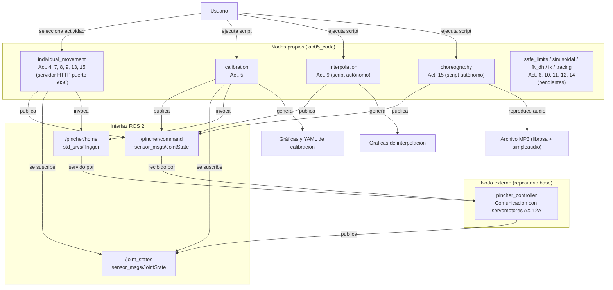
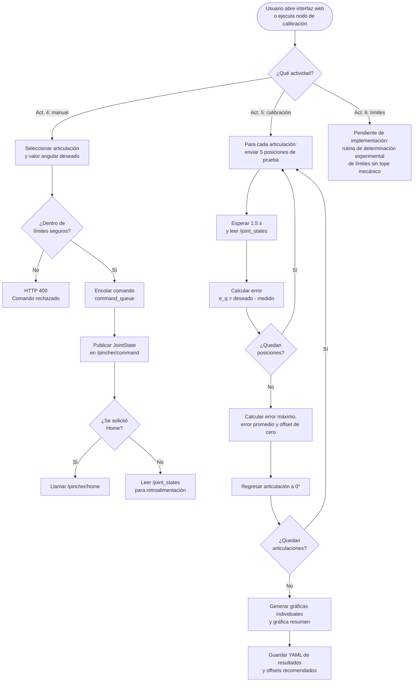
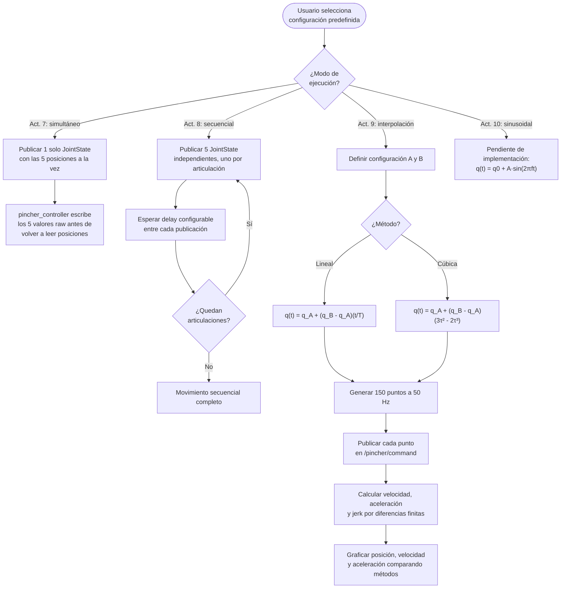
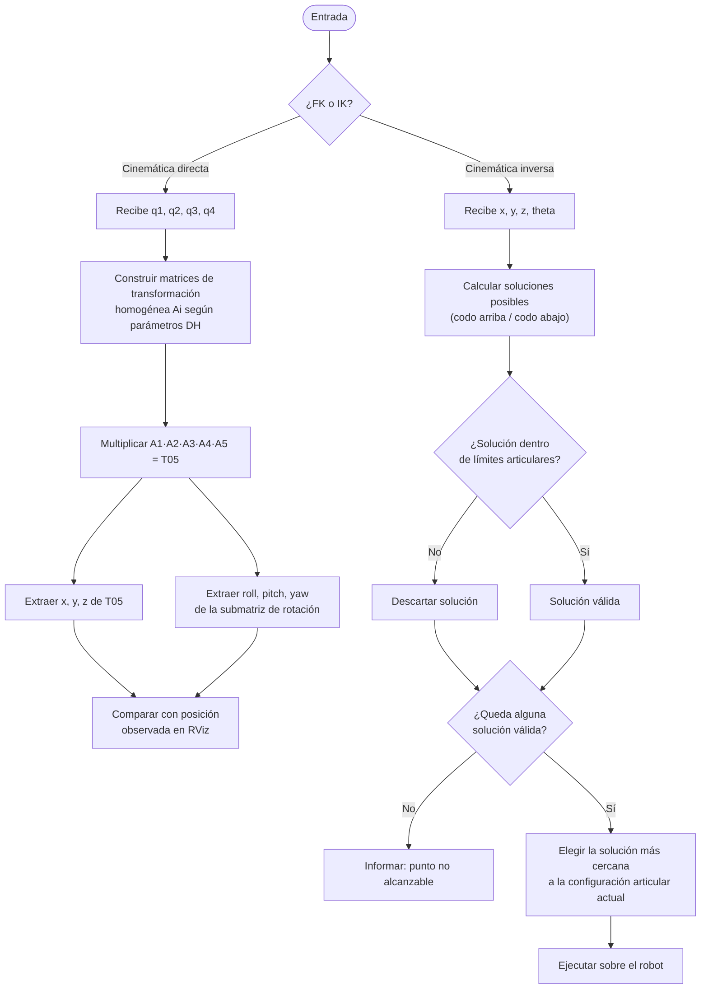
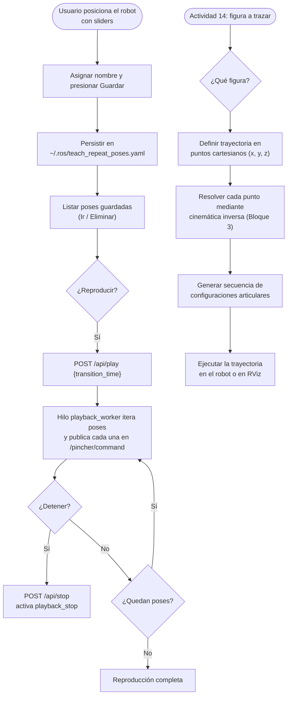
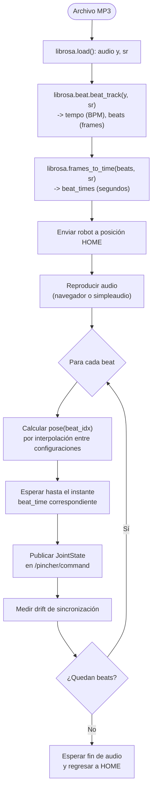

<div align="center">


<a href="https://docs.ros.org/en/jazzy/"></a>
<a href="https://www.python.org/"></a>
<a href="https://emanual.robotis.com/docs/en/dxl/ax/ax-12a/"></a>
<a href="./LICENSE"></a>

</div>

---

<div align="center">

```
╔══════════════════════════════════════════════════════════════════════╗
║        Control y Calibración del Robot Phantom X Pincher X100         ║
║   Cinemática · Trayectorias · Enseñanza y Repetición · Coreografía    ║
╚══════════════════════════════════════════════════════════════════════╝
```

</div>

> **Resumen del laboratorio:** Práctica de laboratorio del curso *Robótica 2026-I* en la que se controla el manipulador Phantom X Pincher X100 mediante ROS 2 Jazzy Jalisco, integrando movimiento articular individual, calibración de cero, movimiento simultáneo y secuencial, interpolación de trayectorias, trayectoria sinusoidal, cinemática directa e inversa, un modo de enseñanza y repetición de poses, trazado de figuras y una coreografía robótica sincronizada con audio. El control se implementa mediante nodos propios en ROS 2 que se comunican con el controlador `pincher_controller` a través de tópicos y servicios, sin depender de herramientas externas de teleoperación.

---

## Tabla de contenido

| # | Sección |
|---|---------|
| 1 | [Información general](#1-información-general) |
| 2 | [Caracterización del robot](#2-caracterización-del-robot) |
| 3 | [Configuración inicial del sistema](#3-configuración-inicial-del-sistema) |
| 4 | [Arquitectura general y diagrama de flujo maestro](#4-arquitectura-general-y-diagrama-de-flujo-maestro) |
| 5 | [Bloque 1 — Control articular básico (Act. 4, 5 y 6)](#5-bloque-1--control-articular-básico-actividades-4-5-y-6) |
| 6 | [Bloque 2 — Movimiento multiarticular y trayectorias (Act. 7, 8, 9 y 10)](#6-bloque-2--movimiento-multiarticular-y-trayectorias-actividades-7-8-9-y-10) |
| 7 | [Bloque 3 — Cinemática directa e inversa (Act. 11 y 12)](#7-bloque-3--cinemática-directa-e-inversa-actividades-11-y-12) |
| 8 | [Bloque 4 — Enseñanza, repetición de poses y trazado (Act. 13 y 14)](#8-bloque-4--enseñanza-repetición-de-poses-y-trazado-actividades-13-y-14) |
| 9 | [Bloque 5 — Coreografía robótica (Act. 15)](#9-bloque-5--coreografía-robótica-actividad-15) |
| 10 | [Plano de planta](#10-plano-de-planta) |
| 11 | [Estructura del repositorio](#11-estructura-del-repositorio) |
| 12 | [Evidencias de ejecución](#12-evidencias-de-ejecución) |
| 13 | [Conclusiones individuales](#13-conclusiones-individuales) |
| 14 | [Referencias](#14-referencias) |

---

## 1. Información general

### 1.1. Datos del laboratorio

| Campo | Descripción |
|-------|-------------|
| **Asignatura** | Robótica — 2026-I |
| **Laboratorio** | No. 05 |
| **Robot** | Phantom X Pincher X100 |
| **Middleware** | ROS 2 Jazzy Jalisco |
| **Sistema operativo** | Ubuntu 24.04 LTS |
| **Lenguaje** | Python 3.12 |
| **Controlador de motores** | DYNAMIXEL AX-12A (Protocolo 1.0) |

### 1.2. Objetivos generales

De acuerdo con la guía de laboratorio, los objetivos de esta práctica son:

- Controlar las articulaciones del robot Phantom X Pincher X100 utilizando ROS 2 Jazzy.
- Medir y modelar la geometría del manipulador.
- Implementar movimientos individuales, simultáneos, secuenciales e interpolados.
- Aplicar cinemática directa e inversa.
- Programar trayectorias, repetición de poses y tareas artísticas con el robot.

### 1.3. Repositorios base

El presente trabajo se desarrolló a partir de los siguientes repositorios institucionales:

| Repositorio | Propósito |
|-------------|-----------|
| [06_Rob_2026_I_ROS2_Jazzy_PhantomX100_RVIZ](https://github.com/labsir-un/06_Rob_2026_I_ROS2_Jazzy_PhantomX100_RVIZ.git) | Visualización y control del robot en ROS 2 Jazzy |
| [KIT_Phantom_X_Pincher_ROS2](https://github.com/labsir-un/KIT_Phantom_X_Pincher_ROS2.git) | Kit Phantom X Pincher para ROS 2 |
| [3DModels_KIT_Phantom_Pincher_X100](https://github.com/labsir-un/3DModels_KIT_Phantom_Pincher_X100.git) | Archivos tridimensionales del robot |

### 1.4. Condiciones de operación

Las siguientes condiciones aplican a todas las actividades del laboratorio:

- El robot debe iniciar y finalizar cada prueba en una posición segura.
- Todos los valores enviados deben respetar los límites articulares.
- Los movimientos de gran amplitud deben realizarse mediante trayectorias interpoladas.
- No se debe sujetar ni bloquear manualmente el robot mientras los servomotores estén energizados.
- Cada movimiento debe verificarse antes de ejecutarse sobre el robot real.

---

## 2. Caracterización del robot

Esta sección corresponde a las Actividades 1, 2 y 3 de la guía: preparación del robot, identificación de motores y articulaciones, y medición de la geometría del manipulador. A diferencia de los bloques posteriores, no requiere un nodo de ROS 2 propio; es trabajo de identificación física y documental que alimenta directamente los parámetros usados en el Bloque 3 (cinemática).

### 2.1. Actividad 1 — Preparación del robot

*Pendiente por diligenciar.* Se debe registrar el procedimiento de verificación de conexión de los servomotores, energización del sistema y comprobación de correspondencia entre el modelo en RViz y la posición física del manipulador (posición de home, todas las articulaciones en 0°).

### 2.2. Actividad 2 — Identificación de motores y articulaciones

Los identificadores DYNAMIXEL se numeran de manera consecutiva desde la base hasta la pinza (Base = ID 1 ... Pinza = ID 5), en correspondencia con el arreglo `dxl_ids: [1, 2, 3, 4, 5]` definido en `pincher_control/config/ax12a.yaml`.

| Articulación | ID DYNAMIXEL | Posición de referencia (home) | Sentido positivo de movimiento | Función |
|-------------|:------------:|:------------------------------:|:-------------------------------:|---------|
| Base (`waist`)      | 1 | *Pendiente* | *Pendiente* | Rotación de la base sobre el eje vertical |
| Hombro (`shoulder`) | 2 | *Pendiente* | *Pendiente* | Elevación del brazo superior |
| Codo (`elbow`)      | 3 | *Pendiente* | *Pendiente* | Flexión del antebrazo |
| Muñeca (`wrist`)    | 4 | *Pendiente* | *Pendiente* | Orientación del efector final |
| Pinza (`gripper`)   | 5 | *Pendiente* | *Pendiente* | Apertura y cierre de las falanges |

> Nota: las columnas "Posición de referencia" y "Sentido positivo" deben verificarse físicamente sobre el robot real (girando cada articulación manualmente sin energizar, o comandando pequeños desplazamientos positivos y observando el sentido de giro) y luego completarse aquí.

### 2.3. Actividad 3 — Medición del robot

Las dimensiones del manipulador se obtuvieron a partir de los parámetros cinemáticos definidos en el archivo `pincher_description/urdf/robot.xacro` del modelo tridimensional del kit. Estas medidas corresponden a la alternativa de "medición de los archivos STL / modelo CAD" contemplada en la guía, y deben contrastarse con una medición directa sobre el robot físico usando calibrador antes de darlas como definitivas.

**Parámetros extraídos del modelo (`robot.xacro`):**

| Parámetro | Valor (m) | Descripción |
|-----------|:---------:|-------------|
| `H0` | 0.0450 | Altura desde la base hasta el eje de la articulación `waist` |
| `L1` | 0.0445 | Distancia entre el eje de `waist` y el eje de `shoulder` |
| `L2` | 0.1010 | Longitud del brazo superior (`shoulder` → `elbow`) |
| `L3` | 0.1010 | Longitud del antebrazo (`elbow` → `wrist`) |
| `L4` | 0.1190 | Distancia desde `wrist` hasta el punto de montaje de la pinza |
| `Lm` | 0.0000 | Desplazamiento horizontal del brazo superior (ajustado a 0 en este robot; el modelo CAD de referencia trae 0.0315 m, pero el robot físico asignado no presenta ese offset — ver sección 3.6) |
| Offset muñeca-pinza | 0.0660 | Distancia adicional desde `link4` hasta la barra de la pinza (`gripper_bar`) |
| Carrera de cada dedo | 0.015 a 0.040 | Recorrido prismático de apertura/cierre por dedo (`joint6`/`joint7`) |

**Distancia total base-TCP aproximada (brazo extendido, sin contar apertura de pinza):**

```
H0 + L1 + L2 + L3 + L4 + 0.066 ≈ 0.045 + 0.0445 + 0.101 + 0.101 + 0.119 + 0.066 ≈ 0.4765 m
```

*Pendiente:* validar estos valores con calibrador sobre el robot físico y generar el diagrama con las dimensiones, los ejes de movimiento y los sistemas coordenados (ver plantilla de referencia en la guía, Figura 2). Este diagrama debe incluirse como imagen en esta sección una vez elaborado, y reutilizarse como base para la tabla de parámetros DH del Bloque 3.

---

## 3. Configuración inicial del sistema

### 3.1. Preparación del espacio de trabajo

El workspace de ROS 2 se encuentra en `~/ros2_jazzy/phantom_ws/` y contiene los siguientes paquetes:

| Paquete | Descripción |
|---------|-------------|
| `pincher_control` | Controlador de los servomotores DYNAMIXEL (publicación de estados y recepción de comandos) |
| `pincher_description` | Modelo URDF del robot, mallas STL y archivos de visualización para RViz |
| `lab05_code` | Código fuente de las actividades del laboratorio (presente repositorio) |

### 3.2. Conexión del robot

1. Conectar el robot Phantom X Pincher X100 al puerto USB del computador.
2. Verificar que el dispositivo aparezca como `/dev/ttyUSB0`:

   ```bash
   ls -l /dev/ttyUSB0
   ```

3. Verificar que el usuario tenga permisos de lectura y escritura sobre el puerto serie:

   ```bash
   sudo usermod -a -G dialout $USER
   ```

   Es necesario cerrar sesión y volver a iniciarla para que el cambio surta efecto.

4. Energizar el robot con su fuente de alimentación.

### 3.3. Lanzamiento del sistema

Para iniciar el controlador del robot junto con la visualización en RViz, ejecutar:

```bash
source /opt/ros/jazzy/setup.zsh
source ~/ros2_jazzy/phantom_ws/install/setup.zsh
ros2 launch pincher_control pincher_system.launch.py use_hardware:=true motor_model:=ax12a
```

Este comando realiza las siguientes acciones:

1. Inicia el nodo `pincher_controller`, que se comunica con los servomotores AX-12A a través del puerto serie `/dev/ttyUSB0` a 1 000 000 baudios.
2. Publica el estado de las articulaciones en el tópico `/joint_states` a 20 Hz.
3. Escucha comandos de posición en el tópico `/pincher/command` (tipo `JointState`, unidades en radianes).
4. Expone los servicios `/pincher/home`, `/pincher/software_stop` y `/pincher/torque_enable`.
5. Inicia la visualización del modelo URDF en RViz2.

### 3.4. Parámetros del controlador

Los parámetros del controlador se definen en el archivo `pincher_control/config/ax12a.yaml`:

```yaml
pincher_controller:
  ros__parameters:
    motor_model: ax12a
    use_hardware: false
    port: /dev/ttyUSB0
    baudrate: 1000000
    dxl_ids: [1, 2, 3, 4, 5]
    joint_names: [waist, shoulder, elbow, wrist, gripper]
    joint_signs: [1.0, -1.0, -1.0, -1.0, 1.0]
    home_positions: [512, 512, 512, 512, 512]
    moving_speed: 100
    torque_limit: 800
    read_rate_hz: 20.0
    home_on_startup: false
    disable_torque_on_shutdown: true
```

| Parámetro | Descripción |
|-----------|-------------|
| `motor_model` | Perfil del motor (`ax12a` o `xl430`) |
| `use_hardware` | Si es `true`, abre el puerto serie y comanda los motores reales |
| `port` | Dispositivo serie del robot |
| `baudrate` | Velocidad de comunicación en baudios |
| `dxl_ids` | Identificadores DYNAMIXEL de cada motor |
| `joint_names` | Nombres lógicos de las articulaciones |
| `joint_signs` | Signo de la relación rad/raw (inversión de sentido) |
| `home_positions` | Valor raw correspondiente a 0° para cada articulación |

### 3.5. Articulaciones del robot

| Índice | Nombre | ID DYNAMIXEL | Función | Rango seguro |
|:------:|--------|:------------:|---------|:------------:|
| 0 | `waist` | 1 | Rotación de la base | ±150° |
| 1 | `shoulder` | 2 | Elevación del hombro | ±150° |
| 2 | `elbow` | 3 | Flexión del codo | ±150° |
| 3 | `wrist` | 4 | Rotación de la muñeca | ±150° |
| 4 | `gripper` | 5 | Apertura y cierre de la pinza | -90° a +90° |

### 3.6. Modificación del modelo URDF

Para que el modelo en RViz coincidiera con la posición física del robot en reposo (todas las articulaciones en 0°), se realizaron las siguientes modificaciones al archivo `pincher_description/urdf/robot.xacro`:

1. **Offset del codo**: Se agregó un desplazamiento de +90° al origen de la articulación `elbow` para que la posición de referencia (0° en el controlador) corresponda a un brazo vertical y no en forma de L.
2. **Parámetro `Lm`**: Se estableció `Lm = 0.0` (originalmente 0.0315 m) debido a que el robot físico no presenta el offset que sí existe en el modelo CAD de referencia.

---

## 4. Arquitectura general y diagrama de flujo maestro

El sistema completo se apoya en un único nodo externo, `pincher_controller` (entregado por el repositorio base), que se comunica con los servomotores AX-12A y expone la interfaz de ROS 2 (tópicos y servicios) usada por todos los nodos propios del laboratorio. Sobre esa base se construyeron los siguientes nodos, cada uno asociado a uno o varios entry points declarados en `setup.py`:

| Nodo / entry point | Actividades que cubre | Archivo fuente | Estado |
|---------------------|------------------------|----------------|:------:|
| `individual_movement` | 4, 7, 8, 9 (interfaz web), 13, 15 (interfaz web) | `individual_movement.py` | Implementado |
| `calibration` | 5 | `calibration.py` | Implementado |
| `safe_limits` | 6 | *(pendiente)* | Pendiente |
| `simultaneous_movement` | 7 (script independiente) | *(pendiente, cubierto por `individual_movement`)* | Cubierto vía interfaz web |
| `sequential_movement` | 8 (script independiente) | *(pendiente, cubierto por `individual_movement`)* | Cubierto vía interfaz web |
| `interpolation` | 9 (script autónomo con gráficas) | `interpolation.py` | Implementado |
| `sinusoidal` | 10 | *(pendiente)* | Pendiente |
| `fk_dh` | 11 | *(pendiente)* | Pendiente |
| `ik` | 12 | *(pendiente)* | Pendiente |
| `teach_and_repeat` | 13 | Cubierto por `individual_movement.py` | Implementado |
| `tracing` | 14 | *(pendiente)* | Pendiente |
| `choreography` | 15 (script autónomo) | `choreography.py` | Implementado |

### 4.1. Diagrama de arquitectura general



Este diagrama es el mapa general del sistema: todos los nodos comparten la misma interfaz de comunicación con `pincher_controller` (un publicador en `/pincher/command`, un suscriptor a `/joint_states` y un cliente del servicio `/pincher/home`), y se diferencian en la lógica que aplican antes de publicar el comando. Los diagramas de detalle de cada bloque, presentados en las secciones siguientes, desarrollan esa lógica interna.

---

## 5. Bloque 1 — Control articular básico (Actividades 4, 5 y 6)

### 5.1. Diagrama de flujo del bloque



### 5.2. Actividad 4 — Movimiento individual de articulaciones

**Objetivo específico:** desarrollar un programa que permita seleccionar una articulación del robot y enviarle una posición angular de forma independiente, ejecutando al menos tres posiciones diferentes por articulación y retornando a la posición de referencia.

**Implementación:** el programa se implementó como un nodo de ROS 2 en Python (`MovementNode`, en `individual_movement.py`) que integra un servidor HTTP embebido para facilitar la interacción con el usuario, mientras que todo el control subyacente se realiza mediante los mecanismos nativos de ROS 2: tópicos, servicios y la cola de ejecución de `rclpy`.

**Componentes del nodo:**

- `cmd_pub`: publicador en `/pincher/command` (tipo `sensor_msgs/JointState`).
- `state_sub`: suscriptor a `/joint_states`, cuyos datos se almacenan en `current_state` protegido por `state_lock`.
- `home_cli`: cliente del servicio `/pincher/home` (tipo `std_srvs/Trigger`).
- `command_queue`: cola de tipo `queue.Queue` que desacopla el servidor HTTP (hilo secundario) del bucle principal de ROS 2. En cada iteración de `rclpy.spin_once`, el método `process_queue` retira un comando de la cola: si es de tipo `move`, construye un `JointState` y lo publica; si es `home`, invoca el servicio de forma asíncrona.

**Servidor HTTP (hilo `daemon`):** implementado con `http.server.HTTPServer` de la biblioteca estándar (sin dependencias externas), corre en el puerto 5050 y expone, entre otros, los endpoints:

| Endpoint | Método | Descripción |
|----------|:------:|--------------|
| `/api/state` | GET | Retorna la posición actual de cada articulación en radianes |
| `/api/command` | POST | Recibe `{name: [...], position: [...]}`, valida contra `JOINT_LIMITS_DEG` y encola el comando |

La validación de límites se realiza en `APIHandler.do_POST` antes de encolar el comando; si un valor excede los límites definidos en `JOINT_LIMITS_DEG`, se responde con HTTP 400 y el comando nunca llega al tópico de ROS 2.

**Límites de seguridad aplicados:**

| Articulación | Límite inferior | Límite superior |
|-------------|:---------------:|:---------------:|
| Base | -150° | +150° |
| Hombro | -150° | +150° |
| Codo | -150° | +150° |
| Muñeca | -150° | +150° |
| Pinza | -90° | +90° |

**Instrucciones de uso:**

```bash
ros2 launch pincher_control pincher_system.launch.py use_hardware:=true motor_model:=ax12a
```

```bash
source ~/ros2_jazzy/phantom_ws/install/setup.zsh
ros2 run lab05_code individual_movement
```

Abrir `http://localhost:5050`, pestaña *Actividad 4*. Cada articulación tiene un slider que envía la posición al soltarlo o al presionar Enter. El botón *Home* invoca el servicio `/pincher/home`.

**Análisis:** el patrón cola de comandos más sondeo en `rclpy.spin_once` permite que el nodo ROS 2 y el servidor HTTP coexistan sin bloqueos. La retroalimentación de `/joint_states` (~13-20 Hz) se usa para visualización; el control de posición real es responsabilidad de `pincher_controller`. La validación de límites en el backend evita que posiciones peligrosas lleguen siquiera al tópico de ROS 2.

*Video de esta actividad:* ver sección 12 (Evidencias de ejecución), video "Movimiento individual, simultáneo y secuencial".

### 5.3. Actividad 5 — Calibración de cero y error articular

**Objetivo específico:** cuantificar el error sistemático de cada articulación enviando posiciones angulares conocidas y comparándolas con la posición reportada por el servomotor, y calcular el desplazamiento de cero necesario para corregir la calibración.

**Fundamento teórico:**

El error articular se define como:

$$e_q = q_{\text{deseado}} - q_{\text{medido}}$$

El offset de cero se calcula como el promedio de los errores medidos:

$$\text{offset} = \frac{1}{N} \sum_{i=1}^{N} e_{q_i}$$

Para aplicar la corrección en los servomotores AX-12A (rango de 0 a 1023 unidades para 300° de giro mecánico):

$$\text{raw\_offset} = \text{offset}_{\text{grados}} \times \frac{1024}{300}$$

**Metodología:** el nodo `calibration.py` (`CalibrationNode`) automatiza el proceso completo. Para cada articulación, en el orden base -> hombro -> codo -> muñeca -> pinza:

1. Se envían 5 posiciones angulares distribuidas en el rango seguro, con paso aproximado de 45°.
2. Después de cada comando se espera hasta 3 s (con verificación activa mediante `wait_settle`, tolerancia de ±2°) a que el motor alcance la posición.
3. Se lee la posición reportada desde `/joint_states`.
4. Se calcula el error, y al finalizar las 5 pruebas de una articulación se determina error máximo, error promedio y offset de cero.
5. La articulación regresa a 0° antes de continuar con la siguiente.

**Posiciones de prueba:**

| Articulación | Posiciones de prueba |
|-------------|:---------------------:|
| Base | -60°, -30°, 0°, +30°, +60° |
| Hombro | 0°, +15°, +30°, +45°, +60° |
| Codo | -60°, -30°, 0°, +30°, +60° |
| Muñeca | -60°, -30°, 0°, +30°, +60° |
| Pinza | -30°, -15°, 0°, +15°, +30° |

*Nota:* los rangos se redujeron respecto a la capacidad máxima de cada servo para evitar colisiones con la mesa de trabajo; el hombro se limitó a [0°, +60°] por la misma razón.

**Resultados obtenidos (sesión del 2026-07-08 23:04):**

| Articulación | Error máx (°) | Error prom (°) | Offset cero (°) |
|-------------|:------------:|:--------------:|:---------------:|
| Base | 1.64 | +0.76 | +0.76 |
| Hombro | 1.29 | -0.85 | -0.85 |
| Codo | 1.00 | -0.29 | -0.29 |
| Muñeca | 0.50 | -0.29 | -0.29 |
| Pinza | 0.38 | +0.29 | +0.29 |

**Gráficas de calibración:**


*Figura 5.1: Calibración de la articulación Base. Panel superior: posición deseada vs. medida. Panel inferior: error por punto de prueba.*


*Figura 5.2: Calibración de la articulación Hombro.*


*Figura 5.3: Calibración de la articulación Codo.*


*Figura 5.4: Calibración de la articulación Muñeca.*


*Figura 5.5: Calibración de la articulación Pinza.*


*Figura 5.6: Resumen comparativo de todas las articulaciones.*

**Aplicación de la corrección de cero:** una vez calculados los offsets, se deben aplicar en `pincher_control/config/ax12a.yaml` sumándolos al parámetro `home_positions`. Por ejemplo, para un offset de hombro de -0.85°:

```yaml
home_positions: [512 + 3, 512 - 3, 512, 512, 512]
```

(la conversión exacta grados -> raw se calcula como `offset_grados × 1024 / 300`; ver `offsets_recomendados.yaml` para los valores ya calculados de esta sesión).

**Archivos generados:** `calibracion_resultados.yaml`, `offsets_recomendados.yaml` y `README_calibracion.md`, disponibles en el directorio `results/` de este paquete.

**Interpretación:** el error máximo se mantuvo por debajo de ±1.7° en todas las articulaciones, y el mayor sesgo sistemático corresponde al hombro (-0.85° en promedio), lo cual es consistente con ser la articulación que soporta mayor carga mecánica en la mayoría de las posiciones de prueba. Se recomienda aplicar los offsets calculados y repetir la calibración para verificar que el error promedio se reduzca.

*Video de esta actividad:* la ejecución de la calibración puede incluirse como evidencia adicional en la sección 12, o documentarse únicamente mediante las gráficas generadas (la guía no exige video específico para esta actividad).

### 5.4. Actividad 6 — Determinación de límites seguros

*Pendiente de implementación.* Esta actividad requiere determinar experimentalmente, sin alcanzar los topes mecánicos, el límite inferior y superior real de cada articulación, y un margen de seguridad. Se planea implementar como una rutina dentro de `safe_limits.py` (entry point ya declarado en `setup.py`) que:

- Incremente progresivamente el valor comandado hasta detectar resistencia mecánica o saturación de corriente (o hasta el límite indicado por el operador desde la interfaz).
- Registre el valor límite alcanzado y calcule un margen de seguridad respecto al tope mecánico real.
- Alimente la tabla `JOINT_LIMITS_DEG` usada por `individual_movement.py` y `calibration.py`, de modo que el sistema impida el envío de valores fuera de estos límites (requisito explícito de la guía).

| Articulación | Límite inferior | Límite superior | Margen de seguridad |
|-------------|:----------------:|:-----------------:|:---------------------:|
| Base | *Pendiente* | *Pendiente* | *Pendiente* |
| Hombro | *Pendiente* | *Pendiente* | *Pendiente* |
| Codo | *Pendiente* | *Pendiente* | *Pendiente* |
| Muñeca | *Pendiente* | *Pendiente* | *Pendiente* |
| Pinza | *Pendiente* | *Pendiente* | *Pendiente* |

Mientras tanto, el sistema opera con los límites conservadores ya declarados en `JOINT_LIMITS_DEG` (±150° para las cuatro articulaciones del brazo y ±90° para la pinza), que cumplen el requisito de no enviar comandos fuera de rango, aunque todavía no han sido determinados de forma experimental según pide la actividad.

---

## 6. Bloque 2 — Movimiento multiarticular y trayectorias (Actividades 7, 8, 9 y 10)

### 6.1. Diagrama de flujo del bloque



### 6.2. Actividad 7 — Movimiento simultáneo

**Objetivo:** programar el desplazamiento simultáneo de todas las articulaciones para ejecutar cinco configuraciones predefinidas.

**Configuraciones de prueba (en grados; base, hombro, codo, muñeca, pinza):**

| Config | Base | Hombro | Codo | Muñeca | Pinza |
|:------:|:----:|:------:|:----:|:------:|:-----:|
| 1 (Home) | 0 | 0 | 0 | 0 | 0 |
| 2 | 25 | 25 | 20 | -20 | 0 |
| 3 | -35 | 35 | -30 | 30 | 0 |
| 4 | 85 | -20 | 55 | 25 | 0 |
| 5 | 80 | -35 | 55 | -45 | 0 |

*Nota:* si alguna configuración no resulta segura para el robot asignado, debe modificarse y justificarse en el informe una vez se realicen las pruebas físicas.

**Implementación:** se reutiliza el mismo `MovementNode` de la Actividad 4 y su endpoint `POST /api/command`. La diferencia clave es que aquí se envían los 5 valores en un único mensaje `JointState`, lo que hace que `pincher_controller` los interprete como un comando simultáneo:

```
POST /api/command {name: [waist,shoulder,elbow,wrist,gripper],
                   position: [0.44,0.44,0.35,-0.35,0.0]}
       -> cmd_pub.publish(JointState(name=[...5...], position=[...5...]))
       -> /pincher/command -> pincher_controller
```

**Interfaz web:** pestaña con las 5 configuraciones predefinidas mostradas en inputs editables, cada una con botón *Ejecutar* que envía un único `POST /api/command`.

### 6.3. Actividad 8 — Movimiento secuencial

**Objetivo:** ejecutar una de las configuraciones anteriores moviendo las articulaciones una tras otra (Base -> Hombro -> Codo -> Muñeca -> Pinza) y comparar el resultado con el movimiento simultáneo.

**Implementación:** en contraste con la Actividad 7, aquí se generan 5 publicaciones independientes en `/pincher/command`, cada una con una sola articulación, separadas por un delay configurable (0.5-3 s):

```
POST /api/command {name:[waist],   position:[0.44]} -> sleep(delay)
POST /api/command {name:[shoulder],position:[0.44]} -> sleep(delay)
POST /api/command {name:[elbow],   position:[0.35]} -> sleep(delay)
POST /api/command {name:[wrist],   position:[-0.35]} -> sleep(delay)
POST /api/command {name:[gripper], position:[0.0]}
```

El tiempo total de la secuencia es `5 × delay` más el tiempo de procesamiento de cada comando.

**Comparación simultáneo vs. secuencial (a completar tras las pruebas físicas):**

| Criterio | Simultáneo | Secuencial |
|----------|:----------:|:----------:|
| Tiempo de ejecución | *Pendiente de medir* | *Pendiente de medir* |
| Trayectoria del TCP | *Pendiente de observar* | *Pendiente de observar* |
| Suavidad del movimiento | *Pendiente de observar* | *Pendiente de observar* |

**Interfaz web:** pestaña con selector de configuración (las de la Actividad 7), slider de delay y tres botones: *Ejecutar secuencial*, *Ejecutar simultáneo* y *Home*, mostrando el progreso (1/5 ... 5/5) y el tiempo transcurrido de cada modo.

*Video de estas actividades:* ver sección 12, video "Movimiento individual, simultáneo y secuencial".

### 6.4. Actividad 9 — Interpolación de trayectorias

**Objetivo:** implementar interpolación lineal y cúbica para mover el robot entre dos configuraciones alejadas, y comparar la suavidad mediante gráficas de `q(t)`.

**Algoritmo:**

Interpolación lineal:
$$q(t) = q_A + (q_B - q_A) \cdot \frac{t}{T}$$

Interpolación cúbica (velocidad cero en ambos extremos):
$$q(t) = q_A + (q_B - q_A) \cdot \left(3\left(\frac{t}{T}\right)^2 - 2\left(\frac{t}{T}\right)^3\right)$$

**Implementación:** el script autónomo `interpolation.py` define dos configuraciones de prueba:

- Configuración A (inicio): home, `[0, 0, 0, 0, 0]`.
- Configuración B (final): `[85, -20, 55, 25, 0]` grados.

Se generan **N = 150 puntos** a **50 Hz** (T = 3 s) para cada método, y se calculan velocidad y aceleración por diferencias finitas (`np.gradient`). El script pregunta si se desea ejecutar la trayectoria en el robot (lineal primero, luego cúbica) y en cualquier caso genera una gráfica comparativa de 5 articulaciones × 3 magnitudes (posición, velocidad, aceleración), guardada en `~/ros2_jazzy/phantom_ws/interpolation_results/`.

**Métricas de suavidad esperadas:**

| Métrica | Lineal | Cúbica |
|---------|--------|--------|
| Velocidad máxima | Mayor (cambio brusco al inicio/fin) | Menor (suave en extremos) |
| Aceleración máxima | Discontinua en t=0 y t=T | Continua |
| Jerk máximo | Teóricamente infinito | Finito |

**Instrucciones de uso:**

```bash
source ~/ros2_jazzy/phantom_ws/install/setup.zsh
ros2 run lab05_code interpolation
```

Adicionalmente, la quinta pestaña de la interfaz web (`individual_movement.py`) permite seleccionar configuraciones A/B, duración, método (lineal, cúbico o ambos) y visualizar las curvas de posición/velocidad/aceleración en Canvas antes de ejecutar en el robot con confirmación previa.

*Gráfica generada:* `interpolacion_config_a_a_b.png` — a incluir en el repositorio una vez ejecutada la prueba física completa.

### 6.5. Actividad 10 — Trayectoria sinusoidal

*Pendiente de implementación.* Debe programarse:

$$q(t) = q_0 + A \sin(2\pi f t)$$

sobre una articulación seleccionada, realizando cuatro pruebas combinando dos amplitudes y dos frecuencias:

| Prueba | Amplitud A (°) | Frecuencia f (Hz) |
|:------:|:--------------:|:-------------------:|
| 1 | 30 | 0.25 |
| 2 | 30 | 0.50 |
| 3 | 60 | 0.25 |
| 4 | 60 | 0.50 |

Se planea generar puntos a 50 Hz durante al menos 2 periodos, registrar posición deseada y medida, graficar ambas curvas por prueba, y calcular el error máximo y el error cuadrático medio (RMSE), siguiendo el mismo patrón de publicación y lectura ya usado en `calibration.py` e `interpolation.py`.

---

## 7. Bloque 3 — Cinemática directa e inversa (Actividades 11 y 12)

*Bloque pendiente de implementación en su totalidad.* Se deja documentada la base teórica y los parámetros geométricos disponibles (sección 2.3) para facilitar su desarrollo posterior.

### 7.1. Diagrama de flujo previsto



### 7.2. Actividad 11 — Cinemática directa

**Parámetros Denavit-Hartenberg propuestos** (a validar y ajustar con las medidas de la sección 2.3 una vez desarrollado `fk_dh.py`):

| i | α(i-1) | a(i-1) | d(i) | θ(i) |
|:-:|:------:|:------:|:----:|:----:|
| 1 | 0° | 0 | H0 + L1 | q1 |
| 2 | -90° | 0 | 0 | q2 |
| 3 | 0° | L2 | 0 | q3 |
| 4 | 0° | L3 | 0 | q4 |
| 5 | 0° | L4 | 0 | 0 |

Donde `H0`, `L1`, `L2`, `L3` y `L4` corresponden a los valores medidos en la sección 2.3 (extraídos de `robot.xacro`; pendientes de validación física con calibrador).

**Pendiente:** implementar `fk_dh.py`, que debe recibir `q1, q2, q3, q4` y calcular `x, y, z, roll, pitch, yaw`, evaluando las 5 configuraciones de la Actividad 7 y comparando la posición calculada con la observada en RViz.

### 7.3. Actividad 12 — Cinemática inversa

**Pendiente:** implementar `ik.py`, que debe recibir `x, y, z, theta` y calcular una configuración articular válida, siguiendo la especificación de la guía:

1. Calcular las soluciones posibles (codo arriba / codo abajo).
2. Descartar soluciones fuera de los límites articulares (usar los límites de la sección 5.4 una vez determinados experimentalmente).
3. Informar cuando el punto no sea alcanzable.
4. Ejecutar la solución válida más cercana a la configuración articular actual.
5. Probar al menos 5 posiciones cartesianas diferentes.

---

## 8. Bloque 4 — Enseñanza, repetición de poses y trazado (Actividades 13 y 14)

### 8.1. Diagrama de flujo del bloque



### 8.2. Actividad 13 — Enseñanza y repetición de poses

**Objetivo:** desarrollar un modo de enseñanza que permita mover el robot a una configuración deseada, guardarla con un nombre, almacenar múltiples poses y reproducirlas secuencialmente con tiempo de transición ajustable, persistiendo las poses en un archivo YAML.

**Implementación:** se extiende el mismo `MovementNode` de la Actividad 4, agregando:

- **Persistencia de poses en YAML** (`~/.ros/teach_repeat_poses.yaml`), cargada automáticamente al iniciar el nodo (`load_poses()`) y reescrita con cada modificación (`save_poses()`). Si el módulo `yaml` no está instalado, las poses solo persisten en memoria durante la sesión.
- **Reproductor en segundo plano:** hilo `daemon` (`playback_worker`) que itera sobre las poses guardadas y las publica una a una en `/pincher/command`, con un tiempo de transición configurable entre 0.5 y 5 s.
- **Control de reproducción** mediante `threading.Event` (`playback_stop`), que permite detener el hilo reproductor en cualquier momento.

**API de poses (HTTP):**

| Método | Endpoint | Descripción |
|--------|----------|-------------|
| `GET` | `/api/poses` | Lista completa de poses guardadas |
| `GET` | `/api/status` | Estado actual: `playing`, `current`, `total`, `pose_name` |
| `POST` | `/api/poses` | Guarda nueva pose. Body `{name, positions: {joint: deg,...}}` |
| `DELETE` | `/api/poses/{idx}` | Elimina la pose en el índice `idx` |
| `POST` | `/api/play` | Inicia reproducción. Body `{transition_time: segundos}` |
| `POST` | `/api/stop` | Detiene la reproducción |

**Formato de persistencia (`teach_repeat_poses.yaml`):**

```yaml
- name: reposo
  positions:
    waist: 0.0
    shoulder: 0.0
    elbow: 0.0
    wrist: 0.0
    gripper: 0.0
- name: alcanzar
  positions:
    waist: 45.0
    shoulder: 30.0
    elbow: -45.0
    wrist: 20.0
    gripper: 10.0
```

**Instrucciones de uso:**

1. Lanzar el controlador y ejecutar `ros2 run lab05_code individual_movement`.
2. Abrir `http://localhost:5050`, pestaña *Actividad 13 — Enseñanza y Repetición*.
3. Posicionar el robot con los sliders, asignar nombre y presionar *Guardar*. Repetir hasta tener al menos 8 poses, según pide la guía.
4. Ajustar tiempo de transición y presionar *Reproducir*.
5. Para detener, presionar *Detener*.

*Video de esta actividad:* ver sección 12, video "Enseñanza y repetición de poses".

### 8.3. Actividad 14 — Trazado de una figura

*Pendiente de implementación.* Debe usarse un soporte liviano para marcador (o trazado virtual en RViz), definiendo la trayectoria en coordenadas cartesianas y resolviendo cada punto mediante la cinemática inversa desarrollada en el Bloque 3 (`ik.py`). Se planea implementar `tracing.py`, que reciba el tipo de figura (triángulo, cuadrado, círculo aproximado por puntos, o iniciales del equipo), la dimensión y la resolución deseada, calcule los puntos vía IK y ejecute la secuencia resultante reutilizando la lógica de interpolación del Bloque 2 entre puntos consecutivos.

*Video de esta actividad:* ver sección 12, video "Trazado de figuras" (pendiente de grabar hasta que se implemente el código).

---

## 9. Bloque 5 — Coreografía robótica (Actividad 15)

### 9.1. Diagrama de flujo del bloque



### 9.2. Objetivo y especificaciones

Programar una coreografía sincronizada con una obra musical para el Phantom X Pincher X100, utilizando todas las articulaciones del robot, con detección automática de beats. La coreografía debe iniciar y finalizar en posición segura, utilizar base, hombro, codo, muñeca y pinza, sincronizar los cambios de pose con los beats detectados, respetar los límites seguros durante toda la ejecución, y ejecutarse sin intervención manual una vez iniciada (duración mínima de 45 s según el enunciado del proyecto; la implementación actual cubre la canción completa, de aproximadamente 144 s).

### 9.3. Implementación

La coreografía combina el análisis de audio con `librosa` (detección de beats) y la publicación de poses en `/pincher/command` sincronizada con el ritmo. Se implementaron dos modalidades:

**Modalidad A — Interfaz web** (pestaña *Baile — Coreografía* dentro de `individual_movement.py`): el servidor HTTP expone `POST /api/dance/start` (analiza el MP3 o recupera el análisis de una caché `_dance_cache`) y `GET /api/dance/audio` (sirve el archivo al navegador). El audio se reproduce localmente en el navegador con `HTMLAudioElement`; cada 40 ms el JavaScript compara `audio.currentTime` contra `beat_times` y, al alcanzar un beat, envía `POST /api/command` con la pose correspondiente, generada por interpolación sinusoidal entre las 5 configuraciones seguras de la Actividad 7:

```javascript
blend = 0.5 + 0.5 * sin(beatIdx / 5 * 2π)
pose[i] = lerp(presets[rawIdx].vals[i], presets[nextIdx].vals[i], blend)
```

**Modalidad B — Script autónomo** (`choreography.py`, nodo `DanceNode`): recibe la ruta al MP3 por línea de comandos, con parámetros opcionales `--start-offset` y `--duration`. Carga el audio con `librosa`, detecta beats con `beat_track`, reproduce el audio con `simpleaudio`, y publica una pose por beat según la función `make_pose(beat_idx)`, que rota entre 8 configuraciones fijas (alternando home con configuraciones de ±30°, ±45° y ±60° en hombro/codo). El *drift* de sincronización entre el tiempo real y el tiempo del beat se mide en cada iteración y se reporta si supera 50 ms:

```python
for i, t in enumerate(beat_times):
    sleep_needed = t - (time.time() - start_real)
    if sleep_needed > 0:
        time.sleep(sleep_needed)
    node.send(poses[i])
    drift = (time.time() - start_real) - t
```

Al finalizar la canción, el script espera a que termine la reproducción de audio (`play_obj.wait_done()`) y regresa el robot a HOME.

### 9.4. Canción utilizada

| Campo | Valor |
|-------|-------|
| **Título** | Pedro — Raffaella Carrà, Jaxomy, Agatino Romero (Remix) |
| **Ubicación** | `~/ros2_jazzy/` |
| **Tempo detectado** | ~152 BPM |
| **Beats detectados** | ~359 |
| **Duración** | ~144 s |

### 9.5. Dependencias adicionales

```bash
pip install librosa simpleaudio
```

| Paquete | Propósito |
|---------|-----------|
| `librosa` | Carga de audio MP3 y detección de beats |
| `numpy` | Procesamiento de arreglos de audio |
| `simpleaudio` | Reproducción de audio (solo script autónomo) |

### 9.6. Instrucciones de uso

**Interfaz web:**

```bash
ros2 launch pincher_control pincher_system.launch.py use_hardware:=true motor_model:=ax12a
ros2 run lab05_code individual_movement
```

Abrir `http://localhost:5050`, pestaña *Baile — Coreografía*, presionar *Iniciar Baile* y esperar el análisis del audio (~5 s). El audio se reproduce en el navegador y el robot se mueve al ritmo; el botón *Detener* pausa la ejecución.

**Script autónomo:**

```bash
ros2 run lab05_code choreography ~/ros2_jazzy/pedro.mp3
```

*Video de esta actividad:* ver sección 12, video completo de la coreografía robótica (obligatorio como entrega independiente, según la guía).

---

## 10. Plano de planta

*Espacio reservado — pendiente de adjuntar.*

Debe incluirse aquí el plano de planta de la ubicación del robot dentro del espacio de trabajo del laboratorio: posición del robot sobre la mesa, zona de alcance del brazo (radio aproximado según la sección 2.3), ubicación del soporte de marcador usado en la Actividad 14, y disposición del computador/fuente de alimentación respecto al robot. Puede elaborarse a partir del mismo diagrama geométrico solicitado en la Actividad 3 (sección 2.3), agregando la vista en planta (proyección sobre el plano de la mesa) en lugar de la vista lateral de eslabones.

```
[ Imagen / diagrama del plano de planta pendiente de insertar aquí ]
```

---

## 11. Estructura del repositorio

```
lab05_code/
├── README.md                          # Este documento (informe completo del laboratorio)
├── package.xml                        # Manifiesto del paquete ROS 2
├── setup.py                           # Configuración del paquete Python (entry points)
├── setup.cfg                          # Configuración de instalación
├── results/                           # Resultados de calibración (Actividad 5)
│   ├── calibracion_waist.png
│   ├── calibracion_shoulder.png
│   ├── calibracion_elbow.png
│   ├── calibracion_wrist.png
│   ├── calibracion_gripper.png
│   ├── calibracion_resumen.png
│   ├── calibracion_resultados.yaml
│   ├── offsets_recomendados.yaml
│   └── README_calibracion.md
├── interpolation_results/             # Gráficas de interpolación (Actividad 9)
│   └── interpolacion_config_a_a_b.png
├── docs/
│   ├── diagrama_geometrico.png        # Actividad 3 (pendiente)
│   └── plano_planta.png               # Sección 10 (pendiente)
└── lab05_code/
    ├── __init__.py
    ├── individual_movement.py         # Actividades 4, 7, 8, 9, 13, 15: interfaz web unificada
    ├── calibration.py                 # Actividad 5: calibración de cero y error
    ├── interpolation.py               # Actividad 9: interpolación de trayectorias (script)
    ├── choreography.py                # Actividad 15: coreografía robótica (script autónomo)
    ├── safe_limits.py                 # Actividad 6 (pendiente)
    ├── sinusoidal.py                  # Actividad 10 (pendiente)
    ├── fk_dh.py                       # Actividad 11 (pendiente)
    ├── ik.py                          # Actividad 12 (pendiente)
    └── tracing.py                     # Actividad 14 (pendiente)
```

### 11.1. Entry points (scripts ejecutables)

| Actividad | Comando | Archivo fuente | Estado |
|:---------:|---------|-----------------|:------:|
| 4 | `ros2 run lab05_code individual_movement` (pestaña 1) | `individual_movement.py` | Implementado |
| 5 | `ros2 run lab05_code calibration` | `calibration.py` | Implementado |
| 6 | `ros2 run lab05_code safe_limits` | `safe_limits.py` | Pendiente |
| 7 | `ros2 run lab05_code individual_movement` (pestaña 3) | `individual_movement.py` | Implementado |
| 8 | `ros2 run lab05_code individual_movement` (pestaña 4) | `individual_movement.py` | Implementado |
| 9 | `ros2 run lab05_code individual_movement` (pestaña 5) + `ros2 run lab05_code interpolation` | `individual_movement.py` + `interpolation.py` | Implementado |
| 10 | `ros2 run lab05_code sinusoidal` | `sinusoidal.py` | Pendiente |
| 11 | `ros2 run lab05_code fk_dh` | `fk_dh.py` | Pendiente |
| 12 | `ros2 run lab05_code ik` | `ik.py` | Pendiente |
| 13 | `ros2 run lab05_code individual_movement` (pestaña 2) | `individual_movement.py` | Implementado |
| 14 | `ros2 run lab05_code tracing` | `tracing.py` | Pendiente |
| 15 | `ros2 run lab05_code individual_movement` (pestaña 6) + `ros2 run lab05_code choreography` | `individual_movement.py` + `choreography.py` | Implementado |

---

## 12. Evidencias de ejecución

De acuerdo con la guía, los videos se organizan por bloque funcional (no uno por cada actividad suelta) y todos deben iniciar con la introducción oficial del laboratorio LabSIR. Dentro de cada video se recomienda marcar en pantalla o indicar aquí los minutos donde inicia cada actividad, para facilitar la revisión.

### 12.1. Video — Movimiento individual, simultáneo y secuencial (Actividades 4, 7 y 8)

*Espacio reservado — pendiente de enlazar.*

| Marca de tiempo | Actividad |
|:---------------:|-----------|
| 0:00 | Introducción oficial LabSIR |
| *Pendiente* | Actividad 4 — Movimiento individual |
| *Pendiente* | Actividad 7 — Movimiento simultáneo |
| *Pendiente* | Actividad 8 — Movimiento secuencial |

```
[ Enlace de video pendiente ]
```

### 12.2. Video — Enseñanza y repetición de poses (Actividad 13)

*Espacio reservado — pendiente de enlazar.*

```
[ Enlace de video pendiente ]
```

### 12.3. Video — Trazado de figuras (Actividad 14)

*Espacio reservado — pendiente de enlazar (depende de la implementación de la Actividad 14).*

```
[ Enlace de video pendiente ]
```

### 12.4. Video — Coreografía robótica (Actividad 15)

*Espacio reservado — pendiente de enlazar.*

```
[ Enlace de video pendiente ]
```

### 12.5. Capturas y gráficas

Las gráficas de calibración (Actividad 5) y de interpolación (Actividad 9) ya están incluidas como imágenes en las secciones 5.3 y 6.4 respectivamente. Las capturas de terminal (`ros2 topic list`, `ros2 node list`, `rqt_graph`, etc.) que se hayan tomado durante las pruebas deben añadirse aquí como evidencia adicional.

```
[ Capturas de terminal y rqt_graph pendientes de insertar ]
```

---

## 13. Conclusiones individuales

*Espacio reservado — pendiente de diligenciar por cada integrante.*

### Duvan Felipe Pacheco Rodriguez

*Pendiente.*

### Juan Andres Mora Henao

*Pendiente.*

### Andres Gustavo Pinilla Martinez

*Pendiente.*

---

## 14. Referencias

1. LabSIR UN. (2026). *06_Rob_2026_I_ROS2_Jazzy_PhantomX100_RVIZ*. GitHub. https://github.com/labsir-un/06_Rob_2026_I_ROS2_Jazzy_PhantomX100_RVIZ.git
2. LabSIR UN. (2026). *KIT_Phantom_X_Pincher_ROS2*. GitHub. https://github.com/labsir-un/KIT_Phantom_X_Pincher_ROS2.git
3. LabSIR UN. (2026). *3DModels_KIT_Phantom_Pincher_X100*. GitHub. https://github.com/labsir-un/3DModels_KIT_Phantom_Pincher_X100.git
4. Robotis. (2010). *AX-12A Dynamixel Servo Manual*. https://emanual.robotis.com/docs/en/dxl/ax/ax-12a/
5. Open Robotics. (2025). *ROS 2 Jazzy Jalisco Documentation*. https://docs.ros.org/en/jazzy/
6. McFee, B., et al. *librosa: Audio and Music Signal Analysis in Python*. https://librosa.org/

---

## Autores

<div align="center">

| Integrante | GitHub |
|---|---|
| **Duvan Felipe Pacheco Rodriguez** | <a href="https://github.com/dupachecor"></a> |
| **Juan Andres Mora Henao** | <a href="https://github.com/JuanMora345"></a> |
| **Andres Gustavo Pinilla Martinez** | <a href="https://github.com/AndresPinilla20"></a> |

</div>

<div align="center">


</div>
